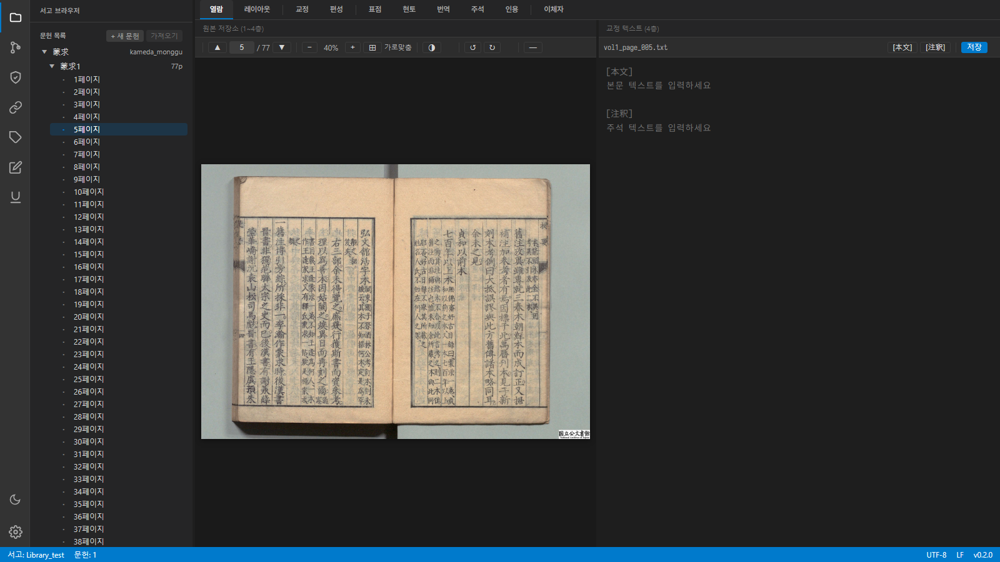
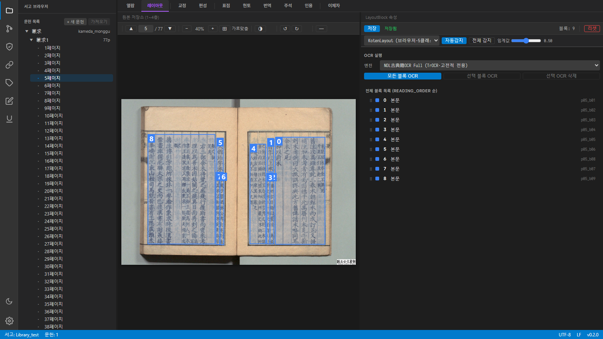
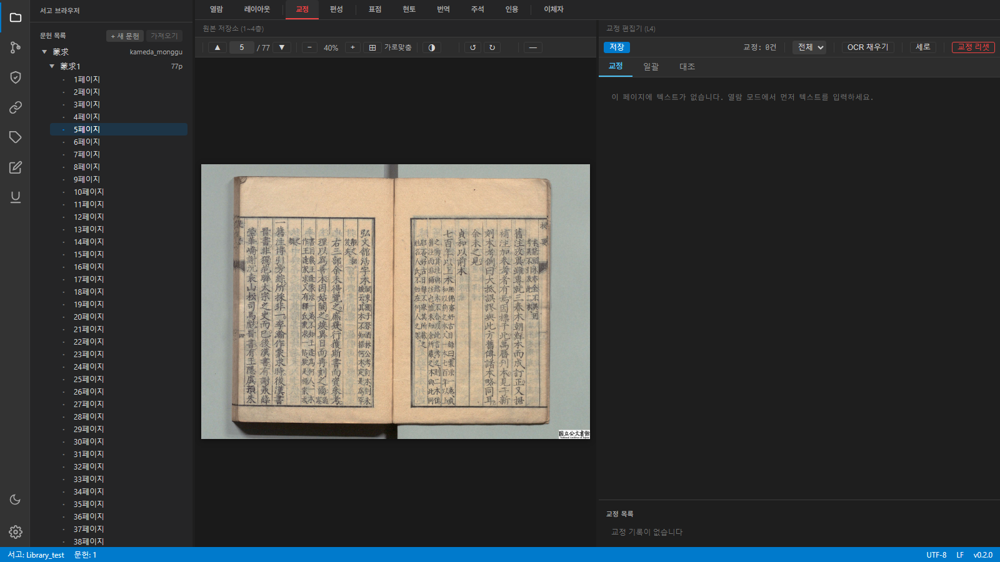
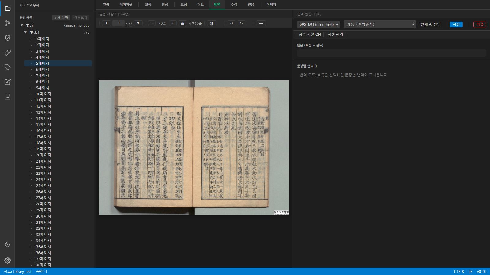
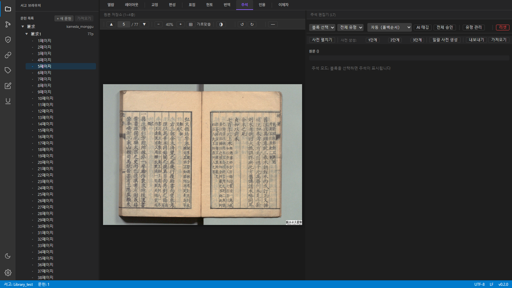
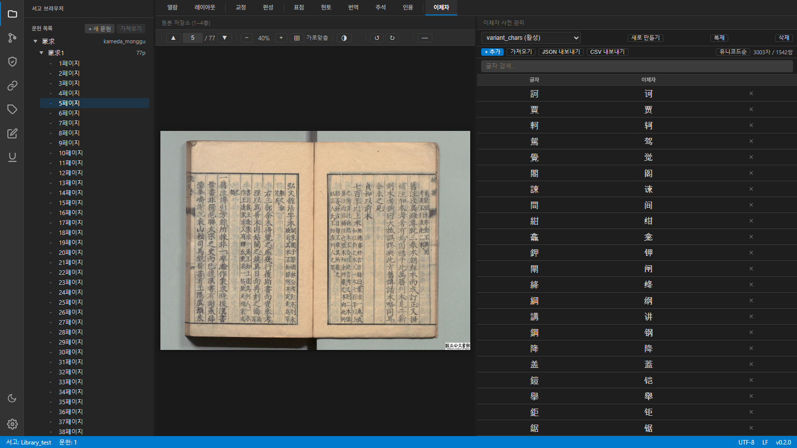
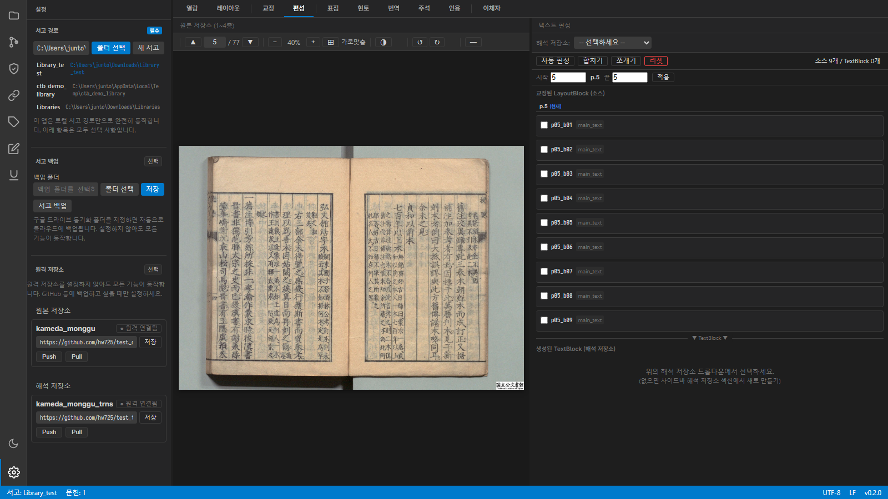

# 고전서지 통합 브라우저 (Classical Text Browser)

물리적 원본(PDF/이미지)과 디지털 텍스트의 연결이 끊어지지 않는,
사람과 LLM이 함께 고전 텍스트를 읽고 번역하고 연구하는 **통합 작업 환경**.

> **처음 사용하시나요?** [사용자 가이드](docs/user-guide.md)를 먼저 읽어주세요.



왼쪽에 서고 탐색기, 가운데에 원본 PDF 뷰어, 오른쪽에 텍스트 작업 패널이 배치된 **VSCode 스타일 3단 레이아웃**입니다. 상단 탭(열람 → 레이아웃 → 교정 → 표점 → 현토 → 번역 → 주석 → 인용 → 이체자)으로 작업 단계를 전환합니다.

---

## 핵심 기능 소개

### 1. 레이아웃 분석 + OCR — 원본 이미지에서 텍스트 추출



PDF/이미지 위에 **읽기 순서대로 번호가 매겨진 파란색 블록**이 표시됩니다.
고전적에 최적화된 NDL古典籍OCR(Full/Lite), 근현대 문서용 NDLOCR, LLM 비전, PaddleOCR 중 원하는 엔진을 선택해서 OCR을 실행할 수 있습니다.

- **자동감지**: 버튼 하나로 페이지 전체의 텍스트 영역을 자동으로 잡아줍니다
- **수동 조정**: 블록을 드래그해서 위치·크기·읽기 순서를 직접 수정할 수 있습니다
- **모든 블록 OCR / 선택 블록 OCR**: 전체 또는 원하는 영역만 골라서 인식합니다

### 2. 교정 — OCR 결과를 원본과 나란히 비교하며 수정



왼쪽 원본 이미지를 보면서 오른쪽에서 OCR 인식 결과를 직접 수정합니다.
**일괄 교정**(이체자 사전 기반)과 **대조 뷰**(OCR 원본 vs 교정본 비교)를 지원합니다.

### 3. 표점(句讀) — 고전 한문에 구두점 찍기


교정이 끝난 텍스트에 **문장 부호(구두점)를 삽입**합니다.
미리 설정된 부호 세트를 사용하거나, AI에게 표점 초안을 요청할 수도 있습니다.

### 4. 현토(懸吐) — 한문에 한국어 토씨 달기


표점이 완료된 문장에 **한국어 토(吐)를 삽입**하는 단계입니다.
한문 원문 옆에 작은 글씨로 토가 표시되며, AI 보조 기능도 사용할 수 있습니다.

### 5. 번역 — LLM 보조 또는 수동 번역



원문을 현대 한국어로 번역합니다. **Ollama(로컬), Anthropic, Gemini, OpenAI** 등 다양한 LLM에 번역 초안을 요청하고, 연구자가 직접 수정·확정합니다. LLM이 응답하지 않으면 자동으로 다음 프로바이더로 폴백합니다.

### 6. 주석 — 태그, 사전형 주석, 인용 마크



번역이 끝난 텍스트에 **연구 주석을 추가**합니다.
인명·지명·서명 등의 **태그**, 단어의 뜻풀이를 기록하는 **사전형 주석**, 다른 문헌의 해당 구절을 연결하는 **인용 마크** 세 가지 유형을 지원합니다.

### 7. 이체자 사전 — 異體字 자동 교정



고전 한문에 자주 등장하는 **이체자(異體字) 대응표**를 관리합니다.
예를 들어 '萬→万', '國→国' 같은 자형 변환을 등록해두면 OCR 결과를 일괄 교정할 때 자동으로 적용됩니다.

### 8. Git 버전 관리 — 모든 작업 이력을 안전하게 보존


원본 저장소와 해석 저장소가 **각각 독립된 Git 저장소**로 관리됩니다.
커밋 로그와 사다리형 그래프로 작업 이력을 한눈에 볼 수 있고, 언제든 이전 상태로 되돌릴 수 있습니다.

### 9. 서고 관리 — 문헌과 해석을 체계적으로 정리



여러 문헌과 해석 저장소를 하나의 **서고(Library)**로 묶어 관리합니다.
백업 경로 설정, 원격 저장소(GitHub 등) 연결, JSON 스냅샷 내보내기/가져오기를 GUI에서 바로 할 수 있습니다.

---

## 기능 요약

| 영역 | 기능 |
|------|------|
| **원본 관리** | PDF/이미지 뷰어, 레이아웃 분석, OCR(NDL古典籍OCR Full/Lite + NDLOCR + LLM 비전 + PaddleOCR), HWP/HWPX 가져오기, PDF 참조 텍스트 추출 |
| **해석 작업** | 표점(句讀), 현토(懸吐), 번역(LLM+수동), 주석(태깅+사전형) |
| **연구 도구** | 인용 마크, 사전 내보내기/가져오기, 이체자 사전, 교차 뷰어 |
| **저장소 관리** | 원본·해석 분리 Git 저장소, 사다리형 그래프, JSON 스냅샷 |
| **텍스트 가져오기** | HWP/HWPX 표점·현토 분리, PDF 텍스트 레이어 추출, LLM 원문/번역/주석 분리 |
| **LLM 연동** | Ollama, Base44, Anthropic, Gemini, OpenAI (자동 폴백) |

## 빠른 시작

1. [**ZIP 다운로드**](https://github.com/hw725/classical-text-browser/archive/refs/heads/master.zip) → 압축 풀기
2. `install.bat` 더블클릭 (Windows) 또는 `./install.sh` (macOS/Linux) — Python, Git, uv 자동 설치
3. `start_server.bat` 더블클릭 (Windows) 또는 `./start_server.sh` (macOS/Linux)

브라우저에서 `http://localhost:8000` 접속. GUI에서 서고를 선택/생성할 수 있습니다.

> Git을 아는 분은 `git clone https://github.com/hw725/classical-text-browser.git`으로도 가능합니다.
> 오프라인 OCR 설치: `uv sync --extra ndlkotenocr` (고전적 전용, 권장) 또는 `uv sync --extra ndlocr` (근현대 범용).
> GPU가 있다면: `uv sync --extra ndlkotenocr-full` (TrOCR, 최고 품질).

## 기술 스택

Python + FastAPI | HTML + vanilla JS (빌드 도구 없음) | PDF.js | PyMuPDF | GitPython | jsonschema | uv

## 8층 데이터 모델

| 층 | 이름 | 저장소 | 층 | 이름 | 저장소 |
|----|------|--------|----|------|--------|
| L1 | 원본 파일 | 원본 | L5 | 표점/현토 | 해석 |
| L2 | OCR 결과 | 원본 | L6 | 번역 | 해석 |
| L3 | 레이아웃 | 원본 | L7 | 주석/사전 | 해석 |
| L4 | 교정 텍스트 | 원본 | L8 | 관계 그래프 | 해석 |

## 프로젝트 구조

```
src/
├── core/         # 핵심 로직 (표점, 번역, 주석 등)
├── hwp/          # HWP/HWPX 처리 (hwp-hwpx-parser)
├── text_import/  # 텍스트 가져오기 (HWP 표점분리 + PDF 참조텍스트)
├── llm/          # LLM 라우터 + 프로바이더
├── ocr/          # OCR 엔진 (NDL古典籍OCR Full/Lite + NDLOCR + LLM 비전 + PaddleOCR)
├── parsers/      # 서지정보 파서
├── cli/          # CLI 도구
└── app/          # 웹 앱 (FastAPI + static)
schemas/
├── source_repo/  # 원본 저장소 스키마 (7개)
├── interp/       # 해석 저장소 스키마 (5개)
└── core/         # 코어 엔티티 스키마 (6개)
```

## 문서 안내

| 문서 | 대상 | 내용 |
|------|------|------|
| [**user-guide.md**](docs/user-guide.md) | 연구자 | 사용 방법 단계별 안내 |
| [platform-v7.md](docs/platform-v7.md) | 개발자 | 전체 아키텍처 |
| [DECISIONS.md](docs/DECISIONS.md) | 개발자 | 설계 결정 근거 (D-001~D-023) |
| [core-schema-v1.3.md](docs/core-schema-v1.3.md) | 개발자 | 코어 엔티티 모델 |
| [schemas/README.md](schemas/README.md) | 개발자 | JSON 스키마 구조 |
| [architecture-diagrams.md](docs/architecture-diagrams.md) | 전체 | Mermaid 다이어그램 |
| [schema_overview.html](docs/schema_overview.html) | 전체 | 스키마 개요도 (브라우저, 19개) |
| [llm_architecture_design.md](docs/llm_architecture_design.md) | 개발자 | LLM 4단 폴백 설계 |
| [docs/sessions/](docs/sessions/session_navigator.md) | 개발자 | 구현 세션 기록 (Phase 10~12) |

## 라이선스

[PolyForm Noncommercial 1.0.0](LICENSE)

- 비상업적 사용·수정·재배포: 자유
- 상업적 사용: 별도 협의 필요 (LICENSE 파일 하단 연락처 참고)
