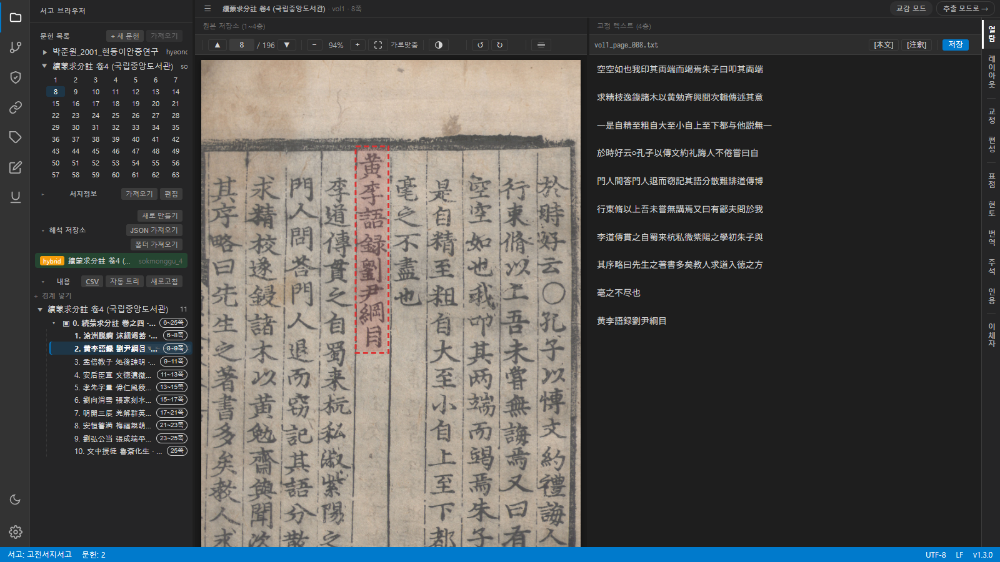
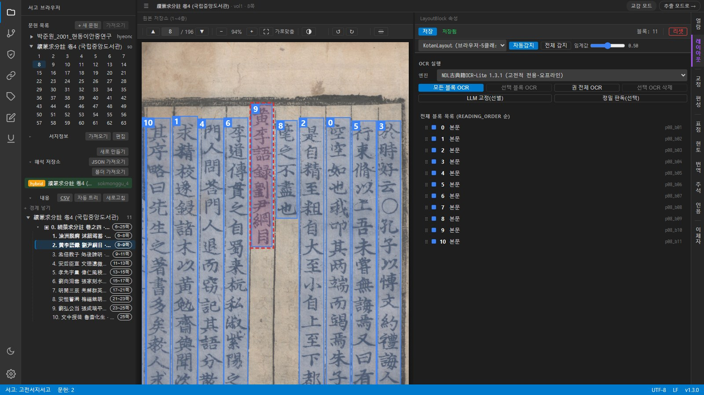
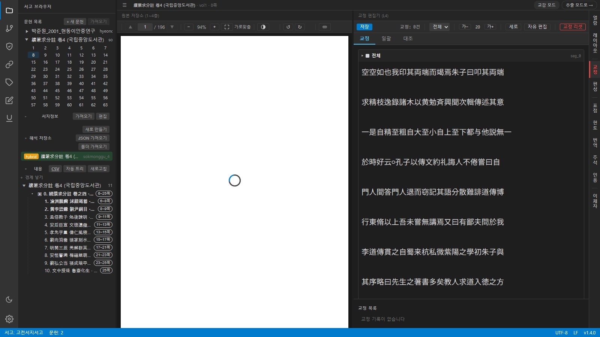
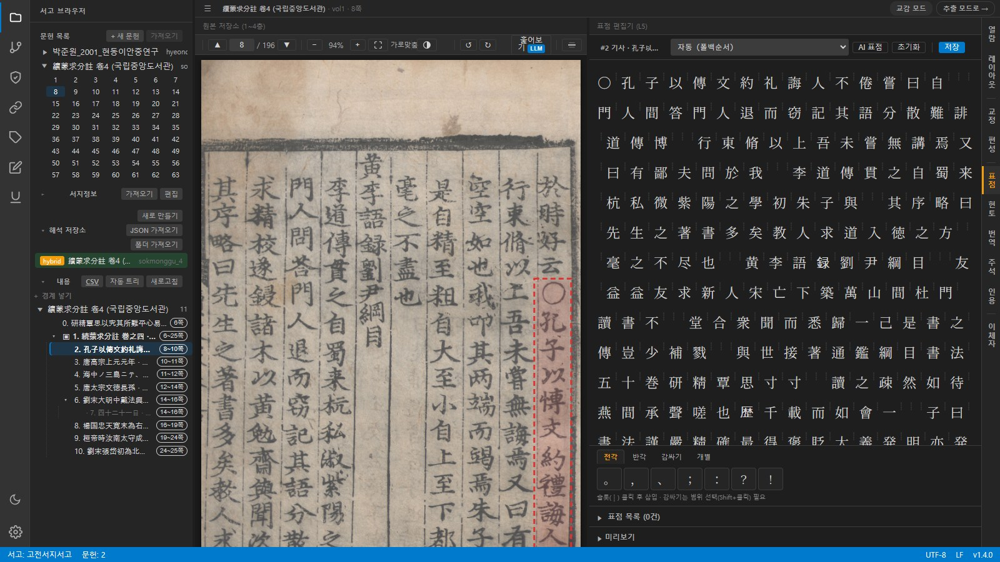
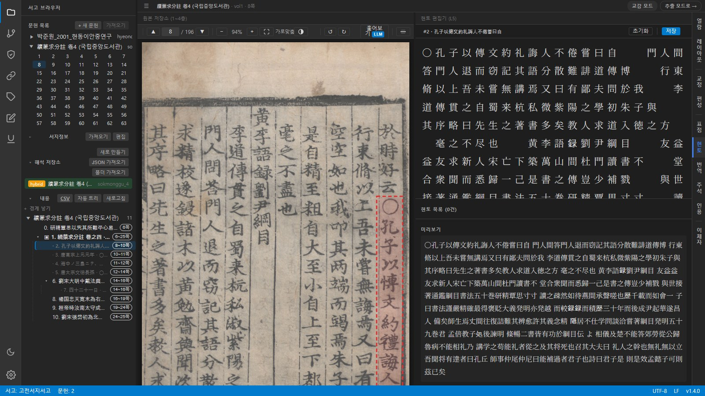
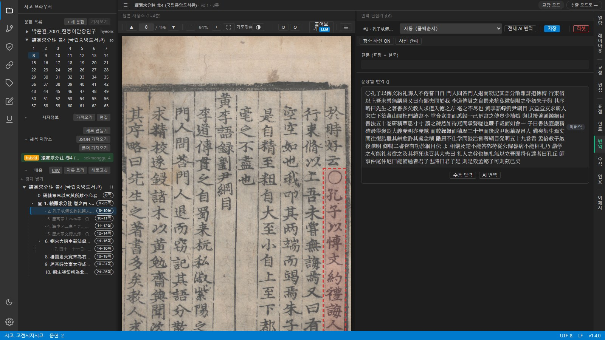
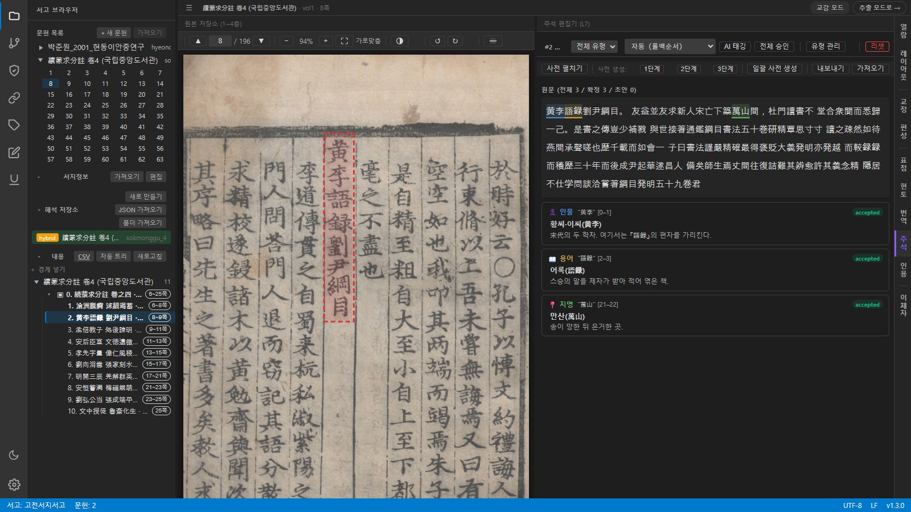
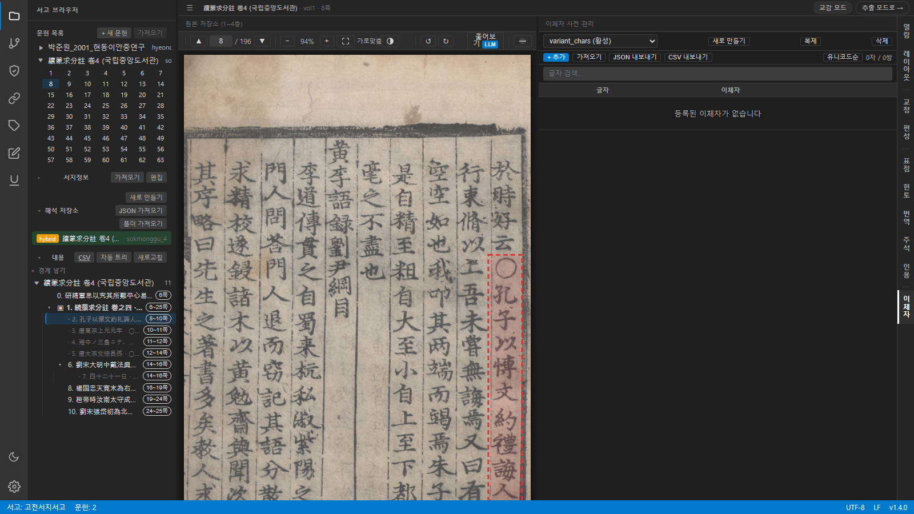
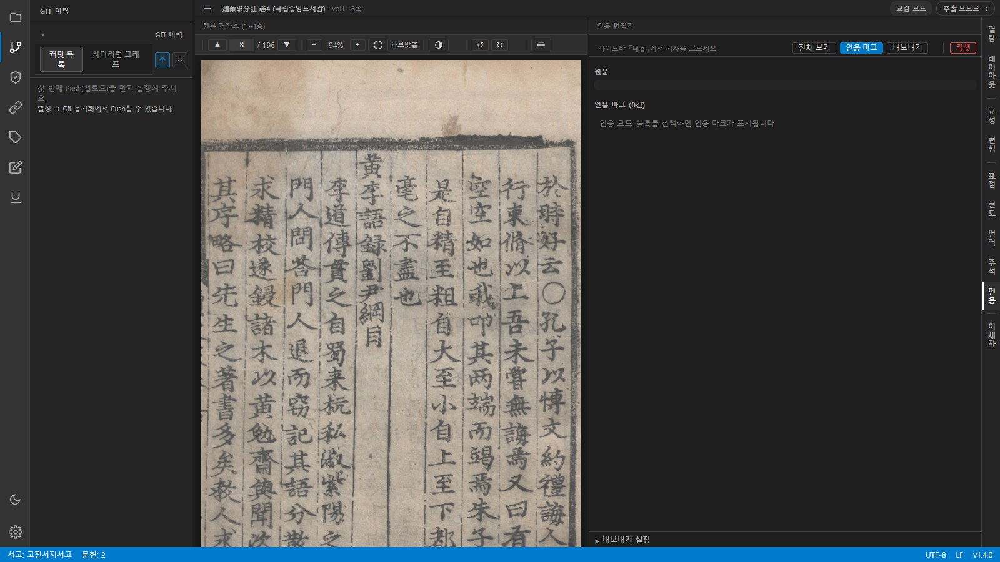
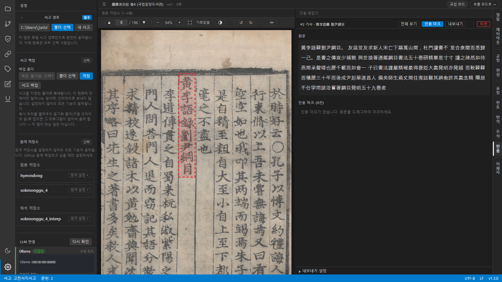

# 고전서지 통합 브라우저 (Classical Text Browser)

물리적 원본(PDF/이미지)과 디지털 텍스트의 연결이 끊어지지 않는,
사람과 LLM이 함께 고전 텍스트를 읽고 번역하고 연구하는 **통합 작업 환경**.

> **처음 사용하시나요?** [사용자 가이드](docs/user-guide.md)를 먼저 읽어주세요.



왼쪽에 서고 탐색기, 가운데에 원본 PDF 뷰어, 오른쪽에 텍스트 작업 패널이 배치된 **VSCode 스타일 3단 레이아웃**입니다. 상단 탭(열람 → 레이아웃 → 교정 → 표점 → 현토 → 번역 → 주석 → 인용 → 이체자)으로 작업 단계를 전환합니다.

---

## 핵심 기능 소개

### 1. 레이아웃 분석 + OCR — 원본 이미지에서 텍스트 추출



PDF/이미지 위에 **읽기 순서대로 번호가 매겨진 파란색 블록**이 표시됩니다.
고전적에 최적화된 NDL古典籍OCR(Full/Lite), 근현대 문서용 NDLOCR, LLM 비전, PaddleOCR 중 원하는 엔진을 선택해서 OCR을 실행할 수 있습니다.

- **자동감지**: 버튼 하나로 페이지 전체의 텍스트 영역을 자동으로 잡아줍니다
- **수동 조정**: 블록을 드래그해서 위치·크기·읽기 순서를 직접 수정할 수 있습니다
- **모든 블록 OCR / 선택 블록 OCR**: 전체 또는 원하는 영역만 골라서 인식합니다

### 2. 교정 — OCR 결과를 원본과 나란히 비교하며 수정



왼쪽 원본 이미지를 보면서 오른쪽에서 OCR 인식 결과를 직접 수정합니다.
**글자 교정**(유형 지정 가능)과 **자유 편집**(글자 추가/삭제/수정) 두 가지 모드를 토글로 전환할 수 있습니다.
**일괄 교정**(이체자 사전 기반)과 **대조 뷰**(OCR 원본 vs 교정본 비교)도 지원합니다.

### 3. 표점(句讀) — 고전 한문에 구두점 찍기



교정이 끝난 텍스트에 **문장 부호(구두점)를 삽입**합니다.
미리 설정된 부호 세트를 사용하거나, AI에게 표점 초안을 요청할 수도 있습니다.

### 4. 현토(懸吐) — 한문에 한국어 토씨 달기



표점이 완료된 문장에 **한국어 토(吐)를 삽입**하는 단계입니다.
한문 원문 옆에 작은 글씨로 토가 표시되며, AI 보조 기능도 사용할 수 있습니다.

### 5. 번역 — LLM 보조 또는 수동 번역



원문을 현대 한국어로 번역합니다. **Ollama(로컬), OpenAI OAuth, Gemini, OpenAI, Anthropic** 등 다양한 LLM에 번역 초안을 요청하고, 연구자가 직접 수정·확정합니다. LLM이 응답하지 않으면 자동으로 다음 프로바이더로 폴백합니다.

### 6. 주석 — 태그, 사전형 주석, 인용 마크



번역이 끝난 텍스트에 **연구 주석을 추가**합니다.
인명·지명·서명 등의 **태그**, 단어의 뜻풀이를 기록하는 **사전형 주석**, 다른 문헌의 해당 구절을 연결하는 **인용 마크** 세 가지 유형을 지원합니다.

### 7. 이체자 사전 — 異體字 자동 교정



고전 한문에 자주 등장하는 **이체자(異體字) 대응표**를 관리합니다.
예를 들어 '萬→万', '國→国' 같은 자형 변환을 등록해두면 OCR 결과를 일괄 교정할 때 자동으로 적용됩니다.

### 8. Git 버전 관리 — 모든 작업 이력을 안전하게 보존



원본 저장소와 해석 저장소가 **각각 독립된 Git 저장소**로 관리됩니다.
커밋 로그와 사다리형 그래프로 작업 이력을 한눈에 볼 수 있고, 언제든 이전 상태로 되돌릴 수 있습니다.

### 9. 서고 관리 — 문헌과 해석을 체계적으로 정리



여러 문헌과 해석 저장소를 하나의 **서고(Library)**로 묶어 관리합니다.
백업 경로 설정, 원격 저장소(GitHub 등) 연결, JSON 스냅샷 내보내기/가져오기를 GUI에서 바로 할 수 있습니다.

### 10. 추출 모드 — 근현대 스캔본에서 텍스트만 빠르게

옛날 논문·단행본처럼 표점·현토·이체자가 필요 없는 자료를 위한 **작업 모드**입니다.
탭 줄 오른쪽 끝의 버튼으로 「고서」와 「논문」을 오가면 교감 전용 탭 7개가 숨습니다
(표시만 바뀌고 데이터는 그대로이며, 프로필은 문헌마다 기억됩니다).

- **자동 진단**: 등록하는 순간 텍스트 레이어 유무를 가려 줍니다. 이미 텍스트가 있으면 **OCR을 아예 건너뜁니다.**
- **권 단위 일괄 OCR**: 페이지마다 레이아웃을 잡을 필요가 없고, 중단해도 **이어서** 돕니다.
- **쪽별 검수**: 쪽마다 줄 수·글자 수·본문 앞머리를 한눈에 보고 확인 표시를 남깁니다.
  진행률(3/15쪽 확인)이 표시되고, **다 확인하지 않은 채 내보내려 하면 알려 줍니다.**
  문제가 보이면 그 자리에서 **교정 탭(대조)·레이아웃 탭(영역)**으로 넘어갑니다 —
  몇 글자 오독은 다시 OCR 해도 대체로 같으므로 손으로 고치는 편이 빠릅니다.
- **부분 재-OCR**: 결과가 나쁜 몇 쪽만 레이아웃을 나눈 뒤 그대로 다시 실행하면
  **고친 쪽만** 돕니다. 쪽 번호를 기억해 입력할 필요가 없습니다.
- **텍스트 레이어를 텍스트 레이어 PDF**: 원본 이미지 위에 보이지 않는 텍스트를 얹어 내보냅니다.
  사이드카 `.txt`와 달리 **복사·Ctrl+F·구조 분석·참고문헌 추출**이 한꺼번에 살아납니다.
  폰트를 임베드하므로 한시 인용문의 벽자(`儂`·`纔`·`鬬` 등)도 그대로 검색됩니다.

> 한글이 포함된 문헌은 **LLM Vision** 엔진을 쓰세요. NDL 계열 엔진은 한글을 인식하지 못합니다.

**형광 표시는 기본 설치만으로 제자리에 뜹니다.** 읽기는 LLM Vision이,
글자 위치 찾기는 PaddleOCR 검출이 맡는 분업입니다
(실측: 15쪽 논문에서 502줄 중 433줄이 제자리). PaddleOCR는 기본 번들입니다.

**논문이 수십 편이면 폴더째** 처리할 수 있습니다. 스캔본만 골라 OCR하고,
원본은 아카이브로 옮긴 뒤 텍스트 레이어 PDF를 원래 이름 그대로 제자리에 놓습니다.

```bash
# 한 편만 — 서고를 미리 만들 필요가 없습니다
ctb ocr "논문.pdf" --execute

# 폴더째 — 기본이 미리보기라 --execute 없이는 아무것도 바뀌지 않습니다
uv run python -m cli embed-folder "C:/논문" --library C:/작업서고
uv run python -m cli embed-folder "C:/논문" --library C:/작업서고 --limit 1 --execute
```

기본이 미리보기라 `--execute` 없이는 아무것도 바뀌지 않고, 중단해도 다음 실행이 이어서 합니다.

자세한 사용법: [사용자 안내서 7-A](docs/user-guide.md#7-a-근현대-논문에서-텍스트만-빠르게-뽑기)

---

## 기능 요약

| 영역 | 기능 |
|------|------|
| **원본 관리** | PDF/이미지 뷰어, **나중에 권 추가**, 레이아웃 분석, OCR(NDL古典籍OCR Full/Lite + NDLOCR + LLM 비전 + PaddleOCR), HWP/HWPX 가져오기 (준비중), PDF 참조 텍스트 추출 |
| **해석 작업** | 표점(句讀), 현토(懸吐), 번역(LLM+수동), 주석(태깅+사전형) |
| **연구 도구** | 인용 마크, 사전 내보내기/가져오기, 이체자 사전, 교차 뷰어 |
| **저장소 관리** | 원본·해석 분리 Git 저장소, 사다리형 그래프, JSON 스냅샷 |
| **텍스트 가져오기** | HWP/HWPX 표점·현토 분리, PDF 텍스트 레이어 추출, LLM 원문/번역/주석 분리 |
| **LLM 연동** | Ollama, OpenAI OAuth, Gemini, OpenAI, Anthropic (5단 자동 폴백) + 설정 화면의 연결·인증 상태 표시 |
| **추출 모드** | 작업 모드(교감/추출) 전환, 텍스트 레이어 진단, 권 단위 일괄 OCR(중단·재개·부분 재실행), 쪽별 검수(확인 진행률·교정/레이아웃 연결), **텍스트 레이어를 텍스트 레이어 PDF 내보내기** |

## 빠른 시작

1. [**ZIP 다운로드**](https://github.com/hw725/classical-text-browser/archive/refs/heads/master.zip) → 압축 풀기
2. `install.bat` 더블클릭 (Windows) 또는 `./install.sh` (macOS/Linux) — Python, Git, uv 자동 설치
3. `start_server.bat` 더블클릭 (Windows) 또는 `./start_server.sh` (macOS/Linux)

브라우저에서 `http://localhost:8000` 접속. **PDF·이미지 파일(또는 이미지 폴더)을 창 안에 끌어다 놓으면** 서고가 없어도 기본 서고(`~/Documents/고전서지서고`)가 자동으로 만들어지고 곧바로 문헌으로 등록됩니다 — 별도 경로 설정이 필요 없고, 기본 해석 저장소도 함께 준비됩니다. GUI 설정에서 서고를 직접 선택/생성할 수도 있습니다.
Windows의 `start_server.bat`는 설정된 표점 Docker 서비스와 OpenAI OAuth 프록시도 창 없이 함께 시작합니다. OAuth 첫 실행에서 로그인이 필요하면 `logs\openai-oauth.log`의 안내를 따라 진행하세요.

> Git을 아는 분은 `git clone https://github.com/hw725/classical-text-browser.git`으로도 가능합니다.
> **기본 설치(`uv sync`)만으로 한글 논문 처리는 전부 됩니다** — OCR, 텍스트 레이어 PDF, 형광 위치까지.
> 아래는 다른 종류의 문헌을 다룰 때만 추가하세요.
>
> | 추가 설치 | 언제 | 크기 |
> |---|---|---|
> | `uv sync --extra japanese` | 일본어 문헌(근현대) | 약 170MB |
> | `uv sync --extra classical` | 고서(古典籍) | 약 170MB |
> | `uv sync --extra classical-gpu` | 고서 최고 품질(TrOCR, GPU 권장) | 약 340MB |
>
> 뒤 둘은 **한글을 인식하지 못합니다** — 한글 논문에는 쓰지 마세요.
> (예전 이름 `ndlocr`·`ndlkotenocr`·`ndlkotenocr-full`도 그대로 동작합니다.)
> Python은 3.10~3.12를 씁니다. paddlepaddle 휠이 3.13까지 나와 있지 않습니다.

## 기술 스택

Python + FastAPI | HTML + vanilla JS (빌드 도구 없음) | PDF.js | PyMuPDF | GitPython | jsonschema | uv

## 8층 데이터 모델

| 층 | 이름 | 저장소 | 층 | 이름 | 저장소 |
|----|------|--------|----|------|--------|
| L1 | 원본 파일 | 원본 | L5 | 표점/현토 | 해석 |
| L2 | OCR 결과 | 원본 | L6 | 번역 | 해석 |
| L3 | 레이아웃 | 원본 | L7 | 주석/사전 | 해석 |
| L4 | 교정 텍스트 | 원본 | L8 | 관계 그래프 | 해석 |

## 프로젝트 구조

```
src/
├── core/         # 핵심 로직 (표점, 번역, 주석 등)
├── hwp/          # HWP/HWPX 처리 (hwp-hwpx-parser)
├── text_import/  # 텍스트 가져오기 (HWP 표점분리 + PDF 참조텍스트)
├── llm/          # LLM 라우터 + 프로바이더
├── ocr/          # OCR 엔진 (NDL古典籍OCR Full/Lite + NDLOCR + LLM 비전 + PaddleOCR)
│              #  + line_detector: 인식 없이 줄 위치만 찾는다 (텍스트 레이어 배치용)
├── export/       # 연구 산출물 내보내기 (텍스트 레이어를 텍스트 레이어 PDF)
├── parsers/      # 서지정보 파서 (NDL, 국립공문서관, KORCIS, KOSTMA, 장서각, 규장각 + 범용 LLM)
├── cli/          # CLI 도구
└── app/          # 웹 앱 (FastAPI + static)
schemas/
├── source_repo/  # 원본 저장소 스키마 (7개)
├── interp/       # 해석 저장소 스키마 (5개)
└── core/         # 코어 엔티티 스키마 (6개)
```

## 문서 안내

| 문서 | 대상 | 내용 |
|------|------|------|
| [**user-guide.md**](docs/user-guide.md) | 연구자 | 사용 방법 단계별 안내 |
| [platform-v7.md](docs/platform-v7.md) | 개발자 | 전체 아키텍처 |
| [DECISIONS.md](docs/DECISIONS.md) | 개발자 | 설계 결정 근거 (D-001~D-064) |
| [core-schema-v1.3.md](docs/core-schema-v1.3.md) | 개발자 | 코어 엔티티 모델 |
| [schemas/README.md](schemas/README.md) | 개발자 | JSON 스키마 구조 |
| [architecture-diagrams.md](docs/architecture-diagrams.md) | 전체 | Mermaid 다이어그램 |
| [schema_overview.html](docs/schema_overview.html) | 전체 | 스키마 개요도 (브라우저, 19개) |
| [llm_architecture_design.md](docs/llm_architecture_design.md) | 개발자 | LLM 5단 폴백 설계 |
| [releases/v1.1.5.md](docs/releases/v1.1.5.md) | 전체 | v1.1.5 릴리스 노트 (최신) |
| [releases/v1.1.4.md](docs/releases/v1.1.4.md) | 전체 | v1.1.4 릴리스 노트 |
| [docs/sessions/](docs/sessions/session_navigator.md) | 개발자 | 구현 세션 기록 (Phase 10~12) |
| [observability-roadmap.md](docs/observability-roadmap.md) | 개발자 | OpenTelemetry 점진적 도입 로드맵 (Phase 1 완료) |
| [docs/retrospective/](docs/retrospective/README.md) | 전체 | 회고 — 결정·세션·패턴·하네스 권고 + 인터랙티브 뷰어 |

## 라이선스

[PolyForm Noncommercial 1.0.0](LICENSE)

- 비상업적 사용·수정·재배포: 자유
- 상업적 사용: 별도 협의 필요 (LICENSE 파일 하단 연락처 참고)

## 외부 모델 출처

외부 표점 서비스의 SikuRoBERTa 엔진은
[`yachagye/korean-classical-chinese-punctuation`](https://github.com/yachagye/korean-classical-chinese-punctuation)
모델을 HTTP 마이크로서비스로 연동합니다. 원 저장소 조건에 따라 원저작자와 출처를
표기하고 논문을 인용해야 합니다.

- 원저작자: Junghyun Yang (양정현)
- 모델: Korean Classical Chinese Punctuation Prediction Model v2.5
- 라이선스: CC BY-NC-SA 4.0
- DOI: https://doi.org/10.37924/JSSW.100.9

권장 인용:

```text
Yang, J. (2025). Development and Application of a Deep Learning-Based Model
for Automated Punctuation Inference in Korean Classical Chinese.
The Korean Journal of History (Yoksahak Yongu), 100, 267-297.
https://doi.org/10.37924/JSSW.100.9
```
