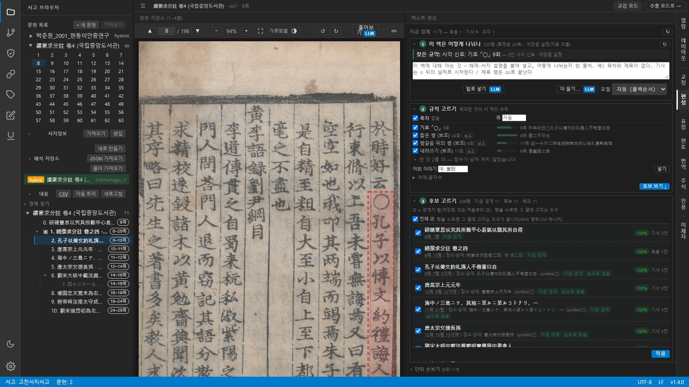

# 고전서지 통합 브라우저 (Classical Text Browser)

물리적 원본(PDF·이미지)과 디지털 텍스트의 연결이 끊어지지 않는,
사람과 LLM이 함께 고전 텍스트를 읽고 번역하고 연구하는 **통합 작업 환경**.

왼쪽에 서고 탐색기, 가운데에 원본 뷰어, 오른쪽에 텍스트 작업 패널이 놓인
VSCode 스타일 3단 화면입니다.

---

## 두 가지 쓰임

하나만 쓰는 사람이 대부분입니다. **자기 것부터 읽으면 됩니다.**
화면이 쓰임에 맞게 달라집니다 — 아래 두 그림의 **오른쪽 세로 인덱스 줄**을 비교해 보세요.

### 📄 추출 — 논문 스캔본에서 텍스트만 빠르게


*인덱스가 **열람·레이아웃·교정 셋**으로 줄고, 오른쪽에 「텍스트 추출」 패널이
붙습니다. 먼저 진단합니다 — 그림처럼 **텍스트 레이어가 이미 있으면 OCR 없이 바로
가져옵니다.** 스캔본이면 OCR 엔진·모델·쪽 범위를 고르고 비용을 미리 알려 준 뒤
쪽별로 검수합니다.*

근현대 논문·단행본처럼 표점·현토가 필요 없는 자료용입니다.
**끌어다 놓고 → OCR → 검색되는 PDF**까지 한 화면에서 끝납니다.
쪽마다 레이아웃을 잡을 필요가 없고, 중단해도 이어서 돕니다.

산출물은 원본 이미지 위에 보이지 않는 텍스트를 얹은 PDF라
복사·Ctrl+F·구조 분석·참고문헌 추출이 한꺼번에 살아납니다.

논문 한 편이면 앱을 열 필요도 없습니다.

```bash
ctb ocr "논문.pdf" --execute
```

→ [사용자 안내서 7-A](docs/user-guide.md#7-a-근현대-논문에서-텍스트만-빠르게-뽑기)

### 📜 교감 — 고전 원전을 읽고 해석하기



*교감 모드에서는 작업 인덱스가 **10개**입니다 — 오른쪽 세로 줄에 열람·레이아웃·교정·편성·
표점·현토·번역·주석·인용·이체자. 그림은 **편성** 인덱스 — 왼쪽 「내용」 트리에서 기사를 누르면
원본 이미지에 그 기사의 시작 행이 점선으로 표시됩니다. 켜진 인덱스를 다시 누르면 오른쪽 패널이 접힙니다.*

원본 이미지에서 텍스트를 만들고(레이아웃 → OCR → 교정),
**편성**으로 글의 경계를 잡은 뒤, 그 위에 표점·현토·번역·주석을 겹겹이 쌓습니다.
**원본과 해석을 각각 다른 Git 저장소**에 두어, 해석이 여럿 병존해도
원본은 하나의 정본으로 남습니다. 편성까지는 원본 저장소의 일이라
문헌만 고르면 되고, 해석 저장소는 표점 인덱스부터 씁니다(v1.3).

→ [사용자 안내서](docs/user-guide.md) · [기능 소개](docs/features.md)

---

## 빠른 시작

### 1단계 — 설치 파일 하나 (Windows)

[**CTB-Setup.exe**](https://github.com/hw725/classical-text-browser/releases/latest/download/CTB-Setup.exe)를 받아 두 번 누릅니다. 폴더와 글자 인식 엔진을 고르면
앱을 내려받아 필요한 것을 전부 깔고 바탕화면에 「고전서지 브라우저」 아이콘을 만듭니다.
그 뒤로는 아이콘으로 켜고, 새 판은 켤 때 저절로 받습니다.

macOS·Linux, 또는 Git을 아신다면 아래 두 단계.

### 2단계 — zip 또는 git으로

[ZIP으로 내려받아](https://github.com/hw725/classical-text-browser/archive/refs/heads/main.zip)
압축을 풀거나 `git clone https://github.com/hw725/classical-text-browser.git`.
`install.bat` 더블클릭 (Windows) 또는 `./install.sh` (macOS·Linux).
Git·uv가 없으면 함께 설치되고 앱 전용 Python 3.12는 uv가 받아 오며, 이어서 `uv sync`가 돕니다.
Ollama가 떠 있으면 기본 비전 모델(약 5GB)도 받습니다. 고서·일본어 엔진을
함께 깔지 물어봅니다 — 나중에 앱 안(처음 설정 ▸ 글자 인식)에서 단추로 더할 수 있습니다.

**설치는 하나뿐이고, 약 828MB입니다.** 그중 **79%가 OCR 스택**입니다.

<details>
<summary>무엇이 그렇게 큰가 — 덜어낼 수는 없나 (실측)</summary>

| 무엇 | 크기 | 뺄 수 있나 |
|---|---:|---|
| OCR 스택 (PaddleOCR + numpy·OpenCV·pandas 등 전이 의존) | **651MB** | ❌ |
| PDF 처리 (PyMuPDF) | 51MB | ❌ |
| 나머지 **전부** (웹 앱·LLM SDK·Git·서지 파서·개발 도구) | 127MB | 일부만 |

**덜어내도 의미가 없습니다.** 웹 앱 뼈대(FastAPI+uvicorn)를 통째로 빼도 14MB,
개발 도구까지 빼도 17MB — 828MB 중 **2%**입니다. 무거운 것은 OCR이고, OCR은
뺄 수 없습니다.

왜 뺄 수 없는가: 읽기(인식)는 LLM Vision이 하고 PaddleOCR는 **글자 위치
찾기(검출)** 만 맡습니다. 없으면 텍스트가 **왼쪽 여백에 줄 순서대로 균등
배치**되어, 검색하면 형광은 뜨는데 **그 자리에 원본 글자가 없습니다.**
실측(15쪽 논문): 있음 → 502줄 중 433줄 제자리 / 없음 → **0줄**.

「설치 안내를 그대로 따랐는데 형광이 엉뚱한 데 뜬다」를 기본 상태로 두지
않기로 했습니다(D-055). PaddleOCR는 **선택이 아니라 기본 번들**입니다.
</details>

### 3단계 — 쓰기: 앱 또는 명령 한 줄

**앱** — `start_server.bat` (Windows) 또는 `./start_server.sh` → `http://127.0.0.1:8000`
→ **PDF나 이미지를 창 안에 끌어다 놓으세요.** 서고가 없으면 자동으로 만들어집니다.

**명령 한 줄** — 논문 몇 편만 처리할 것이라면 앱을 열 필요가 없습니다.

```bash
ctb ocr "논문.pdf" --execute
```

실행 전에 **어느 모델이 도는지 한 줄** 찍습니다. 모델은 `ctb models`의 번호나 이름 일부로
고르고(`--model 9`, `--model astra`), 자주 쓰는 옵션은 `ctb config set model 9`처럼 저장해 두면
다음부터는 위 한 줄만 칩니다.

두 방법 모두 **같은 설치**를 씁니다. 골라야 하는 것은 설치가 아니라 쓰는 방식입니다.

### 다른 종류의 문헌을 다룰 때만 — 오프라인 OCR 추가

위 설치만으로 **한글 논문 처리는 전부 됩니다.** 아래는 일본 국립국회도서관(NDL)이
공개한 오프라인 OCR 엔진으로, 다른 문헌을 다룰 때만 더합니다.

앱 안에서 **설정 ▸ 처음 설정 ▸ 글자 인식**의 「설치」 단추로 더합니다. 터미널이 편하면
아래 명령도 같습니다.

| 엔진 | 설치 명령 | 언제 | 크기 |
|---|---|---|---|
| **NDLOCR-Lite** | `uv sync --extra japanese` | 일본어 문헌(근현대) | 약 170MB |
| **NDL古典籍OCR-Lite** | `uv sync --extra classical` | 고서(古典籍) | 약 170MB |
| **NDL古典籍OCR Full** (TrOCR) | 별도 GPU 환경 `.venv-gpu` — [사용자 안내서 §7-A.6-2](docs/user-guide.md) | 고서 최고 품질, GPU 권장 | **약 4.5GB** |

> extra 이름을 용도(`japanese`·`classical`)로 지은 것은, 예전에 세 엔진이
> `ndlocr`·`ndlkotenocr`·`ndlkotenocr-full`로 나란히 있어 한글 논문을 하려던 사람이
> **한글을 못 읽는** 고전적 전용 엔진을 설치하는 일이 있었기 때문입니다.
> 예전 이름도 그대로 동작합니다.
>
> **셋 다 한글을 인식하지 못합니다** — 한글 논문에는 쓰지 마세요.
> 세 엔진 모두 NDL이 CC BY 4.0으로 공개한 것입니다
> ([ndlocr-lite](https://github.com/ndl-lab/ndlocr-lite) ·
> [ndlkotenocr-lite](https://github.com/ndl-lab/ndlkotenocr-lite) ·
> [ndlkotenocr_cli](https://github.com/ndl-lab/ndlkotenocr_cli)).
>
> Python은 3.10~3.12를 씁니다(paddlepaddle 휠이 3.13까지 나와 있지 않습니다).

### 표점(句讀) 자동 제안을 쓸 때만 — 별도 서비스

고전 한문에 구두점을 기계로 제안받는 기능은 **본체에 들어 있지 않습니다.**
SikuRoBERTa 모델(torch·transformers·가중치 수 GB)을 본체에 박으면 설치가
폭증하고 paddlepaddle과 충돌하므로, **HTTP로 분리된 컨테이너**로 뺐습니다.

```bash
cd punctuation-service
# 가중치 경로를 .env에 적고 (yachagye 레포의 Google Drive 링크에서 받습니다)
docker compose up -d --build
```

베이스 이미지는 PyTorch 공식 CUDA 이미지라 **GPU가 있으면 누구나 자기 이미지를
만들 수 있습니다.** 이미 torch+CUDA 이미지를 갖고 있으면 `.env`에
`BASE_IMAGE=<그 이미지>`를 적어 재사용하면 내려받기 수 GB를 아낍니다.

모델과 가중치는 **외부 저장소의 것**이고 이 저장소는 배포하지 않습니다 —
출처와 인용은 맨 아래 「외부 모델 출처」를 보세요.
자세히: [punctuation-service/README.md](punctuation-service/README.md)

---

## 문서 지도

### 쓰는 사람

| 문서 | 무엇이 있나 |
|---|---|
| [**사용자 안내서**](docs/user-guide.md) | 설치부터 산출물까지 **단계별 사용법** |
| [기능 소개](docs/features.md) | 이 프로그램이 무엇을 할 수 있나 |
| [릴리스 노트](docs/releases/v1.3.0.md) | 판마다 무엇이 바뀌었나 (v1.3.0 최신) |

### 고치는 사람

| 문서 | 무엇이 있나 |
|---|---|
| [**유지보수 안내**](docs/maintenance.md) | **고치기 전에 볼 것** — 되돌릴 수 없는 것, 되풀이하지 말 것, 테스트 사각지대 |
| [DECISIONS.md](docs/DECISIONS.md) | 설계 결정 근거 (D-001~D-110) |
| [아키텍처 다이어그램](docs/architecture-diagrams.md) | 전체 그림 (Mermaid 13종) |
| [platform-v7.md](docs/platform-v7.md) | 8층 모델·이중 저장소 설계 |
| [AGENTS.md](AGENTS.md) · [인지 부채 감사](docs/cognitive-debt-audit.html) | 어디가 위험한가 |

### 자료 구조

| 문서 | 무엇이 있나 |
|---|---|
| [core-schema-v1.3.md](docs/core-schema-v1.3.md) · [operation-rules-v1.0.md](docs/operation-rules-v1.0.md) | 코어 엔티티 모델과 운영 규약 |
| [schemas/README.md](schemas/README.md) · [스키마 개요](docs/schema-overview.md) | JSON 스키마 19개 |
| [llm_architecture_design.md](docs/llm_architecture_design.md) | LLM 5단 폴백 설계 |
| [세션 기록](docs/sessions/session_navigator.md) · [회고](docs/retrospective/README.md) | 만들면서 무엇을 배웠나 |

---

## 8층 데이터 모델

| 층 | 이름 | 저장소 | 층 | 이름 | 저장소 |
|----|------|--------|----|------|--------|
| L1 | 원본 파일 | 원본 | L5 | 표점·현토 | 해석 |
| L2 | OCR 결과 | 원본 | L6 | 번역 | 해석 |
| L3 | 레이아웃 | 원본 | L7 | 주석·사전 | 해석 |
| L4 | 교정 텍스트 | 원본 | L8 | 관계 그래프 | 해석 |

원본(L1~L4)은 **단일 정본**으로 수렴하고, 해석(L5~L8)은 **여럿이 병존**합니다.
자세히: [platform-v7.md](docs/platform-v7.md) · [아키텍처 다이어그램](docs/architecture-diagrams.md)

## 기술 스택

Python + FastAPI · HTML + vanilla JS (빌드 도구 없음) · PDF.js · PyMuPDF · GitPython · jsonschema · uv

---

## 라이선스

[PolyForm Noncommercial 1.0.0](LICENSE)

- 비상업적 사용·수정·재배포: 자유
- 상업적 사용: 별도 협의 (LICENSE 파일 하단 연락처)

## 외부 모델 출처

외부 표점 서비스의 SikuRoBERTa 엔진은
[`yachagye/korean-classical-chinese-punctuation`](https://github.com/yachagye/korean-classical-chinese-punctuation)
모델을 HTTP 마이크로서비스로 연동합니다. 원 저장소 조건에 따라 원저작자와 출처를
표기하고 논문을 인용해야 합니다.

- 원저작자: Junghyun Yang (양정현)
- 모델: Korean Classical Chinese Punctuation Prediction Model v2.5
- 라이선스: CC BY-NC-SA 4.0
- DOI: https://doi.org/10.37924/JSSW.100.9

권장 인용:

```text
Yang, J. (2025). Development and Application of a Deep Learning-Based Model
for Automated Punctuation Inference in Korean Classical Chinese.
The Korean Journal of History (Yoksahak Yongu), 100, 267-297.
https://doi.org/10.37924/JSSW.100.9
```
