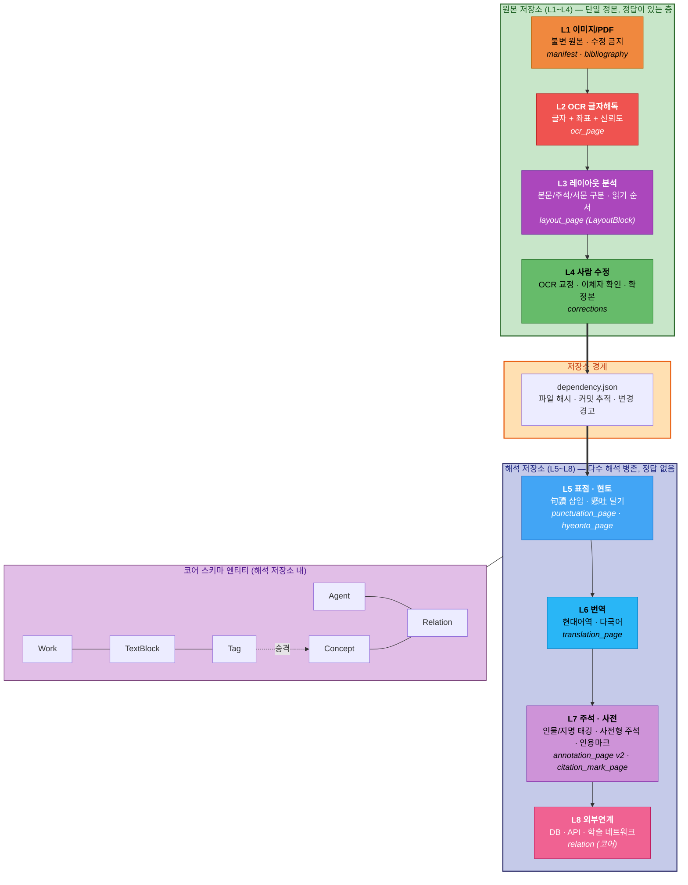
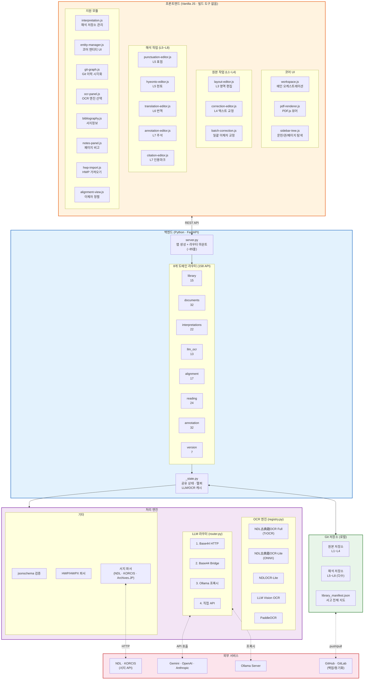
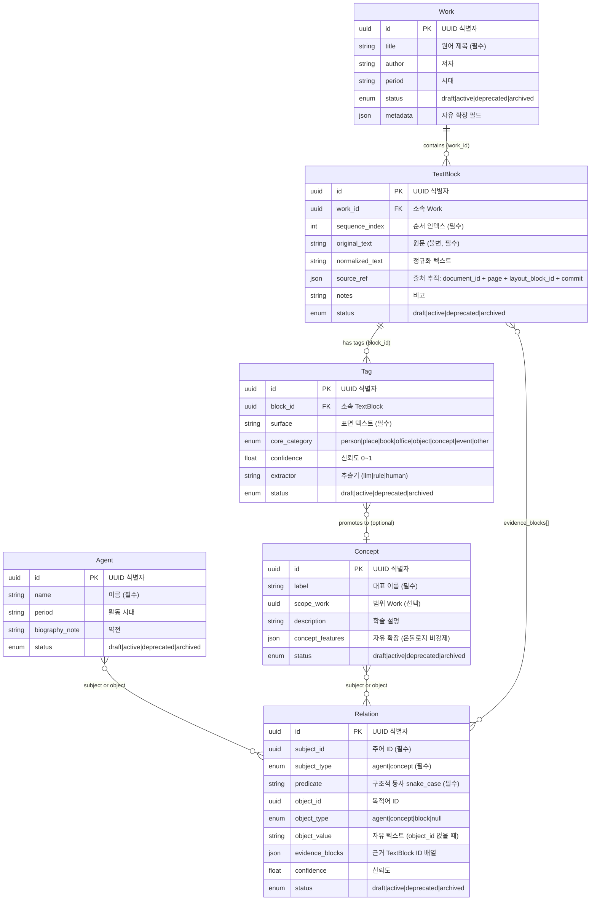
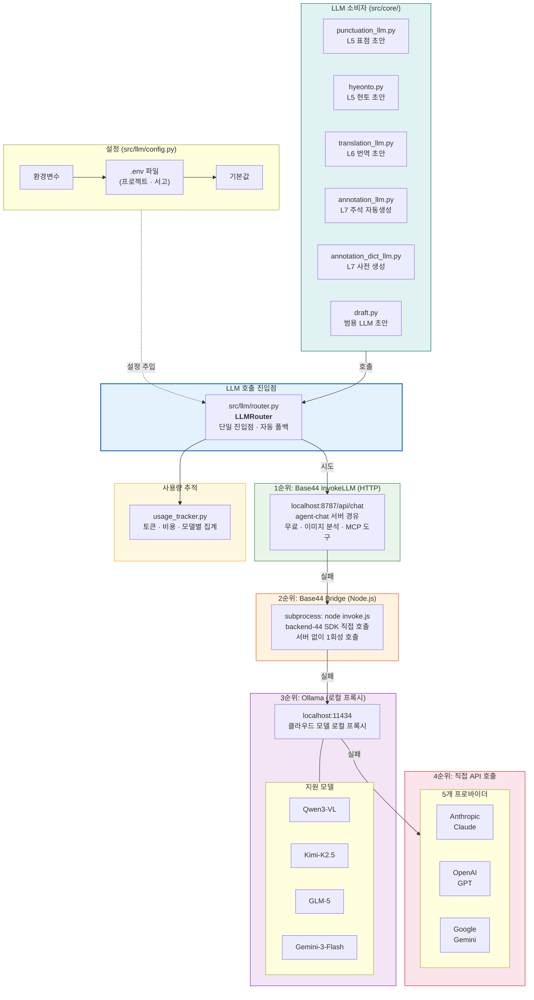
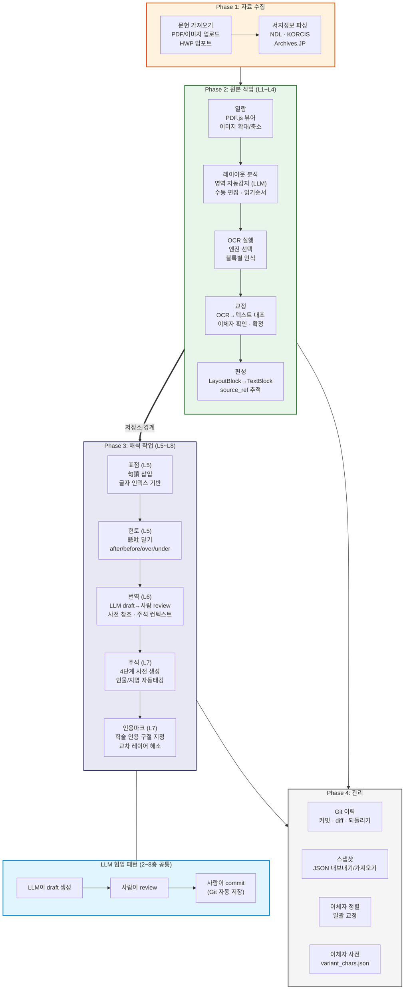
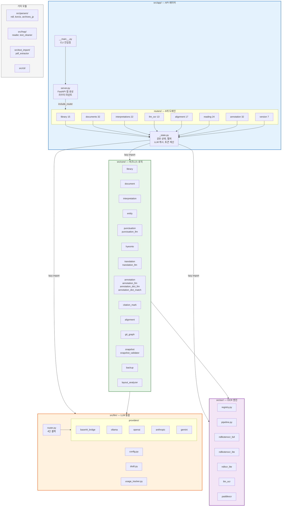
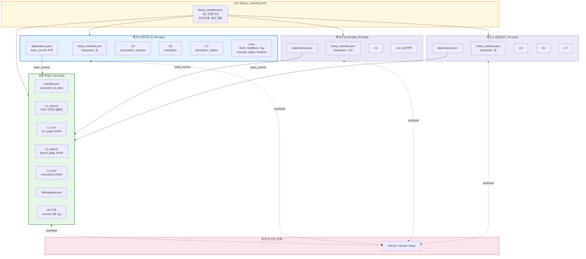
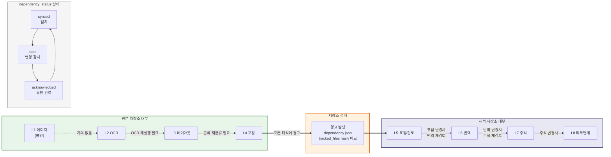
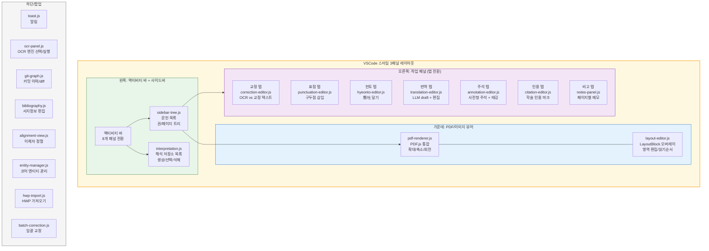
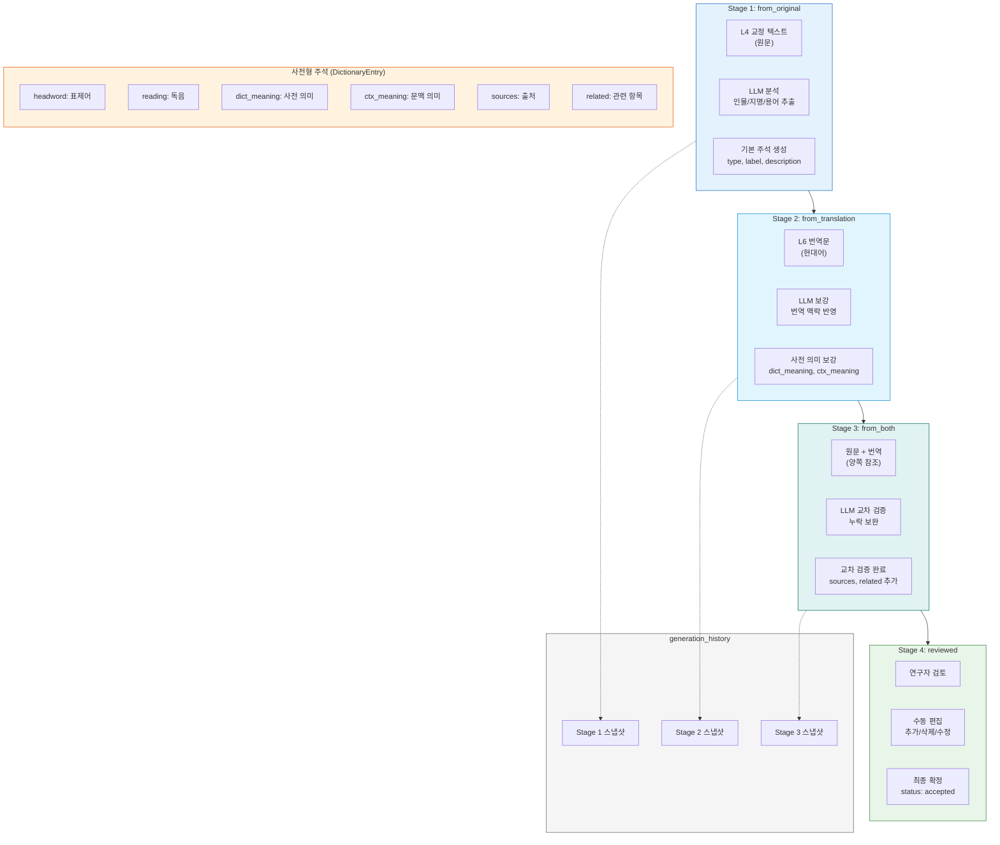

# 아키텍처 다이어그램

> 2026-03-14 기준. Mermaid 문법으로 작성.
> GitHub, VSCode (Mermaid 확장), [Mermaid Live Editor](https://mermaid.live)에서 렌더링 가능.
>
> **구성**: 12개 다이어그램 — 데이터 모델(1~3), 시스템 아키텍처(4~5), 워크플로우(6~7), 스키마(8~9), 저장소(10~11), UI(12)

---

## 1. 8층 데이터 모델

원본 저장소(L1~L4, 단일 정본)와 해석 저장소(L5~L8, 다수 병존)의 구조.
저장소 경계에서 `dependency.json`이 변경을 추적한다.

```mermaid
flowchart TB
  subgraph L1_4["원본 저장소 (L1~L4) — 단일 정본, 정답이 있는 층"]
    direction TB
    L1["<b>L1 이미지/PDF</b><br/>불변 원본 · 수정 금지<br/><i>manifest · bibliography</i>"]
    L2["<b>L2 OCR 글자해독</b><br/>글자 + 좌표 + 신뢰도<br/><i>ocr_page</i>"]
    L3["<b>L3 레이아웃 분석</b><br/>본문/주석/서문 구분 · 읽기 순서<br/><i>layout_page (LayoutBlock)</i>"]
    L4["<b>L4 사람 수정</b><br/>OCR 교정 · 이체자 확인 · 확정본<br/><i>corrections</i>"]
    L1 --> L2
    L2 --> L3
    L3 --> L4
  end

  subgraph boundary["저장소 경계"]
    dep["dependency.json<br/>파일 해시 · 커밋 추적 · 변경 경고"]
  end

  subgraph L5_8["해석 저장소 (L5~L8) — 다수 해석 병존, 정답 없음"]
    direction TB
    L5["<b>L5 표점 · 현토</b><br/>句讀 삽입 · 懸吐 달기<br/><i>punctuation_page · hyeonto_page</i>"]
    L6["<b>L6 번역</b><br/>현대어역 · 다국어<br/><i>translation_page</i>"]
    L7["<b>L7 주석 · 사전</b><br/>인물/지명 태깅 · 사전형 주석 · 인용마크<br/><i>annotation_page v2 · citation_mark_page</i>"]
    L8["<b>L8 외부연계</b><br/>DB · API · 학술 네트워크<br/><i>relation (코어)</i>"]
    L5 --> L6
    L6 --> L7
    L7 --> L8
  end

  subgraph core["코어 스키마 엔티티 (해석 저장소 내)"]
    direction LR
    W["Work"] --- TB["TextBlock"]
    TB --- T["Tag"]
    T -.->|승격| C["Concept"]
    A["Agent"] --- R["Relation"]
    C --- R
  end

  L4 ==> dep
  dep ==> L5
  L5_8 --- core

  style L1_4 fill:#c8e6c9,stroke:#2d6a2d,stroke-width:2px,color:#1b5e20
  style L5_8 fill:#c5cae9,stroke:#2d2d6a,stroke-width:2px,color:#1a237e
  style boundary fill:#ffe0b2,stroke:#e65100,stroke-width:2px,color:#bf360c
  style core fill:#e1bee7,stroke:#6a2d6a,stroke-width:1px,color:#4a148c
  style L1 fill:#f0883e,stroke:#c25e00,color:#000
  style L2 fill:#ef5350,stroke:#b71c1c,color:#fff
  style L3 fill:#ab47bc,stroke:#6a1b9a,color:#fff
  style L4 fill:#66bb6a,stroke:#2e7d32,color:#000
  style L5 fill:#42a5f5,stroke:#1565c0,color:#fff
  style L6 fill:#29b6f6,stroke:#0277bd,color:#000
  style L7 fill:#ce93d8,stroke:#7b1fa2,color:#000
  style L8 fill:#f06292,stroke:#c2185b,color:#fff
```

**핵심 원칙:**
- 원본 저장소는 **단일 정본**으로 수렴 (정답이 있다)
- 해석 저장소는 **다수 병존** (해석은 연구자마다 다르다)
- L4 확정 → `dependency.json` → 해석 저장소 시작점 (저장소 경계)
- 코어 스키마 6개 엔티티(Work, TextBlock, Tag, Concept, Agent, Relation)는 해석 저장소 내부에 위치

---

## 2. 전체 시스템 아키텍처

프론트엔드(27개 JS 모듈) · 백엔드(FastAPI + 8 라우터) · 처리 엔진(OCR 5종 + LLM 4단) · Git 저장소 · 외부 서비스.

```mermaid
flowchart TB
  subgraph frontend["프론트엔드 (Vanilla JS · 빌드 도구 없음)"]
    direction TB
    subgraph ui_core["코어 UI"]
      workspace["workspace.js<br/>메인 오케스트레이션"]
      pdf["pdf-renderer.js<br/>PDF.js 뷰어"]
      sidebar["sidebar-tree.js<br/>문헌/권/페이지 탐색"]
    end
    subgraph ui_source["원본 작업 (L1~L4)"]
      layout_ed["layout-editor.js<br/>L3 영역 편집"]
      corr_ed["correction-editor.js<br/>L4 텍스트 교정"]
      batch["batch-correction.js<br/>일괄 이체자 교정"]
    end
    subgraph ui_interp["해석 작업 (L5~L8)"]
      punct["punctuation-editor.js<br/>L5 표점"]
      hyeonto["hyeonto-editor.js<br/>L5 현토"]
      trans["translation-editor.js<br/>L6 번역"]
      annot["annotation-editor.js<br/>L7 주석"]
      cite["citation-editor.js<br/>L7 인용마크"]
    end
    subgraph ui_support["지원 모듈"]
      interp_mgr["interpretation.js<br/>해석 저장소 관리"]
      entity["entity-manager.js<br/>코어 엔티티 UI"]
      git_ui["git-graph.js<br/>Git 이력 시각화"]
      ocr_ui["ocr-panel.js<br/>OCR 엔진 선택"]
      bib["bibliography.js<br/>서지정보"]
      notes["notes-panel.js<br/>페이지 비고"]
      hwp_ui["hwp-import.js<br/>HWP 가져오기"]
      align_ui["alignment-view.js<br/>이체자 정렬"]
    end
  end

  subgraph backend["백엔드 (Python · FastAPI)"]
    direction TB
    server["server.py<br/>앱 생성 + 라우터 마운트<br/>(~85줄)"]
    state["_state.py<br/>공유 상태 · 헬퍼<br/>LLM/OCR 캐시"]
    subgraph routers["8개 도메인 라우터 (158 API)"]
      r_lib["library<br/>15"]
      r_doc["documents<br/>32"]
      r_int["interpretations<br/>22"]
      r_llm["llm_ocr<br/>13"]
      r_ali["alignment<br/>17"]
      r_read["reading<br/>24"]
      r_ann["annotation<br/>32"]
      r_ver["version<br/>7"]
    end
  end

  subgraph engines["처리 엔진"]
    direction TB
    subgraph ocr_eng["OCR 엔진 (registry.py)"]
      ndl_full["NDL古典籍OCR Full<br/>(TrOCR)"]
      ndl_lite["NDL古典籍OCR-Lite<br/>(ONNX)"]
      ndlocr["NDLOCR-Lite"]
      llm_vis["LLM Vision OCR"]
      paddle["PaddleOCR"]
    end
    subgraph llm_eng["LLM 라우터 (router.py)"]
      b44_http["1. Base44 HTTP"]
      b44_node["2. Base44 Bridge"]
      ollama["3. Ollama 프록시"]
      direct["4. 직접 API"]
    end
    subgraph other_eng["기타"]
      schema_v["jsonschema 검증"]
      hwp_eng["HWP/HWPX 파서"]
      parsers["서지 파서<br/>(NDL · KORCIS · Archives.JP)"]
    end
  end

  subgraph storage["Git 저장소 (로컬)"]
    src_repo["원본 저장소<br/>L1~L4"]
    int_repo["해석 저장소<br/>L5~L8 (다수)"]
    lib_manifest["library_manifest.json<br/>서고 전체 지도"]
  end

  subgraph external["외부 서비스"]
    cloud["Gemini · OpenAI · Anthropic"]
    ollama_srv["Ollama Server"]
    git_remote["GitHub · GitLab<br/>(백업/동기화)"]
    bib_api["NDL · KORCIS<br/>(서지 API)"]
  end

  frontend <-->|REST API| server
  server --> routers
  routers --> state
  state --> engines
  state <--> storage
  llm_eng <-.->|API 호출| cloud
  llm_eng <-.->|프록시| ollama_srv
  storage <-.->|push/pull| git_remote
  parsers <-.->|HTTP| bib_api

  style frontend fill:#fff3e0,stroke:#e65100,stroke-width:2px
  style backend fill:#e3f2fd,stroke:#1565c0,stroke-width:2px
  style engines fill:#f3e5f5,stroke:#7b1fa2,stroke-width:2px
  style storage fill:#e8f5e9,stroke:#2e7d32,stroke-width:2px
  style external fill:#fce4ec,stroke:#c62828,stroke-width:2px
```

**역할 분리:**
- **Git**: 저장, 이력, 버전, diff → 이미 있는 인프라
- **앱**: 관계, 의미, 경고, UI → 만들어야 할 것
- **원격 호스팅**: 백업, 동기화 → 교체 가능
- **오프라인 퍼스트**: 핵심 작업(교정, 열람, 커밋)은 인터넷 없이 완전히 동작

---

## 3. 코어 스키마 엔티티 관계 (ER Diagram)

해석 저장소 내부의 6개 엔티티 모델. core-schema-v1.3 기준.
모든 엔티티는 `draft → active → deprecated → archived` 상태 전이를 따른다 (삭제 금지).

```mermaid
erDiagram
  Work ||--o{ TextBlock : "contains (work_id)"
  TextBlock ||--o{ Tag : "has tags (block_id)"
  Tag }o--o| Concept : "promotes to (optional)"
  Agent }o--o{ Relation : "subject or object"
  Concept }o--o{ Relation : "subject or object"
  TextBlock }o--o{ Relation : "evidence_blocks[]"

  Work {
    uuid id PK "UUID 식별자"
    string title "원어 제목 (필수)"
    string author "저자"
    string period "시대"
    enum status "draft|active|deprecated|archived"
    json metadata "자유 확장 필드"
  }

  TextBlock {
    uuid id PK "UUID 식별자"
    uuid work_id FK "소속 Work"
    int sequence_index "순서 인덱스 (필수)"
    string original_text "원문 (불변, 필수)"
    string normalized_text "정규화 텍스트"
    json source_ref "출처 추적: document_id + page + layout_block_id + commit"
    string notes "비고"
    enum status "draft|active|deprecated|archived"
  }

  Tag {
    uuid id PK "UUID 식별자"
    uuid block_id FK "소속 TextBlock"
    string surface "표면 텍스트 (필수)"
    enum core_category "person|place|book|office|object|concept|event|other"
    float confidence "신뢰도 0~1"
    string extractor "추출기 (llm|rule|human)"
    enum status "draft|active|deprecated|archived"
  }

  Concept {
    uuid id PK "UUID 식별자"
    string label "대표 이름 (필수)"
    uuid scope_work "범위 Work (선택)"
    string description "학술 설명"
    json concept_features "자유 확장 (온톨로지 비강제)"
    enum status "draft|active|deprecated|archived"
  }

  Agent {
    uuid id PK "UUID 식별자"
    string name "이름 (필수)"
    string period "활동 시대"
    string biography_note "약전"
    enum status "draft|active|deprecated|archived"
  }

  Relation {
    uuid id PK "UUID 식별자"
    uuid subject_id "주어 ID (필수)"
    enum subject_type "agent|concept (필수)"
    string predicate "구조적 동사 snake_case (필수)"
    uuid object_id "목적어 ID"
    enum object_type "agent|concept|block|null"
    string object_value "자유 텍스트 (object_id 없을 때)"
    json evidence_blocks "근거 TextBlock ID 배열"
    float confidence "신뢰도"
    enum status "draft|active|deprecated|archived"
  }
```

**설계 보장:**
- 구조(Structure) ≠ 해석(Interpretation) — 코어는 구조만 저장
- 온톨로지 잠금 없음 — Concept의 `concept_features`는 자유 확장
- Tag → Concept 승격은 연구자 판단 (선택적, Promotion Flow)
- Predicate는 snake_case, 구조적 행위만 (해석 배제)
- `source_ref`로 원본 저장소 역참조 (document_id + page + layout_block_id + git commit)

---

## 4. LLM 4단 폴백 아키텍처

전체 프로젝트 공용 LLM 연동. `src/llm/router.py`가 단일 진입점.
자동으로 1순위부터 시도, 실패 시 다음으로 폴백.

```mermaid
flowchart TB
  subgraph entry["LLM 호출 진입점"]
    router["src/llm/router.py<br/><b>LLMRouter</b><br/>단일 진입점 · 자동 폴백"]
  end

  subgraph level1["1순위: Base44 InvokeLLM (HTTP)"]
    b44http["localhost:8787/api/chat<br/>agent-chat 서버 경유<br/>무료 · 이미지 분석 · MCP 도구"]
  end

  subgraph level2["2순위: Base44 Bridge (Node.js)"]
    b44node["subprocess: node invoke.js<br/>backend-44 SDK 직접 호출<br/>서버 없이 1회성 호출"]
  end

  subgraph level3["3순위: Ollama (로컬 프록시)"]
    ollama["localhost:11434<br/>클라우드 모델 로컬 프록시"]
    subgraph ollama_models["지원 모델"]
      direction LR
      qwen["Qwen3-VL"]
      kimi["Kimi-K2.5"]
      glm["GLM-5"]
      gemini_o["Gemini-3-Flash"]
    end
  end

  subgraph level4["4순위: 직접 API 호출"]
    subgraph providers["5개 프로바이더"]
      direction LR
      anthropic["Anthropic<br/>Claude"]
      openai["OpenAI<br/>GPT"]
      gemini_d["Google<br/>Gemini"]
    end
  end

  subgraph config["설정 (src/llm/config.py)"]
    direction LR
    env["환경변수"]
    dotenv[".env 파일<br/>(프로젝트 · 서고)"]
    defaults["기본값"]
    env --> dotenv --> defaults
  end

  subgraph consumers["LLM 소비자 (src/core/)"]
    direction LR
    punct_llm["punctuation_llm.py<br/>L5 표점 초안"]
    hyeonto_llm["hyeonto.py<br/>L5 현토 초안"]
    trans_llm["translation_llm.py<br/>L6 번역 초안"]
    annot_llm["annotation_llm.py<br/>L7 주석 자동생성"]
    dict_llm["annotation_dict_llm.py<br/>L7 사전 생성"]
    draft["draft.py<br/>범용 LLM 초안"]
  end

  router -->|시도| b44http
  b44http -->|실패| b44node
  b44node -->|실패| ollama
  ollama -->|실패| providers
  ollama --- ollama_models
  config -.->|설정 주입| router
  consumers -->|호출| router

  subgraph tracking["사용량 추적"]
    tracker["usage_tracker.py<br/>토큰 · 비용 · 모델별 집계"]
  end
  router --> tracker

  style entry fill:#e3f2fd,stroke:#1565c0,stroke-width:2px
  style level1 fill:#e8f5e9,stroke:#2e7d32
  style level2 fill:#fff3e0,stroke:#e65100
  style level3 fill:#f3e5f5,stroke:#7b1fa2
  style level4 fill:#fce4ec,stroke:#c62828
  style consumers fill:#e0f2f1,stroke:#00695c
  style tracking fill:#fff8e1,stroke:#f9a825
```

**LLM 협업 패턴 (2~8층 공통):**
1. LLM이 draft 생성
2. 사람이 review
3. 사람이 commit (Git 자동 저장)

---

## 5. OCR 엔진 파이프라인

5개 OCR 엔진의 레지스트리 기반 자동 선택. LayoutBlock 단위로 이미지 크롭 → 전처리 → 인식 → 후처리.

```mermaid
flowchart LR
  subgraph input["입력"]
    img["L1 이미지/PDF<br/>페이지 단위"]
    layout["L3 LayoutBlock<br/>영역 · 읽기순서 · block_type"]
  end

  subgraph registry["OCR 레지스트리 (registry.py)"]
    reg["자동 등록<br/>우선순위 기반 선택<br/>엔진 불가시 폴백"]
  end

  subgraph engines["OCR 엔진 (우선순위순)"]
    direction TB
    e1["1. NDL古典籍OCR Full<br/><i>ndlkotenocr_full_engine.py</i><br/>TrOCR · RTMDet<br/>최고 품질 · GPU 권장"]
    e2["2. NDL古典籍OCR-Lite<br/><i>ndlkotenocr_engine.py</i><br/>ONNX 경량 · CPU 가능"]
    e3["3. NDLOCR-Lite<br/><i>ndlocr_engine.py</i><br/>현대/인쇄 자료<br/>ParseQ · DEIM"]
    e4["4. LLM Vision OCR<br/><i>llm_ocr_engine.py</i><br/>LLM 비전 모델 활용"]
    e5["5. PaddleOCR<br/><i>paddleocr_engine.py</i><br/>다국어 · 멀티라인"]
  end

  subgraph pipeline["파이프라인 (pipeline.py)"]
    direction TB
    crop["이미지 크롭<br/>(LayoutBlock bbox)"]
    preprocess["전처리<br/>(BGR/RGB 변환 · 리사이즈)"]
    recognize["글자 인식<br/>(엔진별 추론)"]
    postprocess["후처리<br/>(신뢰도 필터 · 좌표 매핑)"]
  end

  subgraph output["출력"]
    ocr_result["L2 OcrResult<br/>ocr_page.json"]
    ocr_detail["OcrLine → OcrCharacter<br/>char · bbox · confidence"]
  end

  img --> crop
  layout --> reg
  reg --> engines
  crop --> preprocess --> recognize --> postprocess
  engines -.->|선택된 엔진| recognize
  postprocess --> ocr_result --> ocr_detail

  subgraph reading_order["읽기 순서 (ndlocr/reading_order/)"]
    xy["XY-Cut 알고리즘"]
    smooth["Smooth Ordering"]
    warichu["割注 블록 감지"]
  end

  layout -.-> reading_order

  style input fill:#fff3e0,stroke:#e65100
  style registry fill:#e3f2fd,stroke:#1565c0
  style engines fill:#f3e5f5,stroke:#7b1fa2
  style pipeline fill:#e8f5e9,stroke:#2e7d32
  style output fill:#ffebee,stroke:#c62828
  style reading_order fill:#fff8e1,stroke:#f9a825
```

---

## 6. 사용자 워크플로우

연구자의 작업 흐름. 자료 수집 → 원본 작업(L1~L4) → 해석 작업(L5~L8) → 관리.

```mermaid
flowchart TB
  subgraph phase1["Phase 1: 자료 수집"]
    direction LR
    import["문헌 가져오기<br/>PDF/이미지 업로드<br/>HWP 임포트"]
    bib["서지정보 파싱<br/>NDL · KORCIS<br/>Archives.JP"]
    import --> bib
  end

  subgraph phase2["Phase 2: 원본 작업 (L1~L4)"]
    direction TB
    view["열람<br/>PDF.js 뷰어<br/>이미지 확대/축소"]
    layout_w["레이아웃 분석<br/>영역 자동감지 (LLM)<br/>수동 편집 · 읽기순서"]
    ocr_w["OCR 실행<br/>엔진 선택<br/>블록별 인식"]
    correct["교정<br/>OCR→텍스트 대조<br/>이체자 확인 · 확정"]
    compose["편성<br/>LayoutBlock→TextBlock<br/>source_ref 추적"]

    view --> layout_w --> ocr_w --> correct --> compose
  end

  subgraph phase3["Phase 3: 해석 작업 (L5~L8)"]
    direction TB
    punct_w["표점 (L5)<br/>句讀 삽입<br/>글자 인덱스 기반"]
    hyeonto_w["현토 (L5)<br/>懸吐 달기<br/>after/before/over/under"]
    trans_w["번역 (L6)<br/>LLM draft→사람 review<br/>사전 참조 · 주석 컨텍스트"]
    annot_w["주석 (L7)<br/>4단계 사전 생성<br/>인물/지명 자동태깅"]
    cite_w["인용마크 (L7)<br/>학술 인용 구절 지정<br/>교차 레이어 해소"]

    punct_w --> hyeonto_w --> trans_w --> annot_w --> cite_w
  end

  subgraph llm_pattern["LLM 협업 패턴 (2~8층 공통)"]
    direction LR
    draft["LLM이 draft 생성"]
    review["사람이 review"]
    commit["사람이 commit<br/>(Git 자동 저장)"]
    draft --> review --> commit
  end

  subgraph phase4["Phase 4: 관리"]
    direction LR
    git_w["Git 이력<br/>커밋 · diff · 되돌리기"]
    snapshot["스냅샷<br/>JSON 내보내기/가져오기"]
    align_w["이체자 정렬<br/>일괄 교정"]
    variant["이체자 사전<br/>variant_chars.json"]
  end

  phase1 --> phase2
  phase2 ==>|저장소 경계| phase3
  phase3 --- llm_pattern
  phase2 & phase3 --> phase4

  style phase1 fill:#fff3e0,stroke:#e65100,stroke-width:2px
  style phase2 fill:#e8f5e9,stroke:#2e7d32,stroke-width:2px
  style phase3 fill:#e8e8f4,stroke:#2d2d6a,stroke-width:2px
  style llm_pattern fill:#e1f5fe,stroke:#0288d1,stroke-width:2px
  style phase4 fill:#f5f5f5,stroke:#616161,stroke-width:2px
```

---

## 7. 스키마 간 참조 관계도

19개 스키마(원본 7 + 해석 5 + 코어 6 + 교환 1)의 연결 구조.
화살표는 참조 방향: A → B = "A가 B를 참조".

```mermaid
flowchart TB
  subgraph source_schemas["원본 저장소 스키마 (7개)"]
    manifest["manifest<br/>document_id, parts<br/>completeness_status"]
    bibliography["bibliography<br/>서지정보, raw_metadata<br/>_mapping_info"]
    ocr_page["ocr_page<br/>OcrResult<br/>char, bbox, confidence"]
    layout_page["layout_page<br/>LayoutBlock<br/>block_id, bbox, reading_order"]
    corrections["corrections<br/>Correction<br/>type, original_ocr, corrected"]
    interp_manifest["interp_manifest<br/>interpretation_id<br/>source_document_id"]
    dependency_s["dependency<br/>source.base_commit<br/>tracked_files, status"]
  end

  subgraph interp_schemas["해석 저장소 스키마 (5개)"]
    punct_page["punctuation_page<br/>block_id, marks<br/>target, before/after"]
    hyeonto_page["hyeonto_page<br/>block_id, annotations<br/>position, text"]
    trans_page["translation_page<br/>source, translations<br/>status, annotation_context"]
    annot_page["annotation_page v2<br/>blocks, annotations<br/>dictionary, generation_history"]
    cite_page["citation_mark_page<br/>marks, source<br/>marked_from, citation_override"]
  end

  subgraph core_schemas["코어 스키마 (6개)"]
    work["Work<br/>title, author, period"]
    text_block["TextBlock<br/>work_id, original_text<br/>source_ref"]
    tag["Tag<br/>block_id, surface<br/>core_category"]
    concept["Concept<br/>label, concept_features"]
    agent["Agent<br/>name, period"]
    relation["Relation<br/>subject, predicate, object<br/>evidence_blocks"]
  end

  subgraph exchange_schema["교환 형식 (1개)"]
    exchange["exchange<br/>단일 JSON 스냅샷<br/>내보내기/가져오기"]
  end

  layout_page -->|part_id| manifest
  ocr_page -->|part_id| manifest
  ocr_page -->|layout_block_id| layout_page
  corrections -->|block_id| layout_page

  interp_manifest -->|source_document_id| manifest
  dependency_s -->|document_id, base_commit| manifest

  punct_page -->|block_id| layout_page
  hyeonto_page -->|block_id| layout_page
  trans_page -->|source.block_id| layout_page
  annot_page -->|block_id| layout_page
  cite_page -->|source.block_id| layout_page

  trans_page -.->|annotation_context| annot_page

  text_block -->|work_id| work
  tag -->|block_id| text_block
  tag -.->|승격| concept
  concept -.->|scope_work| work
  relation -->|subject_id| agent
  relation -->|subject_id| concept
  relation -->|evidence_blocks| text_block

  text_block -.->|source_ref| manifest

  style source_schemas fill:#fff3e0,stroke:#e65100,stroke-width:2px
  style interp_schemas fill:#e3f2fd,stroke:#1565c0,stroke-width:2px
  style core_schemas fill:#f3e5f5,stroke:#7b1fa2,stroke-width:2px
  style exchange_schema fill:#e8f5e9,stroke:#2e7d32,stroke-width:2px
```

**참조 패턴 요약:**
- 원본 내부: `layout_page/ocr_page` → `manifest`, `ocr_page/corrections` → `layout_page`
- 저장소 간: `interp_manifest/dependency` → `manifest` (document_id + base_commit)
- 해석→원본: 모든 해석 스키마 → `layout_page` (block_id로 연결)
- 해석 내부: `translation_page` ↔ `annotation_page` (annotation_context)
- 코어→원본: `TextBlock.source_ref` → `manifest` (역참조)

---

## 8. 백엔드 모듈 의존 구조

`server.py`(조립) → 8개 라우터 → `_state.py`(공유 상태) → core/llm/ocr 모듈.
라우터 간 직접 import 금지. `_state.py`가 lazy import로 순환 방지.

```mermaid
flowchart TB
  subgraph app["src/app/ — API 레이어"]
    main["__main__.py<br/>CLI 진입점"]
    server["server.py<br/>FastAPI 앱 생성<br/>라우터 마운트"]
    state["_state.py<br/>공유 상태, 헬퍼<br/>LLM 캐시, 토큰 계산"]

    subgraph routers["routers/ — 8개 도메인"]
      r1["library 15"]
      r2["documents 32"]
      r3["interpretations 22"]
      r4["llm_ocr 13"]
      r5["alignment 17"]
      r6["reading 24"]
      r7["annotation 32"]
      r8["version 7"]
    end

    main --> server
    server -->|include_router| routers
    r1 & r2 & r3 & r4 & r5 & r6 & r7 & r8 --> state
  end

  subgraph core["src/core/ — 비즈니스 로직"]
    c_lib["library"]
    c_doc["document"]
    c_interp["interpretation"]
    c_entity["entity"]
    c_punct["punctuation<br/>punctuation_llm"]
    c_hye["hyeonto"]
    c_trans["translation<br/>translation_llm"]
    c_annot["annotation<br/>annotation_llm<br/>annotation_dict_llm<br/>annotation_dict_match"]
    c_cite["citation_mark"]
    c_align["alignment"]
    c_git["git_graph"]
    c_snap["snapshot<br/>snapshot_validator"]
    c_backup["backup"]
    c_layout["layout_analyzer"]
  end

  subgraph llm["src/llm/ — LLM 통합"]
    l_router["router.py<br/>4단 폴백"]
    l_config["config.py"]
    l_draft["draft.py"]
    l_usage["usage_tracker.py"]
    subgraph prov["providers/"]
      p_b44["base44_bridge"]
      p_oll["ollama"]
      p_oai["openai"]
      p_ant["anthropic"]
      p_gem["gemini"]
    end
    l_router --> prov
  end

  subgraph ocr["src/ocr/ — OCR 엔진"]
    o_reg["registry.py"]
    o_pipe["pipeline.py"]
    o_full["ndlkotenocr_full"]
    o_lite["ndlkotenocr_lite"]
    o_ndl["ndlocr_lite"]
    o_llm["llm_ocr"]
    o_pad["paddleocr"]
  end

  subgraph etc["기타 모듈"]
    parsers["src/parsers/<br/>ndl, korcis, archives_jp"]
    hwp["src/hwp/<br/>reader, text_cleaner"]
    text_imp["src/text_import/<br/>pdf_extractor"]
    cli["src/cli/"]
  end

  state -->|lazy import| core
  state -->|lazy import| llm
  state -->|lazy import| ocr
  core --> llm
  core --> ocr

  style app fill:#e3f2fd,stroke:#1565c0,stroke-width:2px
  style core fill:#e8f5e9,stroke:#2e7d32,stroke-width:2px
  style llm fill:#fff3e0,stroke:#e65100,stroke-width:2px
  style ocr fill:#f3e5f5,stroke:#7b1fa2,stroke-width:2px
  style etc fill:#f5f5f5,stroke:#616161
```

**규칙:**
- 라우터 간 직접 import 금지 → 공유 로직은 `_state.py`에 배치
- `_state.py`는 core/llm/ocr 모듈을 lazy import (순환 방지)
- Pydantic 모델은 사용하는 라우터 파일 내부에 정의

---

## 9. Git 저장소 모델

하나의 원본 저장소 위에 여러 해석 저장소가 독립 Git 리포로 병존.
`library_manifest.json`이 서고 전체 지도 역할.

```mermaid
flowchart TB
  subgraph library["서고 (library_manifest.json)"]
    direction TB
    lib_man["library_manifest.json<br/>서고 전체 지도<br/>문헌 목록, 해석 목록"]
  end

  subgraph source["원본 저장소 (Git repo)"]
    direction LR
    s_man["manifest.json<br/>document_id, parts"]
    s_l1["L1_source/<br/>PDF, 이미지 (불변)"]
    s_l2["L2_ocr/<br/>ocr_page JSON"]
    s_l3["L3_layout/<br/>layout_page JSON"]
    s_l4["L4_text/<br/>corrections JSON"]
    s_bib["bibliography.json"]
    s_git["Git 이력<br/>commit, diff, log"]
  end

  subgraph interp_a["해석 A (연구자 김, Git repo)"]
    direction LR
    ia_man["interp_manifest.json<br/>interpreter: 김"]
    ia_dep["dependency.json<br/>base_commit 추적"]
    ia_l5["L5/<br/>punctuation, hyeonto"]
    ia_l6["L6/<br/>translation"]
    ia_l7["L7/<br/>annotation, citation"]
    ia_core["core/<br/>Work, TextBlock, Tag<br/>Concept, Agent, Relation"]
  end

  subgraph interp_b["해석 B (LLM draft, Git repo)"]
    direction LR
    ib_man["interp_manifest.json<br/>interpreter: LLM"]
    ib_dep["dependency.json"]
    ib_l5["L5/"]
    ib_l6["L6/ LLM 번역"]
  end

  subgraph interp_c["해석 C (공동연구, Git repo)"]
    direction LR
    ic_man["interp_manifest.json<br/>interpreter: 팀"]
    ic_dep["dependency.json"]
    ic_l5["L5/"]
    ic_l6["L6/"]
    ic_l7["L7/"]
  end

  subgraph remote["원격 호스팅 (선택)"]
    gh["GitHub / GitLab / Gitea"]
  end

  lib_man --> source
  lib_man --> interp_a
  lib_man --> interp_b
  lib_man --> interp_c

  ia_dep -->|base_commit| source
  ib_dep -->|base_commit| source
  ic_dep -->|base_commit| source

  source <-.->|push/pull| gh
  interp_a <-.->|push/pull| gh
  interp_b <-.->|push/pull| gh
  interp_c <-.->|push/pull| gh

  style library fill:#fff8e1,stroke:#f9a825,stroke-width:2px
  style source fill:#e8f5e9,stroke:#2e7d32,stroke-width:2px
  style interp_a fill:#e3f2fd,stroke:#1565c0,stroke-width:2px
  style interp_b fill:#e8e8f4,stroke:#5c6bc0,stroke-width:1px
  style interp_c fill:#ede7f6,stroke:#7e57c2,stroke-width:1px
  style remote fill:#fce4ec,stroke:#c62828,stroke-width:1px
```

---

## 10. 층별 의존 관계

하위층 변경이 상위층에 미치는 영향. `dependency.json`의 `dependency_status` 상태 전이.

```mermaid
flowchart LR
  subgraph source["원본 저장소 내부"]
    s1["L1 이미지<br/>(불변)"]
    s2["L2 OCR"]
    s3["L3 레이아웃"]
    s4["L4 교정"]
    s1 -.->|거의 없음| s2
    s2 -->|OCR 재실행 필요| s3
    s3 -->|블록 재분류 필요| s4
  end

  subgraph boundary["저장소 경계"]
    warn["경고 발생<br/>dependency.json<br/>tracked_files hash 비교"]
  end

  subgraph interp["해석 저장소 내부"]
    i5["L5 표점/현토"]
    i6["L6 번역"]
    i7["L7 주석"]
    i8["L8 외부연계"]
    i5 -->|표점 변경시<br/>번역 재검토| i6
    i6 -->|번역 변경시<br/>주석 재검토| i7
    i7 -->|주석 변경시| i8
  end

  s4 ==>|모든 해석에 경고| warn
  warn ==> i5

  subgraph status["dependency_status 상태"]
    direction TB
    synced["synced<br/>일치"]
    stale["stale<br/>변경 감지"]
    ack["acknowledged<br/>확인 완료"]
    synced --> stale
    stale --> ack
    ack --> synced
  end

  style source fill:#e8f5e9,stroke:#2e7d32,stroke-width:2px
  style boundary fill:#fff3e0,stroke:#e65100,stroke-width:2px
  style interp fill:#e8e8f4,stroke:#2d2d6a,stroke-width:2px
  style status fill:#f5f5f5,stroke:#616161,stroke-width:1px
```

---

## 11. 프론트엔드 UI 구조

VSCode 스타일 3패널 레이아웃. 왼쪽(탐색) · 가운데(PDF 뷰어) · 오른쪽(작업 탭).

```mermaid
flowchart TB
  subgraph layout["VSCode 스타일 3패널 레이아웃"]
    direction LR
    subgraph left["왼쪽: 액티비티 바 + 사이드바"]
      direction TB
      act["액티비티 바<br/>8개 패널 전환"]
      tree["sidebar-tree.js<br/>문헌 목록<br/>권/페이지 트리"]
      interp_list["interpretation.js<br/>해석 저장소 목록<br/>생성/선택/삭제"]
    end

    subgraph center["가운데: PDF/이미지 뷰어"]
      direction TB
      pdf_view["pdf-renderer.js<br/>PDF.js 통합<br/>확대/축소/회전"]
      layout_overlay["layout-editor.js<br/>LayoutBlock 오버레이<br/>영역 편집/읽기순서"]
    end

    subgraph right["오른쪽: 작업 패널 (탭 전환)"]
      direction TB
      tab_corr["교정 탭<br/>correction-editor.js<br/>OCR vs 교정 텍스트"]
      tab_punct["표점 탭<br/>punctuation-editor.js<br/>구두점 삽입"]
      tab_hye["현토 탭<br/>hyeonto-editor.js<br/>懸吐 달기"]
      tab_trans["번역 탭<br/>translation-editor.js<br/>LLM draft + 편집"]
      tab_annot["주석 탭<br/>annotation-editor.js<br/>사전형 주석 + 태깅"]
      tab_cite["인용 탭<br/>citation-editor.js<br/>학술 인용 마크"]
      tab_notes["비고 탭<br/>notes-panel.js<br/>페이지별 메모"]
    end
  end

  subgraph support["하단/팝업"]
    direction LR
    toast["toast.js<br/>알림"]
    ocr_panel["ocr-panel.js<br/>OCR 엔진 선택/실행"]
    git_panel["git-graph.js<br/>커밋 이력/diff"]
    bib_panel["bibliography.js<br/>서지정보 편집"]
    align_panel["alignment-view.js<br/>이체자 정렬"]
    entity_panel["entity-manager.js<br/>코어 엔티티 관리"]
    hwp_panel["hwp-import.js<br/>HWP 가져오기"]
    batch_panel["batch-correction.js<br/>일괄 교정"]
  end

  act --> tree
  act --> interp_list
  tree --> pdf_view
  pdf_view --- layout_overlay
  tree --> right

  style layout fill:#fff8e1,stroke:#f9a825,stroke-width:2px
  style left fill:#e8f5e9,stroke:#2e7d32
  style center fill:#e3f2fd,stroke:#1565c0
  style right fill:#f3e5f5,stroke:#7b1fa2
  style support fill:#f5f5f5,stroke:#616161
```

---

## 12. L7 주석 4단계 누적 생성 워크플로우

annotation_page v2의 4단계 `current_stage` 전이. 각 단계마다 `generation_history`에 스냅샷 저장.

```mermaid
flowchart TB
  subgraph stage1["Stage 1: from_original"]
    direction LR
    s1_input["L4 교정 텍스트<br/>(원문)"]
    s1_llm["LLM 분석<br/>인물/지명/용어 추출"]
    s1_output["기본 주석 생성<br/>type, label, description"]
  end

  subgraph stage2["Stage 2: from_translation"]
    direction LR
    s2_input["L6 번역문<br/>(현대어)"]
    s2_llm["LLM 보강<br/>번역 맥락 반영"]
    s2_output["사전 의미 보강<br/>dict_meaning, ctx_meaning"]
  end

  subgraph stage3["Stage 3: from_both"]
    direction LR
    s3_input["원문 + 번역<br/>(양쪽 참조)"]
    s3_llm["LLM 교차 검증<br/>누락 보완"]
    s3_output["교차 검증 완료<br/>sources, related 추가"]
  end

  subgraph stage4["Stage 4: reviewed"]
    direction LR
    s4_input["연구자 검토"]
    s4_edit["수동 편집<br/>추가/삭제/수정"]
    s4_output["최종 확정<br/>status: accepted"]
  end

  stage1 --> stage2 --> stage3 --> stage4

  subgraph dict["사전형 주석 (DictionaryEntry)"]
    direction TB
    headword["headword: 표제어"]
    reading["reading: 독음"]
    dict_meaning["dict_meaning: 사전 의미"]
    ctx_meaning["ctx_meaning: 문맥 의미"]
    sources["sources: 출처"]
    related["related: 관련 항목"]
  end

  subgraph history["generation_history"]
    direction TB
    snap1["Stage 1 스냅샷"]
    snap2["Stage 2 스냅샷"]
    snap3["Stage 3 스냅샷"]
  end

  stage1 -.-> snap1
  stage2 -.-> snap2
  stage3 -.-> snap3

  style stage1 fill:#e3f2fd,stroke:#1565c0
  style stage2 fill:#e1f5fe,stroke:#0288d1
  style stage3 fill:#e0f2f1,stroke:#00695c
  style stage4 fill:#e8f5e9,stroke:#2e7d32
  style dict fill:#fff3e0,stroke:#e65100
  style history fill:#f5f5f5,stroke:#616161
```

---

## 부록: 설계 원칙 요약

| 원칙 | 설명 |
|------|------|
| **원본 불변** | L1 파일, raw_metadata, original_text — 수정 금지 |
| **모든 필드 Nullable** | 소스에 없는 필드는 비워두고 나중에 채운다 |
| **삭제 금지, 상태 전이만** | `draft → active → deprecated → archived` |
| **원문 비변형** | 표점/현토/번역은 글자 인덱스 오버레이. 원문은 그대로 |
| **매핑 투명성** | `_mapping_info`에 출처/신뢰도 기록 |
| **출처 추적** | `source_ref`로 원본 저장소 역참조 |
| **온톨로지 비강제** | Concept 자유 확장. 부재 = 미지정 |
| **Promotion Flow** | Tag(잠정) → Concept(확정), 연구자 판단 |
| **용어 규칙** | LayoutBlock / OcrResult / TextBlock. "Block" 단독 사용 금지 |
| **오프라인 퍼스트** | 핵심 작업(교정, 열람, 커밋)은 인터넷 없이 동작 |

---

> 생성: 2026-03-14 · 12개 다이어그램 · 19개 스키마 (원본 7 + 해석 5 + 코어 6 + 교환 1) · 158 API 엔드포인트 · 27 JS 모듈
