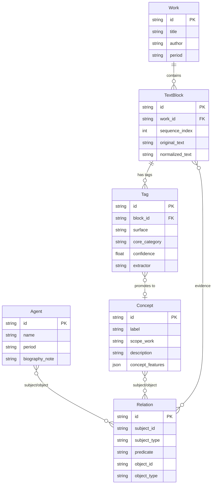

# 아키텍처 다이어그램

> Mermaid 문법으로 작성. GitHub, VSCode(Mermaid 확장), 또는 [Mermaid Live Editor](https://mermaid.live)에서 렌더링 가능.

---

## 1. 8층 데이터 모델

원본 저장소(L1~L4)와 해석 저장소(L5~L8)의 구조 및 의존 관계.

**핵심 원칙:**
- 원본 저장소는 **단일 정본**으로 수렴 (정답이 있다)
- 해석 저장소는 **다수 병존** (해석은 연구자마다 다르다)
- L4 확정 → 해석 저장소의 시작점 (저장소 경계)

---

## 2. 사용자 워크플로우 (UI 탭 기반)

탭 순서대로의 작업 흐름. 원본 작업(초록) → 해석 작업(보라) → 교차 뷰어(빨강).

**LLM 협업 패턴:** LLM이 draft → 사람이 review → 사람이 commit (2~8층 공통)

---

## 3. 시스템 아키텍처

프론트엔드, 백엔드, 저장소, 외부 서비스의 연결 구조.

**역할 분리:**
- **Git**: 저장, 이력, 버전, diff → 이미 있는 인프라
- **앱**: 관계, 의미, 경고, UI → 만들어야 할 것
- **원격 호스팅**: 백업, 동기화 → 교체 가능

---

## 4. 코어 스키마 엔티티 관계 (해석 저장소)

해석 저장소 내부의 엔티티 모델 (core-schema-v1.3).

**설계 보장:**
- 구조(Structure) ≠ 해석(Interpretation) — 코어는 구조만 저장
- 온톨로지 잠금 없음 — Concept는 자유 확장
- Tag → Concept 승격은 연구자 판단 (선택적)
- Predicate는 snake_case, 구조적 행위만 (해석 배제)

---

## 5. 층별 의존 관계

하위 층 변경이 상위 층에 미치는 영향.

