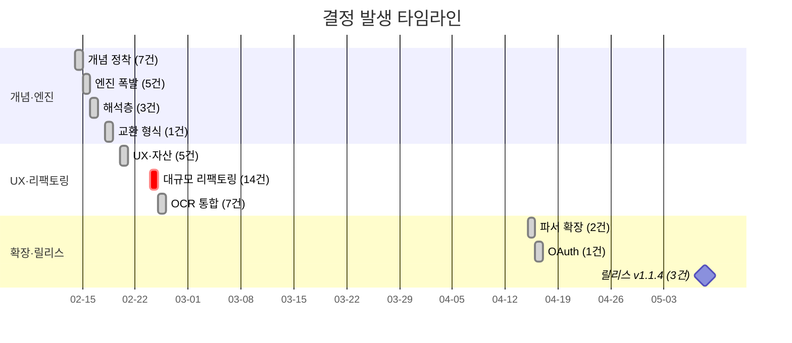

# 통합 타임라인

> 결정(D-XXX)과 세션을 일자별로 통합한 회고용 타임라인. 세션 자체에는 명시적 날짜가 없으므로 결정 기록에서 추정한 일자 + git 로그를 기준으로 한다.

## 한눈에 보기 (간트)



## ASCII 막대 (오프라인 보조)

```
2026-02-14 │ █████████████████        7  ← 개념 정착
2026-02-15 │ ████████████             5  ← 엔진 폭발
2026-02-16 │ ███████                  3  ← 해석층
2026-02-18 │ ██▌                      1
2026-02-20 │ ████████████             5  ← UX·자산
2026-02-24 │ ██████████████████████████████████ 14  ★ 대규모 리팩토링
2026-02-25 │ █████████████████        7  ← OCR 통합
2026-04-15 │ █████                    2
2026-04-16 │ ██▌                      1
2026-05-08 │ ███████                  3  ← 릴리스 v1.1.4
```

더 많은 시각화 → [06_visualizations.md](06_visualizations.md)

## 단계 요약

| 시점 | 단계 | 핵심 |
|---|---|---|
| 2026-02-14 | **개념 정착** | "IDE는 비유다" 정체성, 8층 모델 확정, Block 용어 분화, 원본/해석 저장소 분리 |
| 2026-02-15 | **엔진 설계 폭발** | OCR 플러그인, LLM 5단 폴백, 정렬 엔진, KORCIS 고도화, L5 표점/현토 (Phase 10 시리즈) |
| 2026-02-16 | **해석층 데이터 모델** | L6 번역, L7 주석, Git 그래프 사다리형 (Phase 11~12) |
| 2026-02-18 | **교환 형식** | JSON 스냅샷 Export/Import |
| 2026-02-20 | **UX·자산** | 사전형 주석, 인용 마크, 범용 에셋, GUI 서고, 휴지통 |
| 2026-02-24 | **대규모 리팩토링 (14건)** | `.git` 오염 수정, 액티비티 바, server.py 분할, SSE, 정렬 최적화, 잘림 방지·캐시 등 |
| 2026-02-25 | **OCR 통합 폭발 (7건)** | NDLOCR-Lite, NDL古典籍OCR-Lite/Full, ndlkotenocr 호환성·캐시 버그 |
| 2026-04-15~16 | **파서 확장** | IIIF/KOSTMA/장서각/규장각, 교정 자유 편집 모드, OpenAI OAuth 프록시 |
| 2026-05-08 | **릴리스 v1.1.4** | SikuRoBERTa 자동 연동, OAuth 자동 기동, 인용/주석 스냅샷 폴백 |

## 일자별 세부

### 2026-02-14

**결정**

- [D-001](02_decisions.md#d-001---ide-는-비유다-프로젝트의-정체성) "IDE"는 비유다 — 프로젝트의 정체성
- [D-002](02_decisions.md#d-002--l3-레이아웃의-block-ocr-읽기-순서-단위) L3 레이아웃의 Block = OCR 읽기 순서 단위
- [D-003](02_decisions.md#d-003--block이라는-용어의-세-가지-쓰임-정리) Block이라는 용어의 세 가지 쓰임 정리
- [D-004](02_decisions.md#d-004--층-번호와-실제-작업-순서는-다를-수-있다) 층 번호와 실제 작업 순서는 다를 수 있다
- [D-005](02_decisions.md#d-005--block-간-원천-추적-source-ref-) Block 간 원천 추적 (source_ref)
- [D-006](02_decisions.md#d-006--프로젝트-이름-미정-) 프로젝트 이름 (미정)
- [D-007](02_decisions.md#d-007--저장소-백업-공유-전략) 저장소·백업·공유 전략

**세션 (추정 시점)**

- [bibliography.schema.json 검증 보고서](../sessions/D-008_bibliography_verification.md)

### 2026-02-15

**결정**

- [D-009](02_decisions.md#d-009--ocr-엔진-플러그인-아키텍처) OCR 엔진 플러그인 아키텍처
- [D-010](02_decisions.md#d-010--llm-5단-폴백-아키텍처) LLM 5단 폴백 아키텍처
- [D-012](02_decisions.md#d-012--정렬-엔진-difflib-이체자-보정) 정렬 엔진 — difflib + 이체자 보정
- [D-013](02_decisions.md#d-013--korcis-파서-고도화-008-해석-판식정보-openapi-보강) KORCIS 파서 고도화 — 008 해석 + 판식정보 + OpenAPI 보강
- [D-014](02_decisions.md#d-014--l5-끊어읽기-표점-현토-편집기-아키텍처) L5 끊어읽기(표점)·현토 편집기 아키텍처

**세션 (추정 시점)**

- [Phase 10-12 상세 설계 및 세션 지시문](../sessions/phase10_12_design_pointer.md)
- [Phase 10-1: OCR 엔진 연동 파이프라인](../sessions/phase10_1_ocr_session.md)
- [Phase 10-2: LLM 4단 폴백 아키텍처 + 레이아웃 분석](../sessions/phase10_2_llm_session.md)
- [Phase 10-3: 정렬 엔진 — OCR ↔ 텍스트 대조](../sessions/phase10_3_alignment_session.md)
- [Phase 10-4: KORCIS 파서 고도화 (선택적)](../sessions/phase10_4_korcis_session.md)
- [Phase 11-1: 끊어읽기·표점·현토 편집기 (L5)](../sessions/phase11_1_hyeonto_session.md)
- [세션 네비게이터 — Phase 10-12 구현 로드맵](../sessions/session_navigator.md)

### 2026-02-16

**결정**

- [D-015](02_decisions.md#d-015--l6-번역-데이터-모델-llm-번역-워크플로우) L6 번역 데이터 모델 + LLM 번역 워크플로우
- [D-016](02_decisions.md#d-016--l7-주석-데이터-모델-주석-유형-관리) L7 주석 데이터 모델 + 주석 유형 관리
- [D-017](02_decisions.md#d-017--git-그래프-사다리형-이분-그래프-based-on-original-trailer) Git 그래프 — 사다리형 이분 그래프 + Based-On-Original trailer

**세션 (추정 시점)**

- [Phase 11-2: 번역 워크플로우 + LLM (L6)](../sessions/phase11_2_translation_session.md)
- [Phase 11-3: 주석/사전 연동 (L7)](../sessions/phase11_3_annotation_session.md)
- [Phase 12-1: Git 그래프 완전판](../sessions/phase12_1_git_graph_session.md)
- [Phase 12 상세 설계: Git 그래프 (12-1) + JSON 스냅샷 (12-3)](../sessions/phase12_design.md)

### 2026-02-18

**결정**

- [D-018](02_decisions.md#d-018--json-스냅샷-export-import-교환-형식-설계) JSON 스냅샷 Export/Import — 교환 형식 설계

**세션 (추정 시점)**

- [Phase 12-3: JSON 스냅샷 Export/Import](../sessions/phase12_3_json_snapshot_session.md)

### 2026-02-20

**결정**

- [D-019](02_decisions.md#d-019--사전형-주석-dictionary-annotation-아키텍처) 사전형 주석 (Dictionary Annotation) 아키텍처
- [D-020](02_decisions.md#d-020--인용-마크-시스템-citation-mark-아키텍처) 인용 마크 시스템 (Citation Mark) 아키텍처
- [D-021](02_decisions.md#d-021--범용-에셋-감지-다운로드-generic-asset-detection-) 범용 에셋 감지 + 다운로드 (Generic Asset Detection)
- [D-022](02_decisions.md#d-022--gui에서-서고-library-관리) GUI에서 서고(Library) 관리
- [D-023](02_decisions.md#d-023--휴지통-시스템-trash-restore-) 휴지통 시스템 (Trash/Restore)

### 2026-02-24

**결정**

- [D-024](02_decisions.md#d-024---git-오염-버그-수정-서고-백업) .git 오염 버그 수정 + 서고 백업
- [D-025](02_decisions.md#d-025--하단-패널-액티비티-바-이동-급행-정거장-커밋-뷰) 하단 패널 → 액티비티 바 이동 + 급행 정거장 커밋 뷰
- [D-026](02_decisions.md#d-026--비교-탭-l5-표점-현토-표시-수정) 비교 탭 L5 표점/현토 표시 수정
- [D-027](02_decisions.md#d-027--server-py-모놀리스-8개-라우터-분할) server.py 모놀리스 → 8개 라우터 분할
- [D-028](02_decisions.md#d-028--sse-스트리밍-llm-호출-진행-바-ui) SSE 스트리밍 LLM 호출 + 진행 바 UI
- [D-029](02_decisions.md#d-029--인용-내보내기-양식-관리자-cite-format-manager-) 인용 내보내기 양식 관리자 (Cite Format Manager)
- [D-030](02_decisions.md#d-030--전문-편집기-파일-경로-통합-layer-file-path-reconciliation-) 전문 편집기 파일 경로 통합 (Layer File Path Reconciliation)
- [D-031](02_decisions.md#d-031--표점-오프셋-보정-display-original-변환-) 표점 오프셋 보정 (Display → Original 변환)
- [D-032](02_decisions.md#d-032--정렬-알고리즘-최적화-n-gram-후보-필터링) 정렬 알고리즘 최적화 — n-gram 후보 필터링
- [D-033](02_decisions.md#d-033--llm-응답-잘림-방지-결과-캐시) LLM 응답 잘림 방지 + 결과 캐시
- [D-034](02_decisions.md#d-034--비교-탭-l6-l7-표시-전용-api-호출-분기) 비교 탭 L6/L7 표시 + 전용 API 호출 분기
- [D-035](02_decisions.md#d-035--주석-라우터-확장-블록-탐색-원문-로드-수정-필드-확장) 주석 라우터 확장 — 블록 탐색 + 원문 로드 + 수정 필드 확장
- [D-036](02_decisions.md#d-036--주석-유형-관리-ux-개선-모달-다이얼로그) 주석 유형 관리 UX 개선 — 모달 다이얼로그
- [D-037](02_decisions.md#d-037--hwp-hwpx-pdf-가져오기-기능-일시-비활성화) HWP/HWPX/PDF 가져오기 기능 일시 비활성화

### 2026-02-25

**결정**

- [D-038](02_decisions.md#d-038--ndlocr-lite-통합-세-번째-ocr-엔진-서버사이드-레이아웃-감지) NDLOCR-Lite 통합 — 세 번째 OCR 엔진 + 서버사이드 레이아웃 감지
- [D-039](02_decisions.md#d-039--ndl-ocr-lite-통합-고전적-전용-ocr-엔진-paddleocr-레이스-컨디션-수정) NDL古典籍OCR-Lite 통합 — 고전적 전용 OCR 엔진 + PaddleOCR 레이스 컨디션 수정
- [D-040](02_decisions.md#d-040--ndlkotenocr-ocr-파이프라인-업스트림-class-index-호환성-복원) ndlkotenocr OCR 파이프라인 — 업스트림 class_index 호환성 복원
- [D-041](02_decisions.md#d-041--ndlkotenocr-parseq-rgb-입력-bgr-변환-금지-) ndlkotenocr PARSeq — RGB 입력 (BGR 변환 금지)
- [D-042](02_decisions.md#d-042--loadocrresults-브라우저-캐시-누락-버그) loadOcrResults() 브라우저 캐시 누락 버그
- [D-043](02_decisions.md#d-043--ndl-ocr-lite-모델-한계와-커스텀-모델-사용-안내) NDL古典籍OCR-Lite — 모델 한계와 커스텀 모델 사용 안내
- [D-044](02_decisions.md#d-044--ndl-ocr-full-trocr-하이브리드-고품질-ocr-엔진) NDL古典籍OCR Full (TrOCR) — 하이브리드 고품질 OCR 엔진

### 2026-04-15

**결정**

- [D-045](02_decisions.md#d-045--서지-파서-확장-국립공문서관-iiif-kostma-장서각-규장각) 서지 파서 확장 — 국립공문서관 IIIF + KOSTMA + 장서각 + 규장각
- [D-046](02_decisions.md#d-046--교정-편집기-자유-편집-모드-diff-기반-corrections-자동-생성) 교정 편집기 자유 편집 모드 — diff 기반 corrections 자동 생성

**세션 (추정 시점)**

- [세션: 서지정보 파서 보완 — URL 자동 인식 + KORCIS](../sessions/session_fix_parsers.md)

### 2026-04-16

**결정**

- [D-047](02_decisions.md#d-047--openai-oauth-프록시-프로바이더-추가) OpenAI OAuth 프록시 프로바이더 추가

### 2026-05-08

**결정**

- [D-048](02_decisions.md#d-048--외부-sikuroberta-표점-서비스-자동-연동) 외부 SikuRoBERTa 표점 서비스 자동 연동
- [D-049](02_decisions.md#d-049--windows-시작-배치파일의-openai-oauth-자동-기동) Windows 시작 배치파일의 OpenAI OAuth 자동 기동
- [D-050](02_decisions.md#d-050--주석-인용-탭의-블록-선택-및-원문-스냅샷-폴백) 주석·인용 탭의 블록 선택 및 원문 스냅샷 폴백
