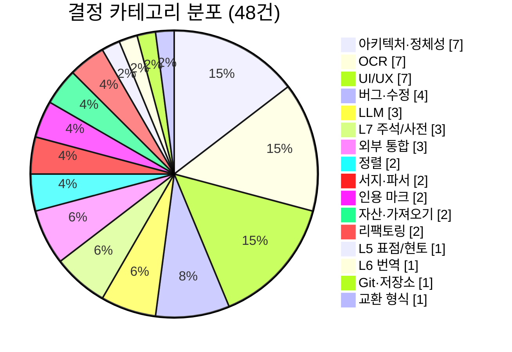
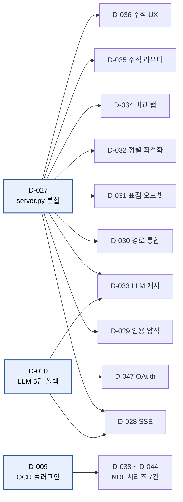

# 결정 카탈로그 (D-001 ~ D-050)

> 원본: [`../DECISIONS.md`](../DECISIONS.md) — 이 문서는 원본을 회고용으로 압축·재배열한 것이다. **원본을 수정하지 않는다.**

총 48개의 결정이 10일에 걸쳐 기록되었다.

## 카테고리 분포



## 결정 트리거 그래프 — 큰 결정이 작은 결정을 허용한다



전체 트리거 그래프와 다른 시각화 → [06_visualizations.md](06_visualizations.md)

## 한눈에 보기

| 날짜 | 건수 | 주요 결정 |
|---|---|---|
| 2026-02-14 | 7 | D-001 "IDE"는 비유다 — 프로젝트의 정체성; D-002 L3 레이아웃의 Block = OCR 읽기 순서 단위; D-003 Block이라는 용어의 세 가지 쓰임 정리; D-004 층 번호와 실제 작업 순서는 다를 수 있다; D-005 Block 간 원천 추적 (source_ref); D-006 프로젝트 이름 (미정); D-007 저장소·백업·공유 전략 |
| 2026-02-15 | 5 | D-009 OCR 엔진 플러그인 아키텍처; D-010 LLM 5단 폴백 아키텍처; D-012 정렬 엔진 — difflib + 이체자 보정; D-013 KORCIS 파서 고도화 — 008 해석 + 판식정보 + OpenAPI 보강; D-014 L5 끊어읽기(표점)·현토 편집기 아키텍처 |
| 2026-02-16 | 3 | D-015 L6 번역 데이터 모델 + LLM 번역 워크플로우; D-016 L7 주석 데이터 모델 + 주석 유형 관리; D-017 Git 그래프 — 사다리형 이분 그래프 + Based-On-Original trailer |
| 2026-02-18 | 1 | D-018 JSON 스냅샷 Export/Import — 교환 형식 설계 |
| 2026-02-20 | 5 | D-019 사전형 주석 (Dictionary Annotation) 아키텍처; D-020 인용 마크 시스템 (Citation Mark) 아키텍처; D-021 범용 에셋 감지 + 다운로드 (Generic Asset Detection); D-022 GUI에서 서고(Library) 관리; D-023 휴지통 시스템 (Trash/Restore) |
| 2026-02-24 | 14 | D-024 .git 오염 버그 수정 + 서고 백업; D-025 하단 패널 → 액티비티 바 이동 + 급행 정거장 커밋 뷰; D-026 비교 탭 L5 표점/현토 표시 수정; D-027 server.py 모놀리스 → 8개 라우터 분할; D-028 SSE 스트리밍 LLM 호출 + 진행 바 UI; D-029 인용 내보내기 양식 관리자 (Cite Format Manager); D-030 전문 편집기 파일 경로 통합 (Layer File Path Reconciliation); D-031 표점 오프셋 보정 (Display → Original 변환); D-032 정렬 알고리즘 최적화 — n-gram 후보 필터링; D-033 LLM 응답 잘림 방지 + 결과 캐시; D-034 비교 탭 L6/L7 표시 + 전용 API 호출 분기; D-035 주석 라우터 확장 — 블록 탐색 + 원문 로드 + 수정 필드 확장; D-036 주석 유형 관리 UX 개선 — 모달 다이얼로그; D-037 HWP/HWPX/PDF 가져오기 기능 일시 비활성화 |
| 2026-02-25 | 7 | D-038 NDLOCR-Lite 통합 — 세 번째 OCR 엔진 + 서버사이드 레이아웃 감지; D-039 NDL古典籍OCR-Lite 통합 — 고전적 전용 OCR 엔진 + PaddleOCR 레이스 컨디션 수정; D-040 ndlkotenocr OCR 파이프라인 — 업스트림 class_index 호환성 복원; D-041 ndlkotenocr PARSeq — RGB 입력 (BGR 변환 금지); D-042 loadOcrResults() 브라우저 캐시 누락 버그; D-043 NDL古典籍OCR-Lite — 모델 한계와 커스텀 모델 사용 안내; D-044 NDL古典籍OCR Full (TrOCR) — 하이브리드 고품질 OCR 엔진 |
| 2026-04-15 | 2 | D-045 서지 파서 확장 — 국립공문서관 IIIF + KOSTMA + 장서각 + 규장각; D-046 교정 편집기 자유 편집 모드 — diff 기반 corrections 자동 생성 |
| 2026-04-16 | 1 | D-047 OpenAI OAuth 프록시 프로바이더 추가 |
| 2026-05-08 | 3 | D-048 외부 SikuRoBERTa 표점 서비스 자동 연동; D-049 Windows 시작 배치파일의 OpenAI OAuth 자동 기동; D-050 주석·인용 탭의 블록 선택 및 원문 스냅샷 폴백 |

## 결정 카드

### D-001 — "IDE"는 비유다 — 프로젝트의 정체성

- **날짜**: 2026-02-14

**맥락**

> 프로젝트 문서에서 "CJK Classical Text IDE"라고 명명했는데, 이것의 의미를 명확히 할 필요가 있다.

---

### D-002 — L3 레이아웃의 Block = OCR 읽기 순서 단위

- **날짜**: 2026-02-14

**맥락**

> "Block"이라는 단어가 L2/L3과 코어 스키마에서 모두 쓰이는데 혼동의 여지가 있었다. L3의 Block이 정확히 무엇인지 명확히 한다.

---

### D-003 — Block이라는 용어의 세 가지 쓰임 정리

- **날짜**: 2026-02-14

---

### D-004 — 층 번호와 실제 작업 순서는 다를 수 있다

- **날짜**: 2026-02-14

---

### D-005 — Block 간 원천 추적 (source_ref)

- **날짜**: 2026-02-14

---

### D-006 — 프로젝트 이름 (미정)

- **날짜**: 2026-02-14
- **상태**: 미결

---

### D-007 — 저장소·백업·공유 전략

- **날짜**: 2026-02-14

**맥락**

> Git을 모르는 연구자에게 Google Drive만 쓰게 하면 되지 않느냐는 질문이 나왔다.
> 
> **분석**:
> 
> 이 플랫폼에서 Git 명령어를 연구자가 직접 치지는 않는다. 앱이 GitPython을 통해 처리한다:
> - "저장" 버튼 → 앱이 git commit
> - "이전 버전" 버튼 → 앱이 git log + diff
> - "변경됨 ⚠️" 경고 → 앱이 git diff --name-only
> 
> 단, 연구자가 해야 하는 **설정·연동 절차**는 있다 (모두 앱 UI를 통해):
> - 초기: "서고 만들기" → 로컬 폴더 선택 → 앱이 git init
> - 원격: "원격 연결" → GitHub/GitLab URL 입력 → 앱이 git remote add
> - 일상: "동기화" 버튼 → 앱이 git push/pull
> - 협업: "서고 가져오기" → URL 입력 → 앱이 git clone
> 
> 즉 **Git의 개념(저장·이력·동기화)은 이해해야 하지만, 명령어는 몰라도 된다**.
> 
> "파일을 어디에 두느냐"와 "이력을 어떻게 관리하느냐"는 별개의 문제:
> 
> | 역할 | 수단 | 대체 불가 여부 |
> |---|---|---|
> | 버전 이력·diff·의존 추적 | Git (내부) | **대

---

### D-009 — OCR 엔진 플러그인 아키텍처

- **날짜**: 2026-02-15
- **상태**: 확정

**결정**

모든 OCR 엔진은 `BaseOcrEngine`을 상속하고, `OcrEngineRegistry`로 등록/조회하며,
`OcrPipeline`을 통해서만 실행한다 (엔진 직접 호출 금지).

| 구성 요소 | 역할 |
|-----------|------|
| `BaseOcrEngine` | 추상 클래스 — `recognize(image_bytes)` 인터페이스 |
| `OcrEngineRegistry` | 엔진 등록/조회/기본 엔진 관리 |
| `OcrPipeline` | L3 bbox → 이미지 크롭 → OCR → L2 JSON 저장 |
| `PaddleOcrEngine` | 기본 엔진 — 오프라인 퍼스트, 한문 세로쓰기 지원 |

**파이프라인 흐름**:
```
L3 LayoutBlock (bbox) → image_utils.crop_block() → OCR 엔진 → OcrBlockResult → L2 JSON
```

**스키마**:
- 입력: `layout_page.schema.json` (L3)
- 출력: `ocr_page.schema.json` (L2)
- `additionalProperties: false` — 스키마에 없는 필드는 저장 금지

---

### D-010 — LLM 5단 폴백 아키텍처

- **날짜**: 2026-02-15

**맥락**

> LLM 호출을 어떤 구조로 관리할 것인가. 프로젝트 초기라 API 키가 없을 수도, 로컬 모델만 쓸 수도, 유료 API를 쓸 수도 있다.

---

### D-012 — 정렬 엔진 — difflib + 이체자 보정

- **날짜**: 2026-02-15
- **상태**: 확정

**맥락**

> OCR 결과(L2)와 확정 텍스트(L4)를 글자 단위로 대조하는 정렬 엔진이 필요하다.
> 고전 한문에서는 같은 글자의 다른 자형(이체자, 同字異形)이 흔해서 단순 문자열 비교로는 불충분하다.

**결정**

`difflib.SequenceMatcher`를 기반으로 한 글자 단위 정렬 + 이체자 사전 보정 방식을 채택한다.

| 구성 요소 | 역할 |
|-----------|------|
| `align_texts()` | 두 텍스트를 글자 단위로 정렬, SequenceMatcher 사용 |
| `VariantCharDict` | 이체자 사전 — 양방향 조회, JSON 파일 기반 |
| `align_page()` | L2 + L4 파일을 읽어 블록별 + 페이지 전체 대조 |
| `_find_best_match_in_ref()` | L4 평문에서 L2 블록에 대응하는 구간을 슬라이딩 윈도우로 탐색 |

**매치 타입** (5종):

| 타입 | 의미 | 예시 |
|------|------|------|
| `exact` | 완전 일치 | 王 ↔ 王 |
| `variant` | 이체자 일치 (사전 등록 필요) | 裴 ↔ 裵 |
| `mismatch` | 불일치 (OCR 오류 또는 원문 차이) | 寬 ↔ 寒 |
| `insertion` | L4에만 존재 (OCR 누락) | — ↔ 清 |
| `deletion` | L2에만 존재 (OCR 오삽입) | 餘 ↔ — |

**L4 블록 매칭 전략**:
L4는 평문 텍스트(.txt)로 블록 경계가 없다. 블록별 대조를 위해:
1. L2 블록 텍스트 길이와 동일한 윈도우로 L4 전체를 슬라이딩 탐색
2. SequenceMatcher.ratio()가 최대인 구간을 해당 블록의 대응 구간으로 결정
3. 2글자 마진 확장을 시도하여 정확도가 올라가면 채택

---

### D-013 — KORCIS 파서 고도화 — 008 해석 + 판식정보 + OpenAPI 보강

- **날짜**: 2026-02-15

**맥락**

> Phase 10-4. 기존 KORCIS 파서(HTML 스크래핑 + MARC 팝업)로는 판식정보(printing_info), 간행사항(publishing), 권책수(extent) 등 고서 핵심 서지정보를 채울 수 없었다.

**결정**

1. **KORMARC 008 고정길이 필드 해석기 추가** — 위치 06(날짜유형), 07-10(연도1), 11-14(연도2), 35-37(언어코드), 38(수정기호)를 코드 테이블로 해석.
2. **판식정보 구조화 추출기 추가** — 정규표현식으로 광곽/행자수/어미/계선/판구/판심제 등을 `printing_info` 스키마 필드로 매핑. 원문은 `summary`에 보존.
3. **KORCIS OpenAPI 보강 경로** — 기존 HTML 스크래핑을 유지하면서, OpenAPI(`nl.go.kr/korcis/openapi/`)를 보조 소스로 추가. FORM_INFO(판식정보), HOLDINFO(소장처)는 OpenAPI에서만 제공.
4. **매퍼 통합** — MARC 260(간행사항→`publishing`), MARC 300(형태사항→`extent`), OpenAPI FORM_INFO(→`printing_info`)를 `map_to_bibliography()`에 반영.
5. **GUI 라이트그레이 테마** — CSS 변수 기반 다크/라이트 테마 전환. `[data-theme="light"]`로 변수 오버라이드, localStorage에 저장, 액티비티 바 하단에 토글 버튼.

**근거**

> - 기존 HTML 스크래핑 경로를 제거하지 않고 보강하여 하위 호환성 유지
> - OpenAPI는 API 키 없이도 동작(KORCIS 공식 가이드)
> - CSS 변수 기반 테마 전환은 빌드 도구 없는 프로젝트에 적합
> 
> ---

---

### D-014 — L5 끊어읽기(표점)·현토 편집기 아키텍처

- **날짜**: 2026-02-15

**맥락**

> 고전 한문에 구두점(句讀)과 한글 현토(懸吐)를 붙이는 L5 계층 편집기가 필요하다.

---

### D-015 — L6 번역 데이터 모델 + LLM 번역 워크플로우

- **날짜**: 2026-02-16

**맥락**

> L5 표점으로 분리된 문장 단위의 번역을 관리하는 L6 계층이 필요하다.

---

### D-016 — L7 주석 데이터 모델 + 주석 유형 관리

- **날짜**: 2026-02-16

**맥락**

> 원문의 인물·지명·용어·전거(고사/출전)에 주석을 다는 L7 계층이 필요하다.

---

### D-017 — Git 그래프 — 사다리형 이분 그래프 + Based-On-Original trailer

- **날짜**: 2026-02-16

**맥락**

> 원본 저장소(L1-L4)와 해석 저장소(L5-L7)의 커밋 이력을
> 나란히 보여주면, 해석 작업이 어떤 원본 시점을 기반했는지 직관적으로 파악할 수 있다.

---

### D-018 — JSON 스냅샷 Export/Import — 교환 형식 설계

- **날짜**: 2026-02-18

**맥락**

> Work(원본 L1-L4 + 해석 L5-L7 + 메타데이터)를 단일 JSON으로
> 직렬화하여 백업, 복원, 다른 환경 이동을 지원해야 한다.

---

### D-019 — 사전형 주석 (Dictionary Annotation) 아키텍처

- **날짜**: 2026-02-20

**맥락**

> L7 주석이 단순 태깅(인물/지명/용어 식별 + label/description)만 지원하여,
> 연구자가 원하는 사전 형식의 체계적 주석이 불가능했다. 표제어, 사전적 의미, 문맥적 의미,
> 출전을 기록하고, LLM이 4단계에 걸쳐 누적적으로 생성하며, 다른 문헌에서도 참조할 수 있는
> 독립 사전으로 내보낼 수 있는 시스템이 필요했다.

---

### D-020 — 인용 마크 시스템 (Citation Mark) 아키텍처

- **날짜**: 2026-02-20

**맥락**

> 연구자가 원문(L4)이나 번역(L6)을 읽으면서 나중에 논문에 인용할 구절을
> 마크업하고, 마크된 구절에 대해 원문+표점본+번역+주석을 한눈에 보며,
> 학술 인용 형식으로 내보내는 기능이 필요했다.
> 
> **인용 형식**: `著者名, 書名卷數, 작품제목, 관련페이지(부가정보) : 표점된 원문`
> 예시: `朴趾源, 燕岩集卷2, 答巡使書 25면(韓國文集叢刊252집, 48면) : 若吾所樂者善，而所敬者天也。`

---

### D-021 — 범용 에셋 감지 + 다운로드 (Generic Asset Detection)

- **날짜**: 2026-02-20

**맥락**

> 기존에는 일본 국립공문서관(`archives_jp`)만 PDF 자동 다운로드를 지원했다.
> 다른 기관 URL에서도 PDF나 이미지 파일을 자동으로 감지하여 다운로드할 수 있어야 한다.

---

### D-022 — GUI에서 서고(Library) 관리

- **날짜**: 2026-02-20

**맥락**

> 서고 경로(`--library`)는 CLI 인자로만 지정 가능하고, 서버 시작 후 변경할 수 없었다.
> GUI에서 서고를 전환·생성·최근 목록 조회할 수 있어야 한다.

---

### D-023 — 휴지통 시스템 (Trash/Restore)

- **날짜**: 2026-02-20

**맥락**

> 문헌이나 해석 저장소를 삭제할 때 영구 삭제는 위험하다.
> 복원 가능한 소프트 삭제가 필요하다.

---

### D-024 — .git 오염 버그 수정 + 서고 백업

- **날짜**: 2026-02-24

**맥락**

> `document.py`의 `repo.index.add(["."])`(GitPython 저수준 API)가
> `.git/` 내부 파일까지 인덱스에 추가하여, push가 차단되는 버그 발생.
> 또한 비개발자 연구자가 구글 드라이브 등에 서고를 쉽게 백업할 방법이 없었다.

---

### D-025 — 하단 패널 → 액티비티 바 이동 + 급행 정거장 커밋 뷰

- **날짜**: 2026-02-24

**맥락**

> 하단 패널의 5개 탭(Git 이력, 검증 결과, 의존 추적, 엔티티, 비고)이
> 가로로 늘어서 화면을 차지하고, Git 커밋 목록은 교정 저장마다 자동 생성되어
> 불필요하게 길었다.

---

### D-026 — 비교 탭 L5 표점/현토 표시 수정

- **날짜**: 2026-02-24

**맥락**

> 교차뷰어 비교 모드에서 L5(구두점) 탭을 선택하면 내용이 표시되지 않는 버그.
> 비교 탭이 `/layers/L5_reading/main_text/pages/{num}` API를 호출하는데,
> 이 API가 찾는 `page_001.json` 파일은 존재하지 않았다.
> 실제 L5 데이터는 `_punctuation.json`과 `_hyeonto.json` 접미사 파일에 저장되기 때문.

**결정**

1. **페이지 단위 L5 비교 전용 API 신설**:
   `GET /api/interpretations/{id}/pages/{num}/l5_compare?kind=punctuation|hyeonto`
   한 페이지의 모든 블록의 표점 또는 현토 파일을 glob으로 수집하여
   `blocks`(원본 JSON)과 `text_summary`(줄 단위 비교용 텍스트)를 반환.

2. **L5 종류 선택 UI 추가**: 교차뷰어 서브탭 바 아래에 "표점/현토" 라디오 버튼.
   L5_reading 탭에서만 표시. 기본값은 표점(punctuation).

3. **비교 패널 API 분기**: `_fetchComparePane()`에서 L5 레이어일 때
   기존 `/layers/` API 대신 `/l5_compare` API를 호출.

**수정 파일**: `server.py`, `interpretation.js`, `index.html`, `workspace.css`

---

### D-027 — server.py 모놀리스 → 8개 라우터 분할

- **날짜**: 2026-02-24

**맥락**

> server.py가 7,718줄, 158개 라우트, 67개 Pydantic 모델을 담은 모놀리스로 성장.
> LLM 컨텍스트 윈도우(500-2,000줄이 적정)를 초과하여 코드 리뷰·수정 시 효율 저하.
> 3-AI 크로스 리뷰(Claude/Codex/Gemini)에서 공통 1순위로 분할이 권고됨.

**결정**

1. **도메인별 8개 APIRouter 모듈로 분할**:
   FastAPI의 `APIRouter` 패턴으로, 각 도메인(서고/문헌/해석/LLM·OCR/정렬/독해/주석/버전)을
   독립 파일로 추출. server.py는 ~85줄 조립 파일로 축소.

2. **공유 상태 모듈 `_state.py` 신설**:
   전역 상태(`_library_path`, `_llm_router`, `_llm_drafts`, `_ocr_pipeline`)와
   공유 헬퍼(`_get_llm_router()`, `_resolve_repo_path()`, `_call_llm_text()` 등)를 집약.
   라우터는 `_state.py`에서만 상태를 가져오고, 라우터 간 직접 import 금지.

3. **순환 import 방지**: `_state.py`는 core/llm/ocr 모듈을 lazy import.
   라우터→`_state`→core 단방향 의존만 허용.

4. **하위 호환**: `from app.server import configure, app, _get_llm_router` 경로 유지.
   `__main__.py`, `parsers/generic_llm.py` 등 기존 코드 변경 불필요.

**파일 구조** (2026-04-14 기준):
```
src/app/
├── server.py            ← 앱 생성 + 라우터 마운트 + configure() (~85줄)
├── _state.py            ← 공유 상태 + 헬퍼 (~930줄)
├── __main__.py          ← CLI 진

---

### D-028 — SSE 스트리밍 LLM 호출 + 진행 바 UI

- **날짜**: 2026-02-24

**맥락**

> LLM 분석(표점·번역·주석)은 10-30초가 걸리는데, 기존 구현은
> 응답이 올 때까지 UI가 멈춘 것처럼 보였다. 사용자가 진행 상황을 실시간으로
> 확인할 수 있어야 한다.

---

### D-029 — 인용 내보내기 양식 관리자 (Cite Format Manager)

- **날짜**: 2026-02-24

**맥락**

> D-020에서 인용 마크의 기본 내보내기 형식을 구현했으나,
> 학술지마다 인용 양식이 다르다. 연구자가 양식을 정의·저장·재사용할 수 있어야 한다.

---

### D-030 — 전문 편집기 파일 경로 통합 (Layer File Path Reconciliation)

- **날짜**: 2026-02-24

**맥락**

> D-027(라우터 분할) 후 세 가지 경로 불일치 버그 발견.
> 
> 1. `_get_resources_dir()`가 `src/resources/`(존재하지 않음)를 가리킴 → 이체자 탭 전체 동작 불가.
> 2. `core/alignment.py`의 `from src.core.document` → 정식 import 경로가 아님.
> 3. `get_layer_content()`가 전문 편집기(표점·번역·주석)의 실제 저장 경로를 모름 → 비교 탭 내용 미표시.

---

### D-031 — 표점 오프셋 보정 (Display → Original 변환)

- **날짜**: 2026-02-24

**맥락**

> 원문에 표점 부호(。！？ 등)를 삽입하여 DOM에 표시하면,
> Selection API가 반환하는 문자 오프셋에 표점 문자가 포함되어
> 원문 기준 `start/end`와 불일치하는 버그 발생.
> 주석 편집기와 인용 편집기 모두에서 동일 문제.

---

### D-032 — 정렬 알고리즘 최적화 — n-gram 후보 필터링

- **날짜**: 2026-02-24

**맥락**

> `_find_best_match_in_ref()`가 O(n*m) 전수 탐색으로,
> 대량 텍스트(수천 자)에서 느려지는 문제.

---

### D-033 — LLM 응답 잘림 방지 + 결과 캐시

- **날짜**: 2026-02-24

**맥락**

> LLM JSON 응답이 `max_tokens` 한도에서 잘려 파싱 오류가 발생하거나,
> 동일 입력에 대해 불필요한 반복 호출이 발생하는 문제.

---

### D-034 — 비교 탭 L6/L7 표시 + 전용 API 호출 분기

- **날짜**: 2026-02-24

**맥락**

> D-026에서 L5 비교를 수정했으나, L6(번역)·L7(주석) 비교 탭도
> 범용 `/layers/` API가 전문 편집기의 실제 저장 경로를 찾지 못해 빈 화면이 표시되는 동일 문제.
> 또한 Git 커밋 기반 비교에서도 전문 편집기 파일 경로 우선순위가 역전되어 빈 파일을 읽는 버그.

---

### D-035 — 주석 라우터 확장 — 블록 탐색 + 원문 로드 + 수정 필드 확장

- **날짜**: 2026-02-24

**맥락**

> 사전형 주석(D-019)의 4단계 생성과 AI 태깅이 블록별 원문 텍스트를
> 직접 로드해야 하는데, 기존에는 별도 헬퍼 없이 라우터 핸들러 안에서 인라인 처리.
> 또한 주석 수정 API(`PUT`)가 기본 필드(target, type, content, status)만 허용하여
> 사전형 필드(dictionary, generation_history 등)를 수정할 수 없었다.

---

### D-036 — 주석 유형 관리 UX 개선 — 모달 다이얼로그

- **날짜**: 2026-02-24

**맥락**

> 주석 유형 관리가 `prompt()` 4연타로 ID/라벨/색상/아이콘을 입력받는 구조.
> 기존 유형 목록 확인 불가, 삭제 UI 없음, 컬러 피커 없음.

---

### D-037 — HWP/HWPX/PDF 가져오기 기능 일시 비활성화

- **날짜**: 2026-02-24
- **상태**: 준비중

**맥락**

> hwp-import.js로 구현된 HWP/HWPX/PDF 텍스트 가져오기 기능이
> 아직 안정적이지 않아 사용자에게 혼란을 줄 수 있다.

---

### D-038 — NDLOCR-Lite 통합 — 세 번째 OCR 엔진 + 서버사이드 레이아웃 감지

- **날짜**: 2026-02-25

**맥락**

> PaddleOCR이 Python 3.13 + Windows 환경에서 PaddlePaddle의 OneDNN 런타임 오류로
> 동작하지 않는 문제. 대안으로 일본 국립국회도서관의 ndlocr-lite를 세 번째 OCR 엔진으로 통합.

---

### D-039 — NDL古典籍OCR-Lite 통합 — 고전적 전용 OCR 엔진 + PaddleOCR 레이스 컨디션 수정

- **날짜**: 2026-02-25

**맥락**

> D-038에서 통합한 NDLOCR-Lite는 근현대 인쇄 자료 범용 엔진이다.
> 에도 이전 와고서, 청대 이전 한적 등 고전적(古典籍) 자료에 특화된
> ndlkotenocr-lite를 네 번째 OCR 엔진으로 추가하고, 기존 PaddleOCR의
> 공유 인스턴스 레이스 컨디션 버그도 함께 수정한다.

**결정**

1. **RTMDet 레이아웃 탐지기 벤더링**: ndlkotenocr-lite의 RTMDet(1280×1280 입력, BGR)을
   `src/ocr/ndlkotenocr/rtmdet.py`에 벤더링. 업스트림은 `class_index=1`을 하드코딩하지만,
   우리 버전은 **실제 모델 출력 class_id를 보존**하여 16클래스 레이아웃 감지를 지원한다.

2. **단일 PARSeq 모델 (캐스케이드 없음)**: ndlocr의 3단계 PARSeq 캐스케이드와 달리,
   ndlkotenocr는 단일 PARSeq 모델(32×384)만 사용. 고전적 문자셋(NDLmoji.yaml, ~42KB) 전용.

3. **코드 공유**: `parseq.py`, `ndl_parser.py`, `reading_order/` 모듈은 기존 ndlocr 패키지에서 공유.
   RTMDet와 config 파일만 별도 벤더링하여 최소한의 코드 추가.

4. **ndl.yaml 호환성 매핑**: ndlkotenocr의 16개 클래스를 ndlocr의 ndl_parser.py와 호환:
   - `table` → `block_table` (ndl_parser가 인식하는 이름)
   - `line_note_dummy` → `line_note_tochu` (두주 클래스)

5. **엔진 등록 순서 변경**:
   NDL古典籍OCR-Lite(1순위, 기본 엔진) → NDLOCR-Lite(2순위) → LLM Vision(3순위, "느릴 수 있음") → PaddleOCR(4순위, Python 3.13 미지원)
   고전적 전용 엔진이 드롭다운

---

### D-040 — ndlkotenocr OCR 파이프라인 — 업스트림 class_index 호환성 복원

- **날짜**: 2026-02-25

**맥락**

> ndlkotenocr-lite 통합 후 OCR 결과가 비정상적으로 나오는 문제 발생.
> 업스트림 소스 비교 결과, 근본 원인은 `_process_detections()`에서
> RTMDet 탐지의 실제 `class_id`를 보존한 채 `resultobj`에 분배한 것.
> 
> **원인 분석**:
> - 업스트림 `rtmdet.py`의 `postprocess()`는 **모든 탐지의 class_index를 1(line_main)로 하드코딩**
> - 이는 OCR 파이프라인(ndl_parser → XY-Cut → PARSeq)이 모든 탐지를 LINE으로 처리하도록 설계됐기 때문
> - 우리 벤더링은 `detect_layout()` 지원을 위해 실제 class_id를 보존했으나,
>   `_process_detections()`에서도 실제 class_id를 사용하여 탐지가 16개 슬롯에 분산
> - 결과: 실제 행인데 class 0(text_block)으로 분류된 탐지가 LINE XML 요소가 되지 못하고
>   PARSeq 인식에서 누락 → 텍스트 빠짐, 순서 꼬임

---

### D-041 — ndlkotenocr PARSeq — RGB 입력 (BGR 변환 금지)

- **날짜**: 2026-02-25

**맥락**

> D-040 수정 후에도 ndlkotenocr OCR 결과가 비정상적.
> 업스트림 소스를 세밀하게 비교한 결과, PARSeq 전처리의 색상 채널 차이를 발견.
> 
> **원인 분석**:
> - ndlocr-lite PARSeq (`parseq.py`): 전처리에서 `resized[:,:,::-1]` (RGB→**BGR** 변환)
> - ndlkotenocr-lite PARSeq: 전처리에서 **RGB 그대로** (변환 없음)
> - 두 모델의 학습 데이터 전처리가 다름: ndlocr=BGR, ndlkotenocr=RGB
> - 우리 코드는 ndlocr의 PARSeq 클래스를 공유하므로,
>   ndlkotenocr 모델에 BGR 입력이 들어가 빨강↔파랑 채널 반전
> - 채널 반전으로 문자 특징이 왜곡되어 인식 정확도 대폭 하락

**결정**

1. 공유 `PARSEQ` 클래스에 `bgr_input: bool = True` 파라미터 추가
2. `bgr_input=True` (기본값): ndlocr 호환 — RGB→BGR 변환 수행
3. `bgr_input=False`: ndlkotenocr 호환 — RGB 그대로 유지
4. `ndlkotenocr_engine.py`에서 `PARSEQ(..., bgr_input=False)` 설정

---

### D-042 — loadOcrResults() 브라우저 캐시 누락 버그

- **날짜**: 2026-02-25

**맥락**

> D-040·D-041 수정 후 백엔드는 정상 OCR 결과를 생성하지만,
> GUI에서 "이전 결과와 같다"는 보고. 원인 조사 결과 프론트엔드 캐시 문제.
> 
> **원인 분석**:
> - `ocr-panel.js`의 `loadOcrResults()` — 페이지 전환 시 L2 OCR 결과를 불러오는 함수
> - `fetch()` 호출에 `cache: "no-store"` 옵션이 빠져 있음
> - 같은 파일의 `_fillFromOcr()`, `_deleteCurrentPageOcr()`에는 이미 있었음
> - 브라우저가 기본 캐싱 정책으로 이전 응답을 재사용
> - OCR 재실행 후에도 캐시된 옛 결과(D-041 수정 전 결과)가 표시됨

---

### D-043 — NDL古典籍OCR-Lite — 모델 한계와 커스텀 모델 사용 안내

- **날짜**: 2026-02-25

**맥락**

> ndlkotenocr-lite의 PARSeq 모델은 "tiny" 버전(~37MB)으로,
> 인식 정확도에 한계가 있다. 일부 행에서 □(U+25A1) 문자, 히라가나 오인식,
> 단일 문자 행 등이 발생한다. 비-lite 풀 모델을 사용하면 정확도가 올라가지만,
> 모델 크기가 크고 설치가 복잡하다.
> 
> **현재 모델 사양**:
> - RTMDet-S: `rtmdet-s-1280x1280.onnx` (~38MB) — 레이아웃/행 탐지
> - PARSeq tiny: `parseq-ndl-32x384-tiny-10.onnx` (~37MB) — 문자 인식
> - 합계 ~74MB, 자동 다운로드

---

### D-044 — NDL古典籍OCR Full (TrOCR) — 하이브리드 고품질 OCR 엔진

- **날짜**: 2026-02-25

**맥락**

> D-039에서 통합한 NDL古典籍OCR-Lite의 PARSeq-tiny 모델은
> 경량(~37MB)이지만 인식 정확도에 한계가 있다(D-043).
> NDL古典籍OCR 풀 버전(ndlkotenocr_cli ver.3)은 TrOCR 기반으로
> 정확도가 훨씬 높지만, PyTorch + GPU가 필요하다.

**결정**

RTMDet ONNX (lite) + TrOCR PyTorch (full) 하이브리드 엔진을 추가한다.

| 구성요소 | lite 엔진 | full 엔진 (하이브리드) |
|----------|----------|----------------------|
| 레이아웃 탐지 | RTMDet ONNX (~38MB) | RTMDet ONNX (lite 공유) |
| 문자 인식 | PARSeq-tiny ONNX (~37MB) | TrOCR PyTorch (~450MB) |
| GPU 필요 | 아니오 | 사실상 필요 (CPU도 동작하나 매우 느림) |
| 의존성 | onnxruntime (~50MB) | torch+CUDA ~4GB, transformers |

**하이브리드 접근 이유**:
- 업스트림 풀 버전은 CascadeRCNN(mmcv+mmdet)을 레이아웃에 사용하지만,
  Windows에서 mmcv/mmdet 설치가 극히 어려움
- RTMDet ONNX는 이미 검증되었고 동일한 클래스(16클래스) 구조를 공유
- 품질 향상의 대부분은 문자 인식(TrOCR)에서 발생

**등록 우선순위** (registry.py auto_register):
1. ndlkotenocr-full (TrOCR) — 최고 품질, torch+GPU 필요
2. ndlkotenocr (PARSeq-tiny) — 경량, CPU OK
3. ndlocr — 근현대 자료 범용
4. llm_vision — LLM 비전 기반
5. paddleocr — Python 3.13 미지원

**의존성 전략**:
- `ndlkotenocr-full` opt

---

### D-045 — 서지 파서 확장 — 국립공문서관 IIIF + KOSTMA + 장서각 + 규장각

- **날짜**: 2026-04-15

**맥락**

> 기존 파서 체계(NDL, 국립공문서관, KORCIS, 범용 LLM)에서
> 국립공문서관의 신형 `/file/` 페이지가 PDF 다운로드 실패했고,
> 한국 고전적 주요 DB(KOSTMA, 장서각, 규장각)는 범용 LLM 폴백만 가능하여
> 이미지 다운로드가 불가능했다.

---

### D-046 — 교정 편집기 자유 편집 모드 — diff 기반 corrections 자동 생성

- **날짜**: 2026-04-15

**맥락**

> 교정 시스템이 `char_index` 기반 1:1 글자 치환만 지원하여,
> 연구자가 OCR 오류를 수정할 때 글자 추가나 삭제가 불가능했다.

---

### D-047 — OpenAI OAuth 프록시 프로바이더 추가

- **날짜**: 2026-04-16

**맥락**

> API 키 없이 ChatGPT 계정으로 OpenAI 모델을 무료로 사용할 수 있는
> openai-oauth 프록시 연동 필요.

---

### D-048 — 외부 SikuRoBERTa 표점 서비스 자동 연동

- **날짜**: 2026-05-08

**맥락**

> yachagye의 Korean Classical Chinese Punctuation Prediction Model v2.5를
> 본체에 직접 넣으면 torch/transformers/대용량 가중치 때문에 설치가 무거워진다.
> 동시에 사용자는 본체에서 환경변수를 매번 지정하지 않고 표점 탭에서 바로 쓰길 원한다.

---

### D-049 — Windows 시작 배치파일의 OpenAI OAuth 자동 기동

- **날짜**: 2026-05-08

**맥락**

> UI에는 OpenAI OAuth 프로바이더가 노출되어 있으나 프록시를 따로 띄워야 하면
> 비개발자 사용자의 실행 단계가 늘어난다.

---

### D-050 — 주석·인용 탭의 블록 선택 및 원문 스냅샷 폴백

- **날짜**: 2026-05-08

**맥락**

> 번역까지 마친 뒤 주석/인용 탭으로 이동하면 드롭다운에 블록이 비거나,
> 인용 마크의 통합 컨텍스트에서 원문이 비는 e2e 문제가 발견되었다.

---
