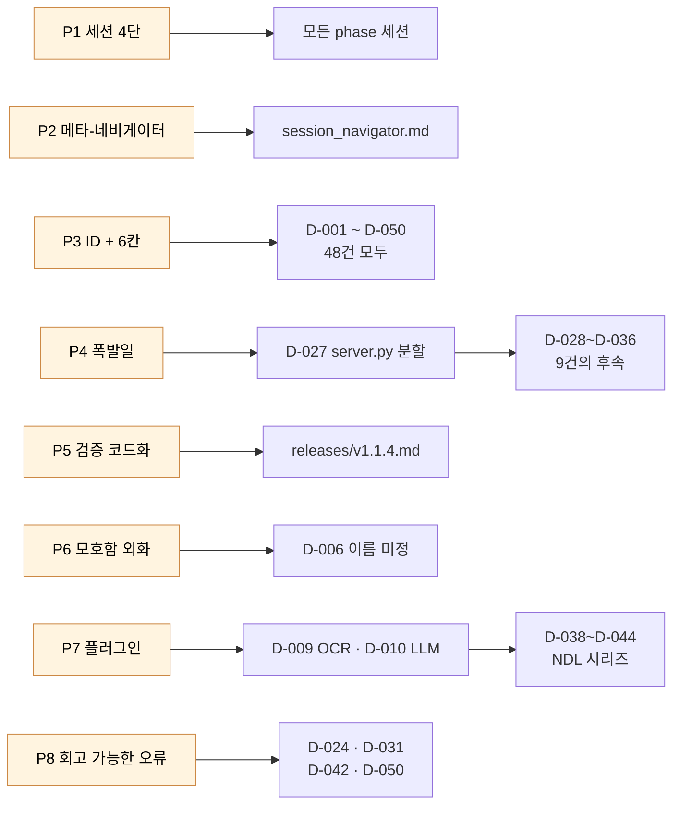

# 인터랙션 패턴 (사용자 ↔ Claude)

> 50개의 결정과 14개의 세션 문서를 횡단해서 관찰된 협업 패턴. 어느 한 사람의 의도가 아니라 **양쪽이 함께 안정시킨 형식**이다. 이 패턴들이 하네스 엔지니어링의 1차 재료다.

## 패턴 ↔ 결정 매핑 한눈에



더 많은 시각화 → [06_visualizations.md](06_visualizations.md)

---

---

## P1 — 세션 카드의 4단 구조

모든 Phase 세션 문서가 다음 골격을 따른다.

```
1. 사전 준비       — 무엇을 읽고 들어와야 하는지
2. 설계 요약       — 핵심 원칙·결정 사항 ("반드시 이해한 후 구현"이라는 경고문구가 있다)
3. 작업 1, 2, 3 …  — 수정 대상 파일·구현·주의·검증 명령
4. 다음 세션       — 어디로 가는가
```

**관찰**: 사용자가 세션 카드를 *미리* 채워둔 흔적이 강하다 (작업 N의 「수정 대상」이 매우 구체적). Claude는 그 골격 안에서만 구현했다.

**효과**: Claude의 컨텍스트가 매 세션 깨끗하게 리셋되더라도, 사전 준비·설계 요약을 다시 읽으면 즉시 작업 가능한 상태가 된다. *회고 가능성 = 재진입 가능성*이라는 등식.

**원본 확인**: [`../sessions/phase12_1_git_graph_session.md`](../sessions/phase12_1_git_graph_session.md) — 「사전 준비 → 설계 요약 — 반드시 이해한 후 구현 → 핵심 원칙 → 작업 1: 커밋 Trailer 자동 기록」.

---

## P2 — 메타-네비게이터 파일

`docs/sessions/session_navigator.md`는 다른 세션 파일의 *목차*가 아니라 **세션 전환 프로토콜**이다.

```
1. 완료 체크리스트 확인
2. 이 네비게이터 업데이트
3. DECISIONS.md 업데이트
4. 다음 세션 시작
```

**관찰**: 메타-네비게이터가 있기 때문에 어느 시점에 들어오더라도 "지금 어디"를 알 수 있다. 한 명의 사용자 + 하나의 Claude가 아니라, *여러 세션의 Claude*가 같은 프로젝트를 이어 받기 위한 인계 노트.

**해석**: 사용자가 Claude를 사람 한 명이 아니라 **세션마다 새로 들어오는 작업자**로 취급한 결과. 메타-네비게이터는 이 추상화의 산물.

---

## P3 — 결정의 ID와 양식 강제

48개 결정이 모두 `## D-NNN: 제목` 헤더와 `날짜 · 상태 · 맥락 · 결정 · 근거 · 트레이드오프` 6칸 양식을 (거의) 깨지 않고 따른다.

**관찰**:
- ID(`D-027`)는 영구 식별자. 코드 주석, 다른 결정의 참조, 세션 문서, 회고 문서 어디에서나 호출 가능.
- 양식의 `트레이드오프` 칸이 살아 있다 (거부된 대안이 명시됨). 미래의 Claude가 *이미 검토된 길을 재탐사하지 않는다.*

**원본 확인**: [`../DECISIONS.md`](../DECISIONS.md) D-019, D-020 등에서 「거절했다」 「채택」 「거부했다」 표현이 반복된다.

---

## P4 — 폭발일과 정적인 날의 이중 리듬

| 시점 | 패턴 |
|---|---|
| 2026-02-14 | 7건 — 개념 정착 (정체성·층 모델·용어) |
| 2026-02-15 | 5건 — 엔진 설계 (OCR·LLM·정렬·KORCIS·L5) |
| 2026-02-24 | **14건** — 단일 날 대규모 리팩토링 + UX |
| 2026-02-25 | 7건 — OCR 통합 폭발 |
| 2026-04~05 | 산발 — 파서 확장 + 릴리스 |

**관찰**: 폭발일은 *하나의 큰 결정이 여러 작은 결정을 끌고 들어온 날*이다. 2026-02-24에는 [D-027 `server.py` 모놀리스 → 8개 라우터 분할](02_decisions.md#d-027) 이 도화선이었고, 같은 날 [D-028 SSE 스트리밍](02_decisions.md#d-028), [D-031 표점 오프셋](02_decisions.md#d-031), [D-032 정렬 n-gram 최적화](02_decisions.md#d-032), [D-033 LLM 응답 잘림 방지](02_decisions.md#d-033) 등이 줄지어 따라온다.

**해석**: 큰 결정 하나가 후속 작은 결정을 *허용*하는 구조. 모놀리스가 있을 때는 SSE를 끼우기 어려웠을 것이다.

---

## P5 — 검증 명령의 코드화

릴리스 노트 [`../releases/v1.1.4.md`](../releases/v1.1.4.md) 의 마지막 줄:

```
- uv run python -m pytest -q tests/test_citation_mark.py
- uv run python -m pytest -q tests/test_llm_integration.py
- node --check src/app/static/js/annotation-editor.js
- node --check src/app/static/js/citation-editor.js
```

**관찰**: 「검증했다」가 자연어 서술이 아니라 **재실행 가능한 명령**으로 남아 있다. 회고 시점에도 동일한 명령을 다시 돌릴 수 있다.

**연결**: 프로젝트 CLAUDE.md에 「작업 방식: CLI를 적극 활용할 것 — 작성만 하고 검증 없이 넘어가지 마라」 라는 지시가 있고, 릴리스 노트가 이를 그대로 따른다.

---

## P6 — 모호함을 결정으로 외화

가장 강력한 패턴 중 하나.

| 결정 | 무엇을 외화했나 |
|---|---|
| [D-001](02_decisions.md#d-001) | 「IDE는 비유다」 — 정체성에 대한 외부인의 오해를 미리 차단 |
| [D-003](02_decisions.md#d-003) | "Block"이라는 단어를 3개 이름으로 분해 (LayoutBlock·OcrResult·TextBlock) |
| [D-004](02_decisions.md#d-004) | 「층 번호와 작업 순서는 다를 수 있다」 — L1~L8 순서대로 작업하지 않음을 명시 |
| [D-006](02_decisions.md#d-006) | 「프로젝트 이름 (미정)」 — *미정인 채로 결정을 기록* |

**관찰**: 모호함·미결 상태도 *결정으로 적힌다*. 「아직 정하지 않았다」가 결정으로 기록되면 미래에 그 자리를 재논의해야 함을 알 수 있다.

---

## P7 — 라우터·플러그인 아키텍처 선호

LLM(5단 폴백 라우터, D-010), OCR(엔진 플러그인, D-009), 정렬(이체자 사전 + difflib, D-012), 파서(NDL·KORCIS·KOSTMA·장서각·규장각, D-045) 모두 **단일 진입점 + 교체 가능한 구현체** 패턴을 따른다.

**관찰**: Claude가 새 기능을 끼울 때 *기존 구조를 확장*하면 되었다. 새 OCR 엔진 추가(D-038, D-039, D-044)나 새 파서 추가(D-045)가 별다른 결정을 동반하지 않은 이유.

---

## P8 — 회고 가능한 오류

`session_fix_parsers.md`, [D-024 `.git` 오염 버그](02_decisions.md#d-024), [D-040 ndlkotenocr 호환성 복원](02_decisions.md#d-040), [D-041 PARSeq RGB 입력](02_decisions.md#d-041), [D-042 브라우저 캐시 누락](02_decisions.md#d-042) — 모두 **버그·실패가 결정으로 기록되었다.**

**관찰**: 「실패」가 결정 카탈로그에 자리를 차지하는 순간, 그건 더 이상 잊혀질 수 없다. 이는 P3(ID 부여)·P5(검증 코드화)와 결합되어 *재발 방지 인프라*가 된다.

---

## 종합

이 프로젝트에서 사용자는 Claude를 **세션마다 갈아끼우는 작업자**로 다루었다. 그래서:

- **세션 카드**(P1)와 **메타-네비게이터**(P2)가 인계 도구가 되었고,
- **결정의 ID·양식**(P3)이 영구 메모리 역할을 했으며,
- **검증 명령의 코드화**(P5)와 **모호함의 외화**(P6)는 다음 세션의 Claude가 *바로 재진입할 수 있는 상태*를 보장했다.

이 모든 패턴이 시사하는 것은 다음 문서에서 다룬다 → [05_harness.md](05_harness.md).
