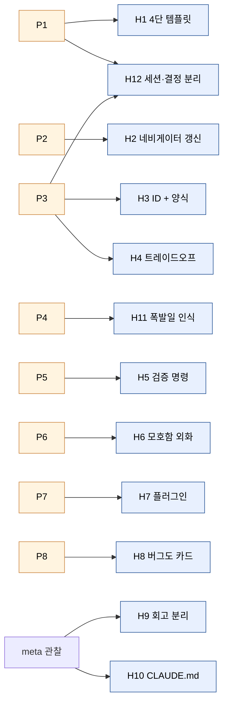

# 하네스 엔지니어링 권고 (12가지)

> [04_patterns.md](04_patterns.md)에서 관찰한 8개 패턴을 일반화한 권고. 이 프로젝트에 한정되지 않고, **세션 단위로 갈아끼우는 에이전트와의 장기 협업** 일반에 적용 가능하다.

## 패턴 → 권고 트레이스



## 매트릭스

| | H1 | H2 | H3 | H4 | H5 | H6 | H7 | H8 | H9 | H10 | H11 | H12 |
|---|---|---|---|---|---|---|---|---|---|---|---|---|
| **P1 세션 4단** | ● | | | | | | | | | | | ● |
| **P2 네비게이터** | | ● | | | | | | | | | | |
| **P3 ID + 양식** | | | ● | ● | | | | | | | | ● |
| **P4 폭발일** | | | | | | | | | | | ● | |
| **P5 검증 코드화** | | | | | ● | | | | | | | |
| **P6 모호함 외화** | | | | | | ● | | | | | | |
| **P7 플러그인** | | | | | | | ● | | | | | |
| **P8 회고 가능 오류** | | | | | | | | ● | | | | |
| (메타 관찰) | | | | | | | | | ● | ● | | |

더 많은 시각화 → [06_visualizations.md](06_visualizations.md)

---

## 표 — 권고 한눈에 보기

| # | 권고 | 어디서 왔는가 | 측정 지표 |
|---|---|---|---|
| H1 | 세션 카드의 4단 템플릿 강제 | P1 | 세션 진입 후 첫 도구 호출까지 걸린 시간 |
| H2 | 메타-네비게이터 의무 갱신 | P2 | "지금 어디?" 질문에 5초 안에 답할 수 있는가 |
| H3 | 결정에 ID + 6칸 양식 강제 | P3 | 다른 결정·코드에서 그 결정을 검색해 찾을 수 있는가 |
| H4 | 트레이드오프 칸 비워두지 말기 | P3 | "거부한 대안" 칸의 충실도 |
| H5 | 검증을 자연어가 아닌 명령으로 | P5 | 회고 시점에 재실행하면 통과하는가 |
| H6 | 모호함도 결정 카드로 외화 | P6 | 「미정」 결정의 개수 (0개면 의심) |
| H7 | 단일 진입점 + 교체 가능한 구현체 | P7 | 새 구현체 추가가 결정 카드 없이 가능한가 |
| H8 | 버그·실패도 결정 카드로 | P8 | 같은 버그가 두 번 일어났을 때 검색에 잡히는가 |
| H9 | 회고 폴더와 원본 폴더 분리 | 본 회고 | 원본 폴더의 mtime이 회고 작업으로 변하는가 |
| H10 | CLAUDE.md 단일 진실 원천 | 본 프로젝트 | 새 세션 첫 응답이 프로젝트 규약을 따르는가 |
| H11 | 폭발일 인식과 큰 결정 우선 | P4 | 큰 결정이 작은 결정들을 *허용*한 흔적이 있는가 |
| H12 | 세션 카드와 결정 카드의 분리 | P1 + P3 | 두 추상화가 1:N으로 깨끗하게 연결되는가 |

---

## H1. 세션 카드의 4단 템플릿 강제

**요지**: 새 세션을 열기 전에 항상 다음 4칸을 채워둔다.

```markdown
## 사전 준비
- 읽어야 하는 문서: [...]
- 이전 세션의 산출물: [...]

## 설계 요약 — 반드시 이해한 후 구현
### 핵심 원칙
### 결정 사항

## 작업 1: <명확한 산출>
### 수정 대상 파일
### 구현 지침
### 검증 명령

## 다음 세션
- 무엇을 이어갈 것인가
```

**왜 효과적인가**: 새로 진입하는 Claude(혹은 다른 사람)가 *컨텍스트를 재구성*할 필요가 없다. 작업 1의 "수정 대상 파일"이 구체적일수록 Claude의 1차 의사결정 부담이 줄어든다.

**반-패턴**: 「대충 어떻게 해볼지 보고 알려줘」. 이건 Claude에게 사용자의 머릿속 모델을 추측하라는 요구다.

---

## H2. 메타-네비게이터 의무 갱신

**요지**: 세션 종료 시 *반드시* 메타-네비게이터 파일을 갱신한다. 이 프로젝트는 [`docs/sessions/session_navigator.md`](../sessions/session_navigator.md)에 다음 4단계를 명시한다.

```
1. 완료 체크리스트 확인
2. 이 네비게이터 업데이트
3. DECISIONS.md 업데이트
4. 다음 세션 시작
```

**도구화 방안**: Claude Code의 hook(`Stop` 이벤트)에 이 4단계의 자가-검증을 걸 수 있다. "이번 세션에서 코드 변경이 있었는데 네비게이터·DECISIONS 갱신이 없습니다 — 정말 종료할까요?" 형태의 게이트.

---

## H3. 결정에 ID + 6칸 양식 강제

**요지**: `D-XXX: 제목` 헤더와 `날짜·상태·맥락·결정·근거·트레이드오프` 6칸 양식.

**ID 발급 규칙**: 마지막 D-번호 + 1을 자동 발급. 이미 결정된 항목과 충돌하지 않도록 `git grep "^## D-"`로 사전 확인.

**검색 가능성**: 모든 결정에 영구 ID가 있으면 코드 주석에서 `# D-027` 같은 참조가 가능해진다. 이 프로젝트는 [`docs/DECISIONS.md`](../DECISIONS.md)가 단일 파일이라 `git blame`이 그대로 결정 이력이 된다.

---

## H4. 트레이드오프 칸을 비우지 말 것

**요지**: 모든 결정에 「거부한 대안」을 적는다.

**왜**: 미래의 Claude가 *이미 검토된 길을 재탐사하지 않는다*. 트레이드오프 칸이 비어 있으면, 6개월 뒤 다른 Claude가 「왜 SQLite를 안 쓰지?」를 다시 묻는다.

**원본 예시**: [D-020](02_decisions.md#d-020) — 「별도 DB(SQLite)에 저장 시 기존 JSON+Git 아키텍처와 불일치로 거절」.

---

## H5. 검증을 자연어가 아닌 명령으로

**요지**: 「테스트했다」가 아니라 *재실행 가능한 명령*을 결정·릴리스 노트에 적는다.

**원본 예시** ([`../releases/v1.1.4.md`](../releases/v1.1.4.md)):

```
uv run python -m pytest -q tests/test_citation_mark.py
node --check src/app/static/js/annotation-editor.js
```

**파생 규칙**: CLAUDE.md에 「작성만 하고 검증 없이 넘어가지 마라」라는 지시가 있다면, 검증 명령이 결정·세션 카드에 *코드 블록으로* 등장해야 한다. 자연어 「검증함」은 검증으로 치지 않는다.

---

## H6. 모호함도 결정 카드로 외화

**요지**: 「미정」 상태도 결정으로 적는다.

**예시**: [D-006 「프로젝트 이름 (미정)」](02_decisions.md#d-006) — 미정인 채로 결정 카드가 발급되었다. 이로써 미래 시점에 "이름을 정해야 함"이 *잊혀지지 않는다*.

**반-패턴**: 「나중에 정하자」를 머릿속에만 두기. 머릿속은 다음 세션의 Claude에게 인계되지 않는다.

---

## H7. 단일 진입점 + 교체 가능한 구현체

**요지**: 새 기능을 *결정 없이* 끼울 수 있는 구조를 먼저 만든다.

**예시**:
- [D-009 OCR 엔진 플러그인](02_decisions.md#d-009) → 이후 [D-038 NDLOCR-Lite](02_decisions.md#d-038), [D-039 古典籍OCR-Lite](02_decisions.md#d-039), [D-044 古典籍OCR Full](02_decisions.md#d-044) 추가가 *별다른 아키텍처 결정 없이* 가능했다.
- [D-010 LLM 5단 폴백](02_decisions.md#d-010) → [D-047 OpenAI OAuth](02_decisions.md#d-047) 프로바이더 추가도 동일.

**효과**: 결정 카탈로그가 *덜* 커진다 (좋은 일). 큰 결정 1개가 작은 결정 N개를 흡수한다.

---

## H8. 버그·실패도 결정 카드로

**요지**: 버그 수정·롤백을 결정으로 기록한다.

**예시**: [D-024 `.git` 오염 버그](02_decisions.md#d-024), [D-040 ndlkotenocr 호환성 복원](02_decisions.md#d-040), [D-041 PARSeq RGB 입력](02_decisions.md#d-041), [D-042 브라우저 캐시 누락](02_decisions.md#d-042).

**왜**: 「이 버그는 이전에도 있었다」를 *검색으로* 알 수 있어야 한다. 결정 카탈로그가 사실상 *증상 → 원인 → 처방* 데이터베이스가 된다.

---

## H9. 회고 폴더와 원본 폴더 분리

**요지**: 회고는 *뷰*, 원본은 *스토어*. 회고를 만들면서 원본을 수정하지 않는다.

**구현**: 본 폴더 `docs/retrospective/`는 모든 항목에서 [`../DECISIONS.md`](../DECISIONS.md)·[`../sessions/`](../sessions/) 로 링크만 건다. 원본 mtime은 회고 작업으로 변하지 않는다.

**검증**: `git status docs/DECISIONS.md docs/sessions/`가 회고 작업 후에도 clean이어야 한다.

---

## H10. CLAUDE.md 단일 진실 원천

**요지**: 코딩 규칙·용어·작업 방식은 `CLAUDE.md` 하나에만 적는다.

**본 프로젝트의 사례**: [`CLAUDE.md`](../../CLAUDE.md)가 다음을 한 곳에 둔다.
- 프로젝트 비전 (8층 모델, IDE 비유)
- 기술 스택 (uv, FastAPI, vanilla JS)
- 백엔드 모듈 구조 (8개 라우터)
- 코딩 규칙 (한국어 주석, 원본 파일 절대 수정 금지)
- 용어 규칙 (LayoutBlock vs OcrResult vs TextBlock)
- 작업 방식 (CLI 적극 활용)
- Git 커밋 규칙

새 세션의 Claude는 이 한 파일만 읽어도 *어색하지 않은 첫 응답*을 낼 수 있다.

**유지 규칙**: CLAUDE.md를 200줄 안에 둔다. 더 자세한 내용은 `docs/`로 위임.

---

## H11. 폭발일 인식: 큰 결정이 작은 결정을 허용한다

**요지**: 모든 결정이 평등하지 않다. 어떤 결정은 *다른 결정을 허용하는* 결정이다.

**예시**: 2026-02-24, [D-027 server.py 모놀리스 → 8개 라우터 분할](02_decisions.md#d-027). 이 결정이 같은 날의 [D-028 SSE 스트리밍](02_decisions.md#d-028), [D-029 인용 양식](02_decisions.md#d-029), [D-030 경로 통합](02_decisions.md#d-030) 등을 한꺼번에 *가능하게* 했다.

**실천**: 작은 결정이 자주 막힐 때, 그 결정들을 가로막는 큰 결정이 무엇인지 식별한다. 큰 결정을 먼저 한다.

---

## H12. 세션 카드와 결정 카드의 분리

**요지**: 두 추상화는 *다른 시간 단위*에 속한다.

| 추상화 | 시간 단위 | 무엇을 담는가 |
|---|---|---|
| 세션 카드 | 분~시간 | "지금 무엇을 만들고 있는가" |
| 결정 카드 | 영구 | "왜 이렇게 결정했는가" |

세션 카드는 일회용일 수 있다. 결정 카드는 영구다. 한 세션이 여러 결정을 만들 수 있고, 한 결정이 여러 세션에 걸쳐 구현될 수 있다 (다대다).

**반-패턴**: 세션 카드 안에 결정의 근거를 적고 결정 카드를 만들지 않기. 세션이 끝나면 그 근거는 사실상 *유실*된다.

---

## 추후 적용 시 시작점

1. 첫 결정 카드 5개를 채워본다 (D-001~D-005). 양식이 자연스러워질 때까지.
2. 첫 세션 카드 템플릿을 `docs/sessions/_template.md`로 둔다.
3. 메타-네비게이터 (`session_navigator.md`)를 한 줄짜리로 시작해도 좋다 — 「다음 세션: <파일>」.
4. CLAUDE.md를 200줄 이내로 작성하고, 첫 세션부터 그것만 보고 일한다.
5. 한 달 후 회고 폴더(`docs/retrospective/`)를 만든다. 원본은 그대로 두고 뷰만 새로.

이 5단계만 따라도 P1~P8 패턴의 절반은 자동으로 생긴다.
