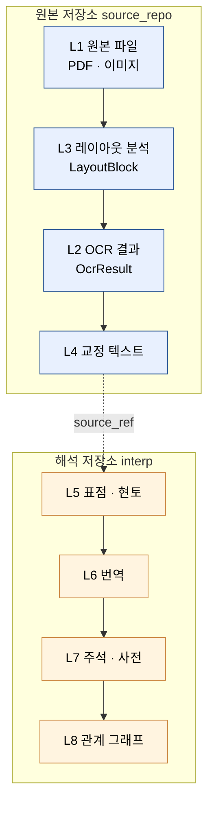
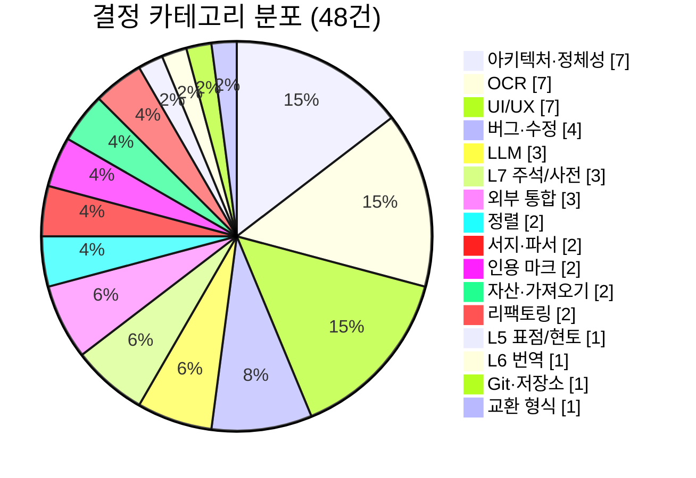
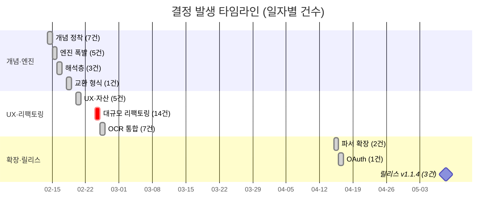
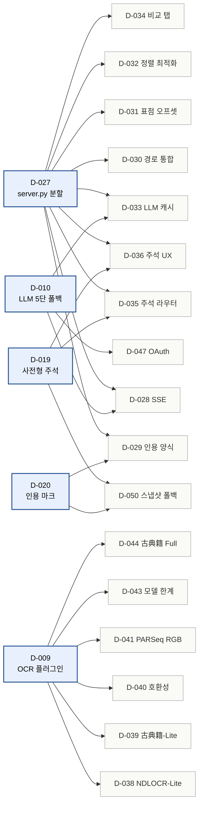
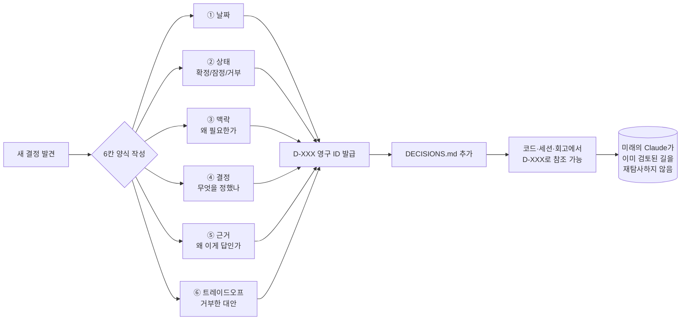
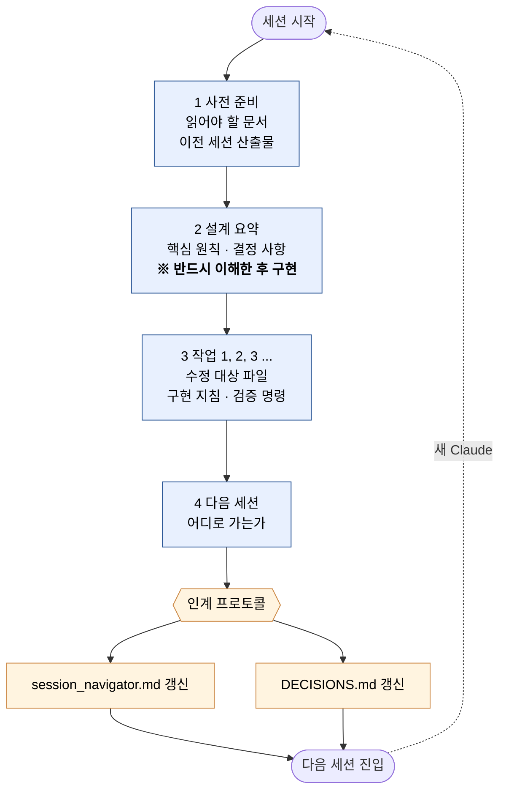
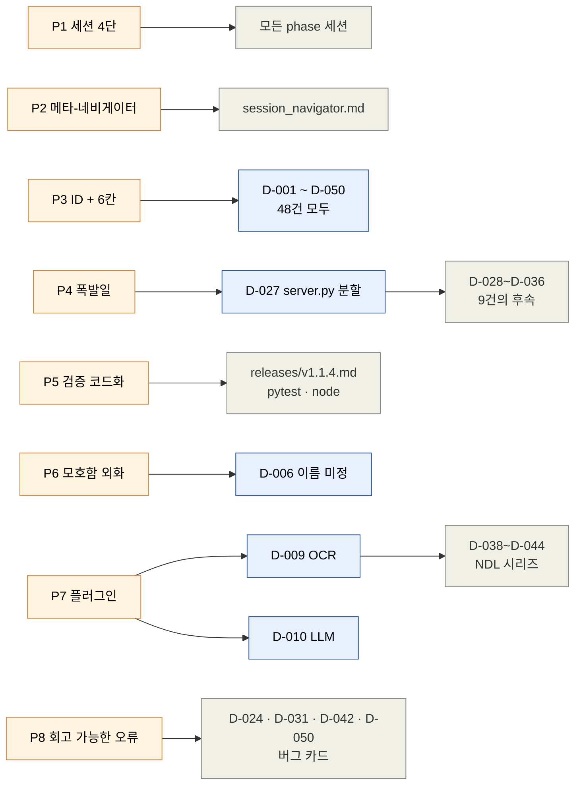
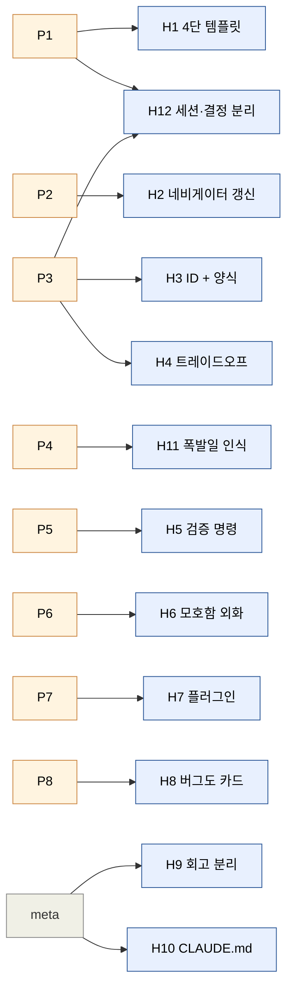
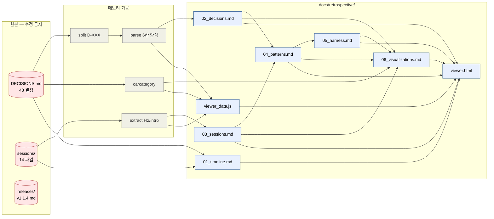

# 시각화 종합

> 결정 50개와 세션 14개를 11종의 다이어그램·차트·매트릭스로 시각화한 모음. Mermaid 다이어그램은 GitHub·Obsidian·VSCode 미리보기에서 자동 렌더링된다. 인터랙티브 버전은 [viewer.html](viewer.html)에서 확인.

## 목차

1. [전체 그림 — 8층 모델](#1-8층-모델)
2. [결정 카테고리 분포 (파이)](#2-결정-카테고리-분포)
3. [일자별 결정 누적 (막대)](#3-일자별-결정-누적)
4. [폭발일의 카테고리 스택 (히트맵)](#4-폭발일의-카테고리-스택)
5. [결정 트리거 그래프 — 큰 결정이 작은 결정을 허용한다](#5-결정-트리거-그래프)
6. [결정 카드의 6칸 양식](#6-결정-카드의-6칸-양식)
7. [세션 카드의 4단 구조 + 인계 사이클](#7-세션-카드의-4단-구조)
8. [패턴 ↔ 결정 매핑](#8-패턴--결정-매핑)
9. [패턴 → 하네스 권고 트레이스](#9-패턴--하네스-권고-트레이스)
10. [카테고리별 결정 일람](#10-카테고리별-결정-일람)
11. [회고 파이프라인 — 원본은 그대로, 회고는 뷰](#11-회고-파이프라인)

---

## 1. 8층 모델

원본 저장소(L1~L4)와 해석 저장소(L5~L8)가 `source_ref`로 연결된다. 이 모델이 [D-002](02_decisions.md#d-002)·[D-003](02_decisions.md#d-003)·[D-005](02_decisions.md#d-005)·[D-007](02_decisions.md#d-007)의 결합 결과다.



---

## 2. 결정 카테고리 분포

48개 결정을 16개 카테고리로 분류했다. **아키텍처·OCR·UI/UX 세 영역이 동률(각 7건)** 로 무게중심을 이룬다.



### ASCII 막대 (오프라인 보조)

```
아키텍처·정체성   │ ████████████████████████ 7
OCR              │ ████████████████████████ 7
UI/UX            │ ████████████████████████ 7
버그·수정        │ █████████████▌           4
LLM              │ ██████████▌              3
L7 주석/사전     │ ██████████▌              3
외부 통합        │ ██████████▌              3
정렬             │ ███████                  2
서지·파서        │ ███████                  2
인용 마크        │ ███████                  2
자산·가져오기    │ ███████                  2
리팩토링         │ ███████                  2
L5 표점/현토     │ ███▌                     1
L6 번역          │ ███▌                     1
Git·저장소       │ ███▌                     1
교환 형식        │ ███▌                     1
```

---

## 3. 일자별 결정 누적

폭발일과 정적인 날의 이중 리듬이 한눈에 보인다. **2026-02-24의 14건이 단연 정점**.



### ASCII 막대 (10일치)

```
2026-02-14 │ █████████████████        7  ← 개념 정착
2026-02-15 │ ████████████             5  ← 엔진 폭발
2026-02-16 │ ███████                  3  ← 해석층
2026-02-18 │ ██▌                      1
2026-02-20 │ ████████████             5  ← UX·자산
2026-02-24 │ ██████████████████████████████████ 14  ★ 대규모 리팩토링
2026-02-25 │ █████████████████        7  ← OCR 통합
2026-04-15 │ █████                    2
2026-04-16 │ ██▌                      1
2026-05-08 │ ███████                  3  ← 릴리스 v1.1.4
```

---

## 4. 폭발일의 카테고리 스택

2026-02-24 14건의 *내역*. [D-027 server.py 분할](02_decisions.md#d-027)이 도화선이 되어 UI·LLM·정렬·주석·버그 영역이 동시에 폭발했다.

| 일자 | UI/UX | 리팩토링 | LLM | 버그 | 인용 | 정렬 | L7 주석 | 자산 | 합계 |
|---|---|---|---|---|---|---|---|---|---|
| 2026-02-14 | | | | | | | | | **7** (전부 arch) |
| 2026-02-15 | | | 1 | | | 1 | | | **5** (OCR/biblio/L5 포함) |
| 2026-02-16 | | | | | | | 1 | | **3** (L6/L7/Git) |
| 2026-02-18 | | | | | | | | | **1** (exchange) |
| 2026-02-20 | 2 | | | | 1 | | 1 | 1 | **5** |
| **2026-02-24** | **4** | **2** | **2** | **2** | **1** | **1** | **1** | **1** | **14 ★** |
| 2026-02-25 | | | | 1 | | | | | **7** (OCR 6 + 버그 1) |
| 2026-04-15 | 1 | | | | | | | | **2** (biblio 1 추가) |
| 2026-04-16 | | | | | | | | | **1** (integration) |
| 2026-05-08 | | | | 1 | | | | | **3** (integration 2 + 버그) |

**핵심 관찰**: 2026-02-24는 *한 카테고리의 폭발*이 아니라 *여러 카테고리의 동시 폭발*. [H11 폭발일 인식](05_harness.md#h11)의 직접적 증거.

---

## 5. 결정 트리거 그래프

큰 결정 하나가 작은 결정 N개를 *허용했다*는 흔적. 화살표는 시간 순서가 아니라 **의존 가능성** (작은 결정이 큰 결정 없이는 어려웠음).



**해석**: 5개의 큰 결정(D-009·D-010·D-019·D-020·D-027)이 25건 이상의 후속 결정을 *허용*했다. 이것이 [P7 라우터·플러그인](04_patterns.md#p7--라우터플러그인-아키텍처-선호)과 [H11 폭발일](05_harness.md#h11)의 구조적 근거.

---

## 6. 결정 카드의 6칸 양식

48개 결정 모두 동일한 양식. 양식이 강제되었기에 회고가 가능했다.



---

## 7. 세션 카드의 4단 구조

매 phase 세션이 동일한 골격. 세션의 Claude가 갈아끼워져도 *재진입*이 가능한 이유.



---

## 8. 패턴 ↔ 결정 매핑

8개 패턴이 어떤 결정·문서에서 관찰되는가.



---

## 9. 패턴 → 하네스 권고 트레이스

8개 패턴 → 12개 하네스 권고 (1:N 매핑).



### 매트릭스 표

| | H1 | H2 | H3 | H4 | H5 | H6 | H7 | H8 | H9 | H10 | H11 | H12 |
|---|---|---|---|---|---|---|---|---|---|---|---|---|
| **P1** | ● | | | | | | | | | | | ● |
| **P2** | | ● | | | | | | | | | | |
| **P3** | | | ● | ● | | | | | | | | ● |
| **P4** | | | | | | | | | | | ● | |
| **P5** | | | | | ● | | | | | | | |
| **P6** | | | | | | ● | | | | | | |
| **P7** | | | | | | | ● | | | | | |
| **P8** | | | | | | | | ● | | | | |
| (메타) | | | | | | | | | ● | ● | | |

---

## 10. 카테고리별 결정 일람

| 카테고리 | 건수 | 결정 ID |
|---|---:|---|
| 아키텍처·정체성 | 7 | D-001, D-002, D-003, D-004, D-005, D-006, D-007 |
| OCR | 7 | D-009, D-038, D-039, D-040, D-041, D-043, D-044 |
| UI/UX | 7 | D-022, D-023, D-025, D-026, D-034, D-036, D-046 |
| 버그·수정 | 4 | D-024, D-031, D-042, D-050 |
| LLM | 3 | D-010, D-028, D-033 |
| L7 주석/사전 | 3 | D-016, D-019, D-035 |
| 외부 통합 | 3 | D-047, D-048, D-049 |
| 정렬 | 2 | D-012, D-032 |
| 서지·파서 | 2 | D-013, D-045 |
| 인용 마크 | 2 | D-020, D-029 |
| 자산·가져오기 | 2 | D-021, D-037 |
| 리팩토링 | 2 | D-027, D-030 |
| L5 표점/현토 | 1 | D-014 |
| L6 번역 | 1 | D-015 |
| Git·저장소 | 1 | D-017 |
| 교환 형식 | 1 | D-018 |

---

## 11. 회고 파이프라인

이 회고 폴더 자체가 어떻게 만들어졌는지. 원본 폴더는 한 글자도 변경하지 않는다 ([H9](05_harness.md#h9)).



**검증 명령** ([H5](05_harness.md#h5) 준수):

```powershell
# 원본 폴더 무수정 검증
git status --porcelain docs/DECISIONS.md docs/sessions/
# → 출력이 비어 있으면 통과 (clean)
```
