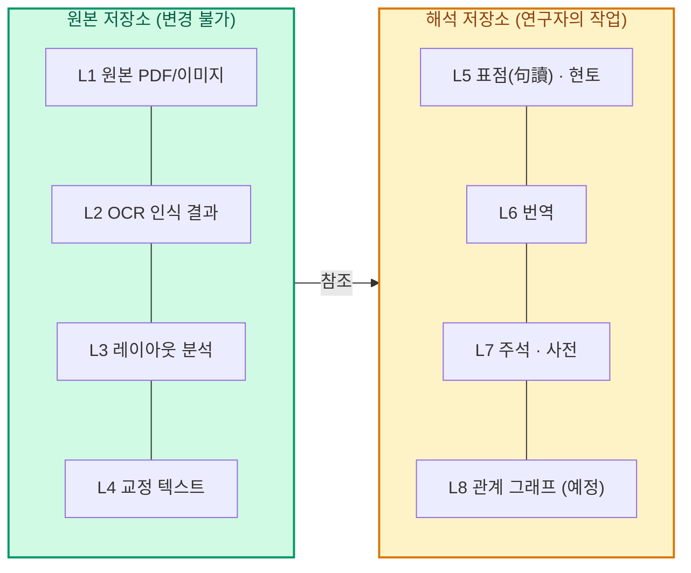
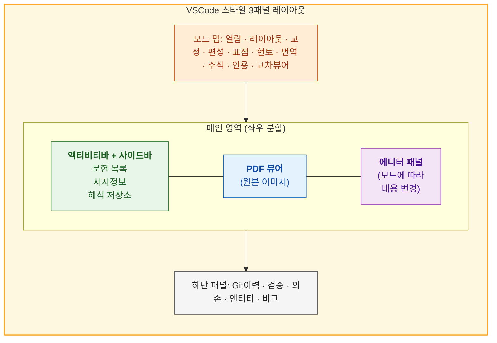

# 사용자 가이드 — 고전서지 통합 브라우저

> 이 문서는 **처음 사용하는 연구자**를 위한 단계별 안내서입니다.
> 프로그래밍 지식은 필요하지 않습니다.

---

## 목차

1. [이 프로그램은 무엇인가](#1-이-프로그램은-무엇인가)
2. [설치와 실행](#2-설치와-실행)
3. [화면 구성 이해하기](#3-화면-구성-이해하기)
4. [시작하기: 첫 문헌 등록](#4-시작하기-첫-문헌-등록)
5. [작업 흐름 1: 이미지에서 텍스트 만들기](#5-작업-흐름-1-이미지에서-텍스트-만들기)
6. [작업 흐름 2: 텍스트 해석하기](#6-작업-흐름-2-텍스트-해석하기)
7. [작업 흐름 3: 연구 도구 활용하기](#7-작업-흐름-3-연구-도구-활용하기)
7-A. [근현대 논문에서 텍스트만 빠르게 뽑기](#7-a-근현대-논문에서-텍스트만-빠르게-뽑기)
8. [LLM 설정 안내](#8-llm-설정-안내)
9. [서고 관리](#9-서고-관리)
10. [자주 묻는 질문](#10-자주-묻는-질문)

---

## 1. 이 프로그램은 무엇인가

개발자에게 VSCode가 있듯이, **고전 텍스트 연구자에게는 이 플랫폼**이 있습니다.

하나의 화면에서:
- 원본 이미지(PDF/스캔본)를 보면서
- 글자를 읽어내고(OCR)
- 교정하고
- 표점(구두점)을 찍고
- 현토를 달고
- 번역하고
- 주석을 붙이고
- 논문 인용을 준비할 수 있습니다.

**모든 작업 이력이 자동으로 기록**됩니다 (Git 기반). 이전 버전으로 되돌리거나, 다른 연구자와 작업을 공유할 수 있습니다.

### 핵심 개념: 8층 데이터 모델

데이터는 8개 층으로 구분됩니다. 아래에서 위로 쌓아올리는 구조입니다.



- **원본 저장소**(L1-L4)는 문헌 자체의 디지털화 작업입니다
- **해석 저장소**(L5-L8)는 연구자의 해석 작업입니다
- 두 저장소는 독립적이므로, 하나의 원본에 여러 해석을 붙일 수 있습니다 (예: 내 번역 vs LLM 번역)

---

## 2. 설치와 실행

### 2.1 다운로드

[**ZIP 다운로드**](https://github.com/hw725/classical-text-browser/archive/refs/heads/master.zip)를 클릭하고 원하는 위치에 압축을 풀어주세요.

> Git을 아는 분은 `git clone https://github.com/hw725/classical-text-browser.git`으로도 가능합니다.

### 2.2 설치

압축을 푼 폴더에서:

| OS | 설치 방법 |
|----|----------|
| **Windows** | `install.bat` 더블클릭 |
| **macOS/Linux** | 터미널에서 `./install.sh` 실행 |

설치 스크립트가 Python, Git, uv를 **자동으로 설치**하고, 의존성 설치(`uv sync`)도 처리합니다.
컴퓨터에 이미 설치된 것은 건너뜁니다. 처음 실행 시 1-2분 소요됩니다.

<details>
<summary>수동 설치 (고급)</summary>

```bash
cd classical-text-browser

# uv가 없다면 먼저 설치:
# Windows: irm https://astral.sh/uv/install.ps1 | iex
# macOS/Linux: curl -LsSf https://astral.sh/uv/install.sh | sh

uv sync

# 이 프로젝트는 Python 3.12를 씁니다 (.python-version).
# uv가 알아서 3.12를 받아 쓰므로 따로 설치할 필요는 없습니다.

# (선택) 오프라인 OCR 엔진 설치 — 아래 중 택일:
uv sync --extra ndlkotenocr       # 고전적(古典籍) 전용, ONNX 경량 (~80MB)
uv sync --extra ndlocr            # 근현대 자료 범용, ONNX (~100MB)
uv sync --extra ndlkotenocr-full  # 최고 품질 TrOCR, GPU 권장 (~4GB)
uv sync --extra paddleocr         # PaddleOCR (~1GB, 줄 위치 검출용)
```
</details>

### 2.3 서버 실행

| OS | 실행 방법 |
|----|----------|
| **Windows** | `start_server.bat` 더블클릭 |
| **macOS/Linux** | `./start_server.sh` |

또는 터미널에서 직접:
```bash
uv run python -m app serve                              # GUI에서 서고 선택
uv run python -m app serve --library /path/to/my-library # 서고 지정
```

실행 후 **브라우저에서 `http://localhost:8000`**을 엽니다 (자동으로 열립니다).

### 2.4 서고 만들기 (처음일 때)

CLI로 서고를 먼저 만들 수도 있습니다:
```bash
uv run python -m cli init-library /path/to/my-library
```

또는 GUI 설정 탭에서 "새 서고" 버튼을 누릅니다 ([9. 서고 관리](#9-서고-관리) 참조).

---

## 3. 화면 구성 이해하기

화면은 크게 4개 영역으로 나뉩니다.



### 3.1 액티비티 바 (맨 왼쪽, 아이콘 세로줄)

| 위치 | 아이콘 | 기능 |
|------|--------|------|
| 상단 | 폴더 | **서고 브라우저** — 문헌 목록, 서지정보, 해석 저장소 |
| 하단 | 해/달 | **테마 전환** — 밝은 모드 / 어두운 모드 |
| 하단 | 톱니바퀴 | **설정** — 서고 경로 변경, 최근 서고 |

> **팁**: 같은 아이콘을 다시 클릭하면 사이드바가 접힙니다. 넓은 화면이 필요할 때 유용합니다.

### 3.2 사이드바

**서고 브라우저** 모드일 때 세 섹션이 표시됩니다:

1. **문헌 목록** — 서고에 등록된 모든 문헌. 트리 형태로 권(卷)→페이지 탐색
2. **서지정보** — 선택한 문헌의 제목·저자·시기 등 메타데이터
3. **해석 저장소** — 선택한 문헌에 연결된 해석 작업 목록

### 3.3 모드 탭 바

작업 종류에 따라 10개 모드를 전환합니다. **왼쪽에서 오른쪽으로 작업 순서**입니다.

| 모드 | 층 | 하는 일 |
|------|-----|---------|
| **열람** | L1-L4 | PDF 보기 + 텍스트 읽기 (기본 모드) |
| **레이아웃** | L3 | 이미지에서 텍스트 영역 지정 (본문 / 주석 / 제목 구분) |
| **교정** | L4 | OCR 결과를 글자 단위로 교정 |
| **편성** | L3→L5 | 레이아웃 블록을 해석 단위로 묶기 |
| **표점** | L5 | 한문에 구두점(。、；) 삽입 |
| **현토** | L5 | 한문에 한국어 토(은, 하고, 이니) 삽입 |
| **번역** | L6 | 문장별 현대어 번역 |
| **주석** | L7 | 인물·지명·용어·전거 주석 |
| **인용** | — | 논문 인용 구절 마크업 + 학술 인용 형식 내보내기 |
| **교차뷰어** | L5-L7 | 표점·번역·주석을 한눈에 통합 열람 |

**작업 모드 — 교감 / 추출 (탭 줄 오른쪽 끝)**

```
[ 교감 모드 ]  추출 모드로 →
```

위 탭들은 **한 글자씩 교감(校勘)하는 작업**까지 포함한 순서입니다.
텍스트만 뽑으면 되는 자료에서는 버튼을 눌러 **「추출 모드」**로 바꾸세요.
**열람·레이아웃·교정** 셋만 남고 나머지 일곱은 숨습니다.

| | 교감 모드 | 추출 모드 |
|---|---|---|
| 탭 | 10개 전부 | **열람·레이아웃·교정** |
| 오른쪽 패널 | 교정 텍스트 | + **텍스트 추출 패널** |

셋을 남긴 이유가 있습니다 — **열람**은 원본을 봐야 하고, **레이아웃**은 드물지만
일본어 세로쓰기 다단에서 영역 지정이 필요하며, **교정**은 인쇄 품질이 나쁠 때
OCR 결과를 손봐야 하기 때문입니다.

- **문헌 종류를 판정하지 않습니다.** 앱이 「이건 논문이다」라고 추측하는 일은 없고,
  버튼을 누를 때만 바뀝니다. 애매한 자료는 「표점·현토를 쓸 것인가」만 생각하세요.
- 숨기는 것은 **표시뿐**입니다. 데이터는 그대로 있고, 되돌리면 다시 나타납니다.
- 모드는 **문헌마다 기억**되므로, 한 서고에 고서와 논문이 섞여 있어도
  문헌을 열 때마다 알맞은 화면으로 따라갑니다.
- 추출 모드로 바꿀 때 **쓰지 않는 빈 해석 저장소**가 있으면 휴지통으로 옮깁니다.
  번역·주석이 하나라도 들어 있으면 그대로 둡니다.
- 자세한 사용법은 [7-A. 근현대 논문에서 텍스트만 빠르게 뽑기](#7-a-근현대-논문에서-텍스트만-빠르게-뽑기)를 보세요.

### 3.4 메인 영역 (좌우 분할)

- **왼쪽**: PDF/이미지 뷰어 (원본 열람)
- **오른쪽**: 에디터 패널 (모드에 따라 내용이 바뀜)
- 경계선을 드래그하여 비율 조절 가능

### 3.5 하단 패널

| 탭 | 용도 |
|----|------|
| **Git 이력** | 작업 저장 이력 보기, 사다리형 그래프 |
| **검증** | 데이터 무결성 검사 결과 (예정) |
| **의존** | 원본이 변경되었는지 추적 |
| **엔티티** | TextBlock, Tag, Concept 등 코어 엔티티 |
| **비고** | 자유 메모 |

---

## 4. 시작하기: 첫 문헌 등록

### 가장 빠른 방법: 드래그 앤 드롭

PDF나 이미지 파일(이미지가 든 폴더도 가능)을 **브라우저 창 안 어디에나 끌어다 놓으세요.**

1. 서고가 아직 없으면 기본 서고(`내 문서/고전서지서고`)가 자동으로 만들어집니다
   (위치는 설정에서 언제든 바꿀 수 있습니다).
2. 파일 목록·제목(원본 파일명)이 채워진 확인 화면이 열립니다.
   문헌 ID는 비워 두면 자동으로 만들어지므로 입력하지 않아도 됩니다.
3. **“문헌 생성”** 클릭 — 끝입니다. 이미지 여러 장은 파일명 순서대로
   1권의 PDF로 묶이고, PDF는 각각 별도의 권이 됩니다.
   기본 해석 저장소(`문헌ID_interp`)도 함께 만들어지므로,
   OCR·교정 후 곧바로 표점·번역·주석 작업을 시작할 수 있습니다.

### 방법 A: URL로 등록 (서지정보 자동 추출)

1. 사이드바 상단의 **"+ 새 문헌"** 클릭
2. **URL 입력**:


   지원하는 서지정보 소스:
   - 한국고문헌종합목록(KORCIS) URL
   - 일본 국립국회도서관(NDL Search) URL
   - 일본 국립공문서관 디지털 아카이브 URL — **PDF 자동 다운로드** (구형/신형 IIIF 모두 지원)
   - 고려대 해외한국학자료센터(KOSTMA) URL — **PDF 자동 다운로드**
   - 한국학중앙연구원 장서각 URL — **PDF 자동 다운로드**
   - 서울대 규장각한국학연구원 URL — **PDF 자동 다운로드**
   - 기타 모든 URL (범용 LLM 파서 사용)
3. 시스템이 자동으로:
   - 서지정보를 파싱하여 제목·저자·시기를 채움
   - PDF/이미지가 있으면 자동 다운로드 제안


4. **"등록"** 클릭하면 서고에 문헌이 추가됩니다

### 방법 B: CLI로 등록

```bash
uv run python -m cli add-document /path/to/my-library \
    --title "蒙求" --doc-id monggu
```

등록 후 PDF 파일을 `documents/monggu/L1_source/` 폴더에 직접 복사합니다.

### 방법 C: HWP/HWPX 가져오기

1. 사이드바의 **"HWP"** 버튼 클릭
2. 한글 파일(.hwp 또는 .hwpx) 선택
3. 미리보기에서 옵션 설정:
   - **표점·현토 자동 분리**: 한문 원문에서 구두점과 토를 자동 분리
   - **대두(擡頭) 감지**: 줄바꿈 형식 메타데이터 추출
4. **가져오기 모드** 선택:
   - **새 문헌 만들기** (기본): 새 문헌 ID를 지정하여 등록
   - **기존 문헌에 텍스트 추가**: 이미 등록된 문헌(OCR 텍스트 보유)에 HWP 텍스트를 매핑
     - 한자 앵커로 기존 페이지와 HWP 텍스트를 자동 대조합니다
     - 매핑 미리보기에서 페이지별 대응을 확인할 수 있습니다
5. **"가져오기"** 클릭

---

## 5. 작업 흐름 1: 이미지에서 텍스트 만들기

> PDF/이미지 원본이 있는 문헌에 해당합니다.
> HWP에서 텍스트를 가져왔다면 이 단계를 건너뛸 수 있습니다.

### 5.1 레이아웃 분석 (L3)

**목적**: 페이지 이미지에서 "어디에 무슨 종류의 글자가 있는지" 지정합니다.

1. **레이아웃** 모드 탭 선택
2. **"AI 분석"** 버튼 클릭 → LLM이 자동으로 영역을 감지합니다
3. 결과를 확인합니다:
   - 초록색 박스 = 본문(大字)
   - 파란색 박스 = 주석(小字雙行)
   - 회색 박스 = 판심제, 장차 등
4. **잘못된 박스 수정**:
   - 박스 클릭 → 오른쪽 패널에서 속성(유형, 읽기 순서) 변경
   - 박스 드래그로 위치/크기 조정
   - 새 박스 추가 또는 삭제
5. **저장** (Ctrl+S 또는 저장 버튼)

> **읽기 순서(reading_order)**: OCR이 블록을 읽는 순서입니다. 고전 한문은 보통 오른쪽에서 왼쪽(세로쓰기, RTL)이므로 오른쪽 블록에 작은 번호를 부여합니다.

### 5.2 OCR (L2)

**목적**: 각 블록의 이미지를 글자로 변환합니다.

1. **레이아웃** 모드에서 우측 하단의 **OCR 실행** 패널 확인
2. 설정:
   - **엔진**: 드롭다운에서 선택 (설치된 엔진만 표시)
     - **NDL古典籍OCR Full** — 최고 품질, GPU 필요 (`uv sync --extra ndlkotenocr-full`)
     - **NDL古典籍OCR-Lite** — 고전적 전용, CPU OK (`uv sync --extra ndlkotenocr`)
     - **NDLOCR-Lite** — 근현대 자료 범용 (`uv sync --extra ndlocr`)
     - **LLM Vision** — 온라인, API 키 필요
     - **PaddleOCR** — 범용 (`uv sync --extra paddleocr`)
   - **언어**: classical_chinese(고전 한문)
3. **"전체 OCR"** 클릭 → 모든 블록을 순서대로 OCR
   - 또는 특정 블록만 선택하여 **"선택 OCR"**


4. 진행률 표시줄에서 **실시간** 진행 상황 확인 (블록별 스트리밍)
5. 완료 후 결과 미리보기

### 5.3 교정 (L4)

**목적**: OCR이 잘못 읽은 글자를 바로잡습니다.

1. **교정** 모드 탭 선택
2. **"OCR 채우기"** 클릭 → OCR 결과를 교정 편집기에 불러옵니다
3. 왼쪽 PDF 이미지와 비교하면서 글자를 수정합니다

**두 가지 편집 모드** (툴바의 "자유 편집" 버튼으로 전환):

| 모드 | 방식 | 적합한 상황 |
|------|------|------------|
| **글자 교정** (기본) | 글자 클릭 → 교정 다이얼로그 | 유형 지정(이체자, 이문 등), 정밀 교정 |
| **자유 편집** | textarea에서 자유롭게 타이핑 | OCR 오류 대량 수정, 글자 추가/삭제 |

- 자유 편집에서는 글자를 추가하거나 삭제할 수 있습니다
- 저장 시 원본과 자동 비교하여 교정 기록(corrections)이 생성됩니다
- 기존 글자 교정에서 지정한 유형·비고 메타데이터는 자유 편집 저장 후에도 보존됩니다

4. **대조** 서브탭: OCR 결과와 교정본을 글자별로 나란히 비교
   - 빨간색 = 불일치, 초록색 = 일치, 노란색 = 이체자


5. **저장** (Ctrl+S)

---

## 6. 작업 흐름 2: 텍스트 해석하기

> 해석 작업을 시작하려면 먼저 **해석 저장소를 생성**해야 합니다.
> 사이드바 "해석 저장소" 섹션에서 **"새로 만들기"**를 클릭합니다.

### 6.1 표점 (L5) — 한문에 구두점 삽입

1. **표점** 모드 탭 선택
2. 상단에서 블록 선택
3. 글자를 클릭하면 **표점 부호 팔레트**가 나타납니다
   - 기본 부호: 。 、 ， ； ： ？ ！ 《》
4. 부호를 선택하면 해당 글자 뒤에 삽입됩니다
   - 서명호(《》)는 범위 선택 필요
5. **"AI 표점"**: LLM 또는 외부 SikuRoBERTa 표점 서비스가 구두점을 제안합니다 → 경과 시간이 표시됩니다 → 검토 후 확정
6. **저장**

### 6.2 현토 (L5) — 한국어 토 달기

1. **현토** 모드 탭 선택
2. 글자를 클릭하면 **현토 입력 팝업**이 나타납니다
   - **위치**: before(글자 앞) 또는 after(글자 뒤)
   - **토**: 한국어 토 입력 (예: 은, 이, 하고, 이니)
3. **삽입** 클릭
4. **저장**

### 6.3 번역 (L6) — 현대어 번역

1. **번역** 모드 탭 선택
2. 상단에서 블록 선택
3. 원문이 표시되고 (표점·현토 적용된 상태), 아래에 문장별 번역 입력란이 나타납니다
4. 직접 번역을 입력하거나 **"전체 AI 번역"** 클릭
   - LLM이 문장별로 초안을 생성합니다
   - 초안(draft)을 검토하고 수정합니다
5. **참조 사전 활용**:
   - **"참조사전 ON"** 토글 → 주석에서 만든 사전 항목이 번역에 참고됩니다
   - **"사전 관리"** → 다른 문헌에서 가져온 참조 사전 관리
6. **저장**

### 6.4 주석 (L7) — 인물·지명·용어·전거

1. **주석** 모드 탭 선택
2. 상단에서 블록 선택
3. 원문에서 주석할 범위를 드래그로 선택
4. 주석 유형 선택: 인물(person), 지명(place), 용어(term), 전거(allusion), 메모(note)
5. 내용 입력: 표제어, 설명, 참고문헌


6. **AI 태깅**: LLM이 자동으로 주석 후보를 생성합니다

#### 사전형 주석 (고급)

단순 태깅 외에 사전 형식의 체계적 주석을 만들 수 있습니다:

| 필드 | 설명 | 예시 |
|------|------|------|
| 표제어 | 한자 원문 | 王戎 |
| 독음 | 한국어 독음 | 왕융 |
| 사전적 의미 | 일반적 정의 | 서진의 관료, 죽림칠현의 한 사람 |
| 문맥적 의미 | 이 텍스트에서의 뜻 | 간결한 행정으로 유명한 인물의 예시 |
| 출전 | 참고문헌 | 《晉書》 列傳 第十三 |

**4단계 LLM 생성**:
1. **[1단계]**: 원문만으로 사전 항목 생성
2. **[2단계]**: 번역을 참고하여 보강
3. **[3단계]**: 원문+번역 통합하여 최종 생성
4. 연구자가 검토·편집 → **확정(accepted)**

확정된 주석은 LLM이 덮어쓰지 않습니다. 안심하고 편집하세요.

---

## 7. 작업 흐름 3: 연구 도구 활용하기

### 7.1 인용 마크

논문 인용을 위해 구절을 마크업합니다.

1. **인용** 모드 탭 선택
2. 원문 또는 번역에서 인용할 범위를 드래그로 선택
3. **"인용 마크 추가"** 클릭
4. 레이블(메모)과 태그(분류)를 붙일 수 있습니다
5. **통합 컨텍스트 뷰**: 마크된 구절에 대해 원문·표점본·번역·주석을 한눈에 확인
6. **"내보내기"**: 학술 인용 형식으로 변환, 클립보드에 복사


인용 형식 예시:
```
朴趾源, 燕岩集卷2, 答巡使書 25면(韓國文集叢刊252집, 48면) : 若吾所樂者善，而所敬者天也。
```

### 7.2 사전 내보내기/가져오기

하나의 문헌에서 만든 주석 사전을 다른 문헌에서 참조할 수 있습니다.

1. **주석** 모드 → **"내보내기"** 클릭 → JSON 파일 저장
2. 다른 해석 저장소에서 **"사전 관리"** → **"가져오기"** → JSON 파일 선택
3. 가져온 사전의 표제어가 원문에서 자동 매칭됩니다
4. 매칭 결과를 체크박스로 선택 → 번역 프롬프트에 참고 사전으로 포함

### 7.3 교차 뷰어

모든 해석을 한 화면에서 확인합니다.

1. **교차뷰어** 모드 탭 선택
2. 상단 탭에서 L5(표점)·L6(번역)·L7(주석)을 전환
3. 본문/주석 토글로 본문 해석과 주석 해석을 구분하여 확인

#### 비교 모드

두 해석 저장소의 내용을 나란히 비교할 수 있습니다.

1. **"비교"** 체크박스를 켭니다
2. 좌측(A)·우측(B) 드롭다운에서 비교할 해석 저장소를 선택합니다
3. 동일한 페이지·층에 대한 두 저장소의 내용이 나란히 표시됩니다
   - 동일한 줄은 흰색, 차이가 있는 줄은 빨강/초록으로 강조됩니다
4. **L5(표점) 탭**에서는 "L5 종류" 라디오가 추가로 표시됩니다:
   - **표점** (기본): 두 저장소의 구두점(句讀) 차이를 비교
   - **현토**: 두 저장소의 현토(懸吐) 차이를 비교

### 7.4 Git 이력 관리

모든 저장은 자동으로 Git 커밋으로 기록됩니다.

1. **하단 패널** → **"Git 이력"** 탭 선택
2. **커밋 목록**: 최근 저장 이력을 시간순으로 보여줍니다
3. **사다리형 그래프**: 원본 저장소와 해석 저장소의 이력을 나란히 비교합니다
   - 가로 연결선은 "이 해석이 원본의 어떤 시점을 기반했는지"를 보여줍니다
   - **금색 링**: 현재 작업 중인 저장 시점을 표시합니다
4. **파일 미리보기**: 커밋 노드를 클릭하면 그 시점에 저장된 파일 목록을 볼 수 있습니다
   - 파일을 클릭하면 읽기 전용으로 내용을 미리봅니다
   - JSON 파일은 자동으로 보기 좋게 정렬됩니다
5. **이 버전으로 되돌리기**: 과거 시점의 상태로 복원합니다
   - 확인 다이얼로그가 표시됩니다
   - 되돌리기는 새로운 저장 시점으로 기록되므로, 기존 이력은 모두 보존됩니다
   - 저장하지 않은 변경사항이 있으면 먼저 저장해야 합니다

### 7.5 JSON 스냅샷 내보내기/가져오기

문헌의 현재 상태를 단일 JSON 파일로 저장하거나, 다른 환경에서 가져올 수 있습니다.

- **내보내기**: 사이드바 해석 저장소 → 선택 → "JSON 내보내기"
- **가져오기**: 사이드바 해석 저장소 → "가져오기" → JSON 파일 선택

---

## 7-A. 근현대 논문에서 텍스트만 빠르게 뽑기

> 옛날 논문·단행본 스캔본처럼 **표점·현토·이체자가 필요 없는 자료**를 다룰 때입니다.
> 5~6장의 고서 작업 흐름을 그대로 거치지 않아도 됩니다.

### 7-A.1 먼저: 이 PDF에 OCR이 필요한가?

문헌을 드래그 앤 드롭으로 등록하면 **자동으로 진단**해서 알려 줍니다.
세 가지 중 하나입니다.

| 진단 | 뜻 | 다음에 할 일 |
|---|---|---|
| **텍스트 있음**(born_digital) | 대부분의 쪽에 활자 정보가 들어 있다 | **OCR 불필요.** 7-A.2로 |
| **일부만 있음**(partial) | 표지·판권지만 활자인 영인본이거나 부분 OCR본 | 나머지 쪽은 7-A.3으로 |
| **스캔본**(scanned) | 이미지뿐이다 | 7-A.3으로 |

나중에 다시 확인하려면: 사이드바에서 문헌을 열고 아래 주소를 브라우저에 넣습니다.

```
/api/documents/<문헌ID>/parts/<권ID>/text-layer
```

### 7-A.2 텍스트 추출 패널

탭 줄 오른쪽 끝의 버튼을 눌러 **「추출」 모드**로 바꾸면,
**열람 탭 오른쪽에 「논문 작업」 패널**이 나타납니다. 아래 작업은 모두 이 패널에서 합니다.

| 칸 | 하는 일 |
|---|---|
| 진단 | 텍스트 레이어 유무와 다음에 할 일을 보여 준다 (↻로 다시 진단) |
| OCR 엔진 | 한글을 못 읽는 엔진은 이름에 «한글 불가»가 붙고, 고르면 경고가 뜬다 |
| 쪽 범위 | 비우면 전체. `1-10, 15`처럼 쓴다. 옆에 **예상 LLM 호출 횟수**가 표시된다 |
| 전체 OCR 실행 | 권 전체를 돌린다. 실행 중에는 같은 버튼이 **「중단」**이 된다 |
| 산출물 | 텍스트 레이어 PDF의 크기·시각과 **내려받기** 링크 |

### 7-A.3 텍스트가 이미 있는 PDF — OCR 없이 바로 가져오기

1. 사이드바에서 문헌의 페이지를 하나 엽니다.
2. 텍스트 추출 패널의 **「텍스트 바로 가져오기」** 버튼을 누릅니다.

PDF에 들어 있는 활자를 그대로 **교정 텍스트(L4)**로 옮깁니다.
OCR을 한 번도 돌리지 않으므로 오인식이 없고 몇 초면 끝납니다.

> 이미 교정해 둔 쪽은 **덮어쓰지 않고 건너뜁니다.** 몇 쪽을 건너뛰었는지 알려 줍니다.

### 7-A.4 스캔본 — 권 전체를 한 번에 OCR

고서와 달리 레이아웃을 직접 잡을 필요가 없습니다. 페이지 전체를 하나의 영역으로
보고 한 번에 처리합니다.

**엔진을 반드시 확인하세요.** 기본 엔진은 «설치된 것 중 첫 번째»라
고전적 전용 엔진이 잡히는 경우가 많은데, 그 엔진들은 **한글을 인식하지 못합니다.**

| 엔진 | 한글 | 비고 |
|---|---|---|
| NDL古典籍OCR (Full/Lite), NDLOCR-Lite | ❌ **인식 불가** | 한문·일본어 전용 |
| **LLM Vision** | ✅ | 한글 논문에는 이것을 쓰세요 |
| PaddleOCR | ✅ | 설치돼 있을 때만 |

한글을 못 읽는 엔진을 고르면 **시작할 때 경고**가 뜹니다.

- 중간에 멈춰도 괜찮습니다. **이미 끝난 쪽은 저장돼 있어** 다시 실행하면 이어서 돕니다.
- 300쪽이면 LLM 호출도 300번입니다. 먼저 몇 쪽만 지정해 품질을 확인하고 전체를 도세요.

### 7-A.5 산출물: 텍스트 레이어를 텍스트 레이어 PDF

작업의 최종 결과물입니다. **원본 이미지 위에 보이지 않는 텍스트를 겹친 PDF**를 만듭니다.

> **중요 — OCR을 돌려도 원본 PDF는 스캔본 그대로입니다.**
> OCR 결과는 별도 파일(L2)에 저장될 뿐이고, 원본(`L1_source/`)은 절대 수정하지 않습니다.
> 검색 가능한 PDF는 **`exports/` 안에 새로 만들어지는 파일**입니다.
> 권 전체 OCR을 실행하면 이 입히기까지 **자동으로 이어서** 실행되므로,
> 보통은 따로 누를 필요가 없습니다. 교정을 마친 뒤 다시 입히고 싶을 때만
> 「텍스트 레이어 PDF 다시 입히기」를 누르세요.
>
> 앱 안의 뷰어는 계속 **원본**을 보여 줍니다. 검색·복사를 하려면
> 「텍스트 레이어 PDF 내려받기」로 받아서 다른 PDF 뷰어에서 여세요.

이렇게 하면 사이드카 `.txt` 파일과 달리 다음이 한꺼번에 됩니다.

- 뷰어에서 **복사**와 **Ctrl+F 검색**
- 다른 도구의 **구조 분석**·**참고문헌 추출**
- 인용 마커와 `p.N` 쪽 번호 점프

결과는 문헌 폴더 안 **`exports/`** 에 새 파일로 저장됩니다.
**원본(`L1_source/`)은 전혀 건드리지 않습니다.**

> **정밀도에 관한 안내 — 꼭 읽어 주세요**
>
> LLM Vision 엔진은 글자의 **위치 정보를 주지 않습니다.** 그래서 이 엔진으로 만든
> PDF는 텍스트를 원본 글자 자리에 놓지 못하고, 모든 줄을 왼쪽 여백에서 시작해
> 위에서 아래로 차례대로 늘어놓습니다.
>
> **되는 것**: 복사, Ctrl+F 검색, 구조 분석, 참고문헌 추출 — 전부 정상입니다.
>
> **안 되는 것**: 검색했을 때 **형광 표시가 뜨는 자리에 그 글자가 없습니다.**
> 표시 자체는 한 줄 크기로 정확히 나오지만, 원본에서 가운데 있던 제목도
> 형광은 왼쪽 위에 뜹니다. 「위치가 대략적」이 아니라 **「위치가 맞지 않는다」**고
> 생각하시는 편이 정확합니다. 찾은 낱말이 몇 번째 줄인지는 알 수 있지만
> 쪽 어디쯤인지는 알 수 없습니다.
>
> 이 사실은 PDF 속성의 «producer» 항목에 `page-approximated`로 기록되므로,
> 나중에 이 파일만 보고도 판별할 수 있습니다.
> 좌표를 주는 한글 OCR 엔진을 쓸 수 있게 되면 제자리에 놓입니다.

### 7-A.6 정리 — 논문 한 편을 처리하는 최소 경로

```
PDF를 창에 끌어다 놓기
  → 「문헌 생성」 클릭            (여기까지 자동: 서고·이력·해석 저장소)
  → 「추출」 모드로 전환         (문헌마다 한 번만. 다음부터 기억됨)
  → 텍스트 추출 패널의 진단을 확인
      텍스트 있음 → 「텍스트 바로 가져오기」              (OCR 0회, 몇 초)
      스캔본     → 엔진을 LLM Vision으로 → 「전체 OCR 실행」
                   (끝나면 텍스트 레이어 PDF까지 자동으로 입혀진다)
  → 「텍스트 레이어 PDF 내려받기」
```

**「전체 OCR 실행」을 중간에 멈춰도 괜찮습니다.** 버튼이 「중단」으로 바뀌어 있고,
누르면 지금 쪽까지 마치고 멈춥니다. 다시 실행하면 **끝난 쪽은 건너뛰고 이어서** 돕니다.

### 7-A.7 논문이 수십 편일 때 — 폴더째 처리하기

한 편씩 다루기에는 많을 때 씁니다. 폴더를 훑어 **스캔본만 골라** 처리하고,
원본은 아카이브로 옮긴 뒤 텍스트 레이어 PDF를 **원래 자리에 원래 이름으로** 놓습니다.
파일명이 유지되므로 서지 관리 도구의 흐름이 끊기지 않습니다.

**먼저 무엇을 할지 봅니다** (아무것도 바꾸지 않습니다):

```bash
uv run python -m cli embed-folder "C:/논문" --library C:/작업서고
```

```
전체 381개 중 텍스트 있음 318개(건너뜀), 처리 대상 63개
  이번에 처리할 것: 63편 / 3358쪽
  → LLM 호출 예상 3358회
[미리보기] 실제로는 아무것도 바꾸지 않았습니다.
```

**실제로 실행하려면 `--execute`를 붙입니다.**

| 옵션 | 뜻 |
|---|---|
| `--execute` | 실제 실행 (없으면 미리보기) |
| `--limit N` | N편만 처리 — **처음에는 `--limit 1`로 한 편만 해 보세요** |
| `--max-pages N` | N쪽 넘는 문헌은 건너뜀 (큰 것을 나중으로) |
| `--only 문자열` | 파일명에 이 말이 든 논문만 |
| `--sleep 초` | 쪽 사이 대기 — LLM 사용량 한도를 아낄 때 |
| `--sleep-between 초` | 논문 사이 대기 |
| `--engine` | 기본 `llm_vision`. 한글 문헌은 바꾸지 마세요 |

**나눠서 돌려도 됩니다.** 처리 기록이 남으므로 다시 실행하면 **끝난 논문은 건너뛰고
이어서** 합니다. 며칠에 걸쳐 조금씩 해도 됩니다.

처리가 끝나면 이렇게 됩니다:

```
논문/<주제>/저자_연도_제목.pdf          ← 텍스트 레이어 PDF (이름 그대로)
논문/_scan_originals/<주제>/…           ← 원본 스캔본 (보관)
```

> **시간을 미리 재 보세요.** 쪽당 소요는 문헌·엔진·회선에 따라 다릅니다.
> `--limit 1`로 한 편을 돌리면 완료 줄에 «쪽당 N초»가 찍히므로,
> 그 값에 전체 쪽수를 곱하면 총 시간이 나옵니다.
> (실측 예: 15쪽 논문 1편 = 5.7분, 쪽당 20.3초)

---

## 8. LLM 설정 안내

이 플랫폼은 여러 LLM 프로바이더를 지원합니다. 설정하지 않아도 기본 폴백이 동작하지만, API 키를 설정하면 더 좋은 품질과 안정성을 얻을 수 있습니다.

### 8.1 프로바이더 목록

시스템은 위에서 아래로 순서대로 시도하며, 첫 번째로 응답한 프로바이더를 사용합니다. 하나가 실패하면 자동으로 다음을 시도합니다. 사용 불가한 프로바이더는 캐시하여 건너뛰므로 폴백이 빠르게 동작합니다.

| 순위 | 프로바이더 | 설정 방법 | 비전(이미지) | 비용 |
|------|-----------|----------|-------------|------|
| 1 | Ollama (로컬 gemma4:e4b) | `ollama pull gemma4:e4b` + `ollama serve` | O | 무료 |
| 2 | OpenAI OAuth | `start_server.bat` 자동 기동 또는 `npx.cmd -y openai-oauth` | O | 무료 |
| 3 | Google Gemini | `.env`에 `GOOGLE_API_KEY` | O | 유료 (저렴) |
| 4 | OpenAI | `.env`에 `OPENAI_API_KEY` | O | 유료 (중간) |
| 5 | Anthropic (Claude) | `.env`에 `ANTHROPIC_API_KEY` | O | 유료 (최후) |

> **권장**: Ollama(gemma4:e4b)만으로도 대부분의 기능을 사용할 수 있습니다.
> 안정적인 자동 표점이 필요하면 외부 SikuRoBERTa 표점 서비스를 함께 설정하세요.

### 8.2 API 키 설정

**프로젝트 루트**에 `.env` 파일을 만들어 API 키를 등록합니다.
(`.env.example` 파일을 `.env`로 복사한 뒤 필요한 값만 채우세요.)

```bash
# .env 파일 위치: classical-text-browser/.env  (프로젝트 루트)

# Google Gemini (권장, 무료 티어 있음)
# 발급: https://aistudio.google.com/apikey
GOOGLE_API_KEY=AI...

# OpenAI
# 발급: https://platform.openai.com/api-keys
OPENAI_API_KEY=sk-...

# Anthropic Claude
# 발급: https://console.anthropic.com/
ANTHROPIC_API_KEY=sk-ant-...
```

**설정 우선순위**: 시스템 환경변수 → 서고 `.env` → 프로젝트 루트 `.env` → 기본값

- **프로젝트 루트 `.env`**: 모든 서고에 공통 적용 (API 키는 여기에)
- **서고 `.env`**: 특정 서고에만 적용 (서고별 설정 덮어쓰기용)
- **시스템 환경변수**: Windows 설정 → 환경 변수에서 직접 등록 (최우선)

> **주의**: `.env` 파일에는 API 키가 포함되므로 `.gitignore`에 등록되어 있습니다. Git에 커밋되지 않습니다.

### 8.3 OpenAI OAuth

Windows에서는 `start_server.bat`가 `npx.cmd -y openai-oauth`를 별도 창에서 자동 실행합니다. 포트 `10531`이 다른 프로그램에 잡혀 있으면 프록시가 `10532~10540` 중 가능한 포트로 올라오고, 배치파일이 감지한 URL을 서버에 전달합니다.

첫 실행에서 로그인이 필요하면 열린 `OpenAI OAuth Proxy` 창의 안내를 따르세요. 직접 프록시를 띄운 포트를 고정해야 하는 경우 프로젝트 루트 `.env`에 다음처럼 적을 수 있습니다.

```bash
OPENAI_OAUTH_BASE_URL=http://127.0.0.1:10532/v1
```

### 8.4 외부 표점 서비스

Windows에서는 `start_server.bat`가 `punctuation-service/.env` 또는 `PUNCT_MODEL_HOST_PATH`를
감지하면 Docker Compose로 SikuRoBERTa 표점 서비스를 자동 실행합니다. Docker Desktop은 먼저
켜져 있어야 합니다. 기본 주소는 `http://127.0.0.1:8765`이므로 보통 본체에
`EXTERNAL_PUNCT_URL`을 따로 지정하지 않아도 됩니다.

`punctuation-service/.env` 예시:

```bash
PUNCT_MODEL_HOST_PATH=C:/Users/<USER>/Downloads/classical-text-browser-models/punctuation/v2.5_best_model_9110/v2.5_best_model_9110/punct-epoch=03-val_f1=0.9110.ckpt
```

표점 탭의 모델 드롭다운에서 `외부 표점 서비스 (SikuRoBERTa)`를 선택하면 사용합니다.
자동 연동을 끄려면 프로젝트 루트 `.env`에 `EXTERNAL_PUNCT_URL=off`를 설정하세요.

### 8.5 비전 모델

OCR과 레이아웃 분석은 **이미지를 볼 수 있는 모델**만 사용할 수 있습니다. 드롭다운에서 모델 옆에 눈 아이콘이 있으면 비전을 지원합니다.

### 8.6 모델 선택 팁

- **오프라인 작업**: NDL古典籍OCR-Lite 또는 NDLOCR-Lite(OCR용) + 수동 해석
- **무료 온라인**: OpenAI OAuth 프록시 또는 Ollama 클라우드 모델(kimi-k2.5, glm-5 등)
- **자동 표점 특화**: 외부 SikuRoBERTa 표점 서비스
- **저렴한 고품질**: Gemini 2.5 Flash (무료 티어 제공, API 키 필요)
- **최고 품질**: Gemini 3 Pro, OpenAI gpt-5, 또는 Anthropic Claude

---

## 9. 서고 관리

### 9.1 서고란?

"서고(Library)"는 여러 문헌과 해석 저장소를 묶어 관리하는 최상위 폴더입니다.

```
내_서고/
├── documents/           # 문헌들 (원본 저장소)
│   ├── monggu/          #   예: 蒙求
│   └── cheonjamun/      #   예: 千字文
├── interpretations/     # 해석 저장소들
│   ├── monggu_interp/   #   예: 蒙求 해석
│   └── ...
├── resources/           # 공유 리소스 (이체자 사전, 주석 유형 등)
└── .trash/              # 휴지통 (삭제된 항목)
```


### 9.2 서고 전환

1. 액티비티 바에서 **톱니바퀴(설정)** 클릭
2. **서고 경로** 옆의 **"편집"** 클릭
3. 새 경로를 입력하고 **"변경"** 클릭
4. 페이지가 새로고침되며 새 서고로 전환됩니다

**최근 서고**: 이전에 사용한 서고 목록이 표시됩니다. 클릭하면 바로 전환됩니다.

### 9.3 새 서고 만들기

1. 설정 탭에서 **"새 서고"** 클릭
2. 경로 입력 (예: `C:\연구\조선시대_문집`)
3. 기본 폴더 구조가 자동으로 생성됩니다

### 9.4 문헌/해석 삭제와 복원

**삭제**: 사이드바에서 문헌 또는 해석 저장소 선택 → 삭제 버튼
- 영구 삭제가 아닙니다! `.trash/` 폴더로 이동합니다
- 해당 문헌을 참조하는 해석 저장소가 있으면 경고를 표시합니다

**복원**: 설정 → 휴지통 → 복원할 항목 선택 → "복원"

### 9.5 서고 백업

서고를 구글 드라이브 등 외부 폴더에 백업할 수 있습니다.

> **이 기능은 선택 사항입니다.** 백업을 설정하지 않아도 모든 기능이 정상 동작합니다.

**설정 방법**:
1. 설정 탭에서 **"서고 백업"** 영역의 **"폴더 선택"** 클릭
2. 백업 대상 폴더를 선택 (예: 구글 드라이브 동기화 폴더)
3. **"저장"** 클릭

**백업 실행**:
- **"서고 백업"** 버튼 클릭 → 확인 → 서고 전체가 백업 폴더에 복사됩니다
- 기존 백업이 있으면 자동으로 교체됩니다 (이전 백업은 `_prev` 접미사로 보존)
- `.git` 이력 파일은 제외됩니다 (로컬 전용이므로)

**구글 드라이브 연동**:
- 백업 폴더를 구글 드라이브 동기화 폴더로 지정하면, 백업 후 자동으로 클라우드에 동기화됩니다
- zip이 아닌 폴더 그대로 복사하므로, 구글 드라이브에서 파일을 개별적으로 열람할 수 있습니다

### 9.6 필수/선택 설정 구분

| 항목 | 필수 여부 | 설명 |
|------|-----------|------|
| 서고 경로 | **필수** | 로컬 서고 폴더 경로 |
| 서고 백업 | 선택 | 구글 드라이브 등 외부 폴더에 백업 |
| 원격 저장소 | 선택 | GitHub 등에 push/pull |

**이 앱은 로컬 서고 경로만 설정하면 완전히 동작합니다.** 원격 저장소나 백업은 필요할 때 설정하세요.

---

## 10. 자주 묻는 질문

### Q. 인터넷이 없어도 사용할 수 있나요?

**네.** 핵심 기능(PDF 보기, 텍스트 편집, 교정, 표점, 현토)은 완전히 오프라인에서 동작합니다.
오프라인 OCR은 NDL古典籍OCR-Lite(`uv sync --extra ndlkotenocr`) 또는 NDLOCR-Lite(`uv sync --extra ndlocr`)를 설치하세요. GPU가 있다면 NDL古典籍OCR Full(`uv sync --extra ndlkotenocr-full`)로 최고 품질을 얻을 수 있습니다. LLM을 오프라인에서 쓰려면 Ollama 로컬 모델을 설치하세요.

### Q. Git을 알아야 하나요?

**아니요.** Git은 내부적으로 자동 관리됩니다. 연구자는 "저장" 버튼만 누르면 됩니다. 사다리형 그래프에서 현재 작업 시점 확인, 과거 버전 파일 미리보기, 이전 버전으로 되돌리기를 모두 GUI에서 할 수 있습니다.

### Q. 원본 파일이 변경되지는 않나요?

**절대 변경되지 않습니다.** L1(원본 PDF/이미지)은 시스템이 읽기 전용으로 보호합니다. 모든 작업(OCR, 교정, 번역 등)은 별도의 파일에 저장됩니다.

### Q. 같은 문헌에 여러 해석을 만들 수 있나요?

**네.** 하나의 원본 저장소에 여러 해석 저장소를 연결할 수 있습니다. 예를 들어 "내 번역"과 "LLM 번역"을 따로 만들어 비교할 수 있습니다.

### Q. LLM이 생성한 결과를 반드시 사용해야 하나요?

**아니요.** LLM 결과는 항상 "초안(draft)" 상태로 생성됩니다. 연구자가 검토하여 수정·확정·거부할 수 있습니다. 확정된 내용은 LLM이 덮어쓰지 않습니다.

### Q. 원격 저장소(GitHub) 없이도 사용할 수 있나요?

**네.** 원격 저장소는 완전히 선택 사항입니다. 로컬 서고 경로만 설정하면 모든 기능이 동작합니다. 원격 저장소는 다른 연구자와 공유하거나 GitHub에 백업하고 싶을 때만 설정하세요.

### Q. 작업 데이터는 어디에 저장되나요?

서고 폴더 안에 모두 저장됩니다. 클라우드에 자동 전송되지 않습니다. 서고를 구글 드라이브 동기화 폴더에 백업하면 자동으로 클라우드에 동기화됩니다 ([9.5 서고 백업](#95-서고-백업) 참조).

### Q. 어떤 순서로 작업해야 하나요?

권장 순서: **레이아웃 → OCR → 교정 → (편성 →) 표점 → 현토 → 번역 → 주석**

단, 이 순서가 필수는 아닙니다:
- HWP에서 텍스트를 가져왔다면 레이아웃/OCR/교정을 건너뛸 수 있습니다
- 표점 없이 바로 번역을 할 수도 있습니다 (표점이 있으면 문장 단위 분리가 더 정확합니다)
- 주석은 번역 전이나 후 언제든 가능합니다

### Q. 다른 연구자와 공유하려면?

두 가지 방법이 있습니다:
1. **JSON 스냅샷**: 해석 저장소를 JSON으로 내보내기 → 상대방이 가져오기
2. **Git 원격 저장소**: GitHub 등에 Push → 상대방이 Clone/Pull

---

## 문서 안내

더 자세한 내용은 다음 문서를 참고하세요:

| 문서 | 대상 | 내용 |
|------|------|------|
| 이 문서 (`user-guide.md`) | 연구자 | 사용 방법 |
| [README.md](../README.md) | 설치자 | 설치·실행 |
| [platform-v7.md](platform-v7.md) | 개발자/설계자 | 전체 아키텍처 |
| [DECISIONS.md](DECISIONS.md) | 개발자 | 설계 결정 근거 |
| [schemas/README.md](../schemas/README.md) | 개발자 | JSON 스키마 구조 |
| [architecture-diagrams.md](architecture-diagrams.md) | 전체 | Mermaid 다이어그램 |
