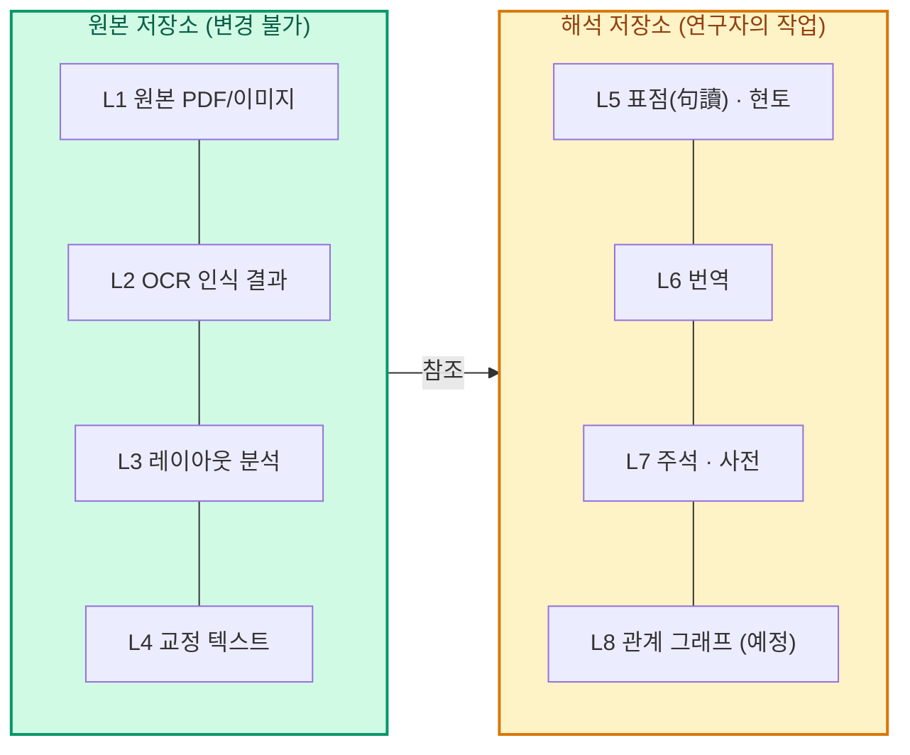
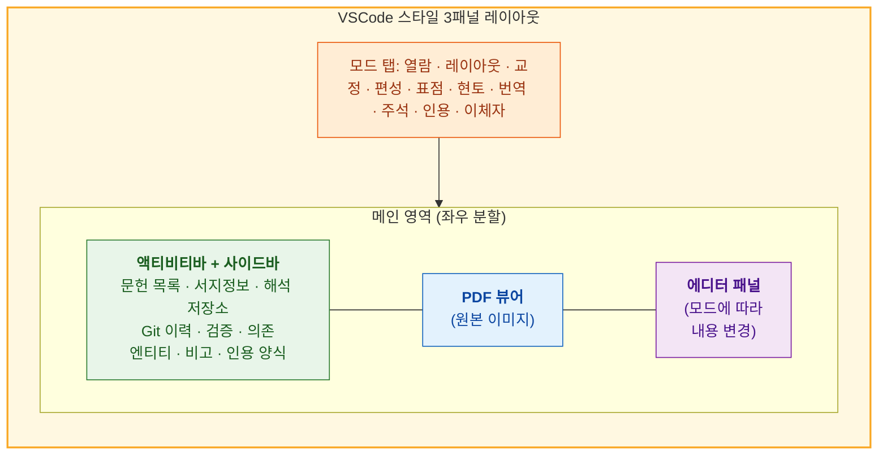
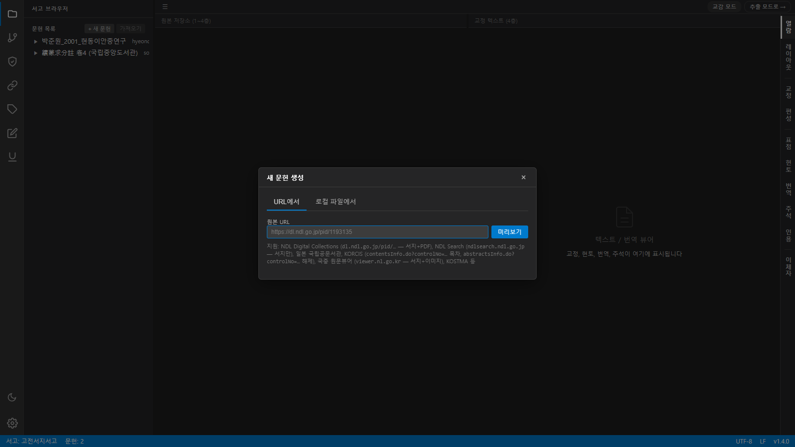
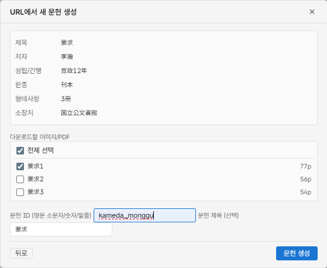
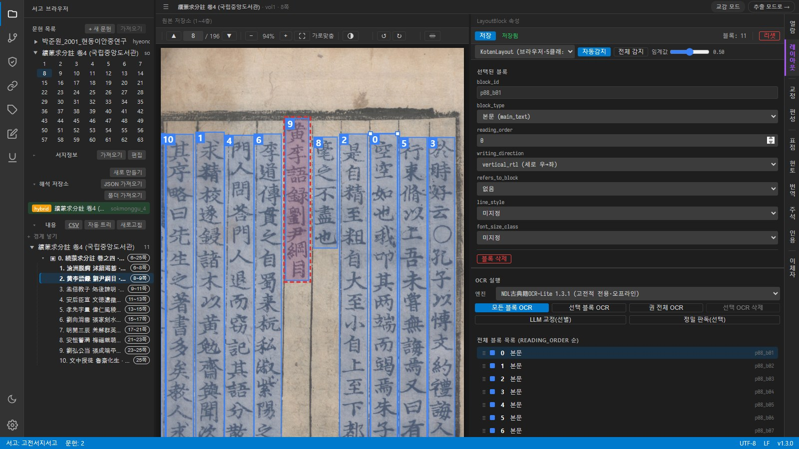
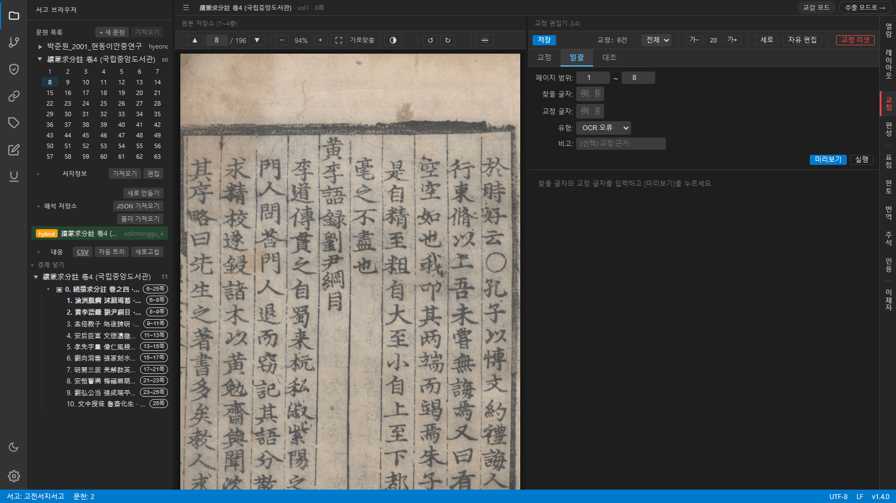
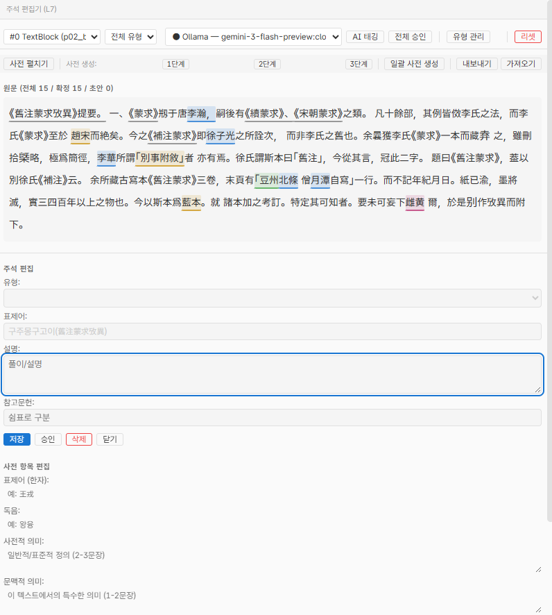
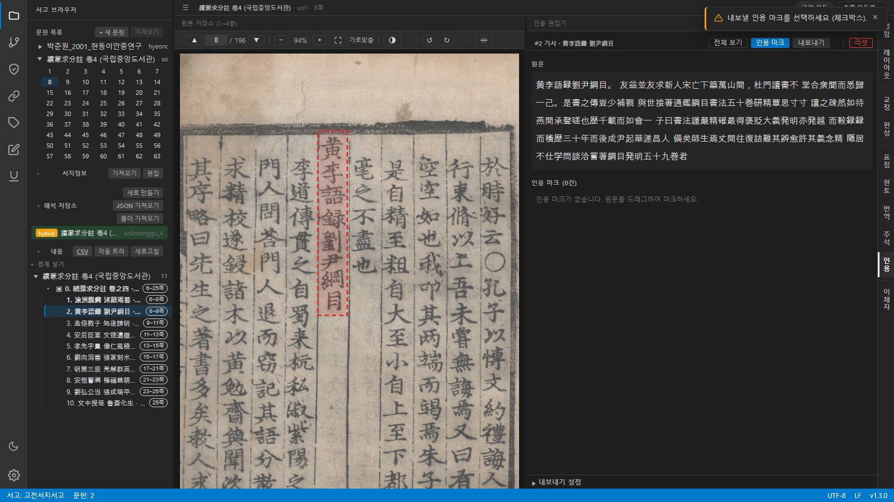
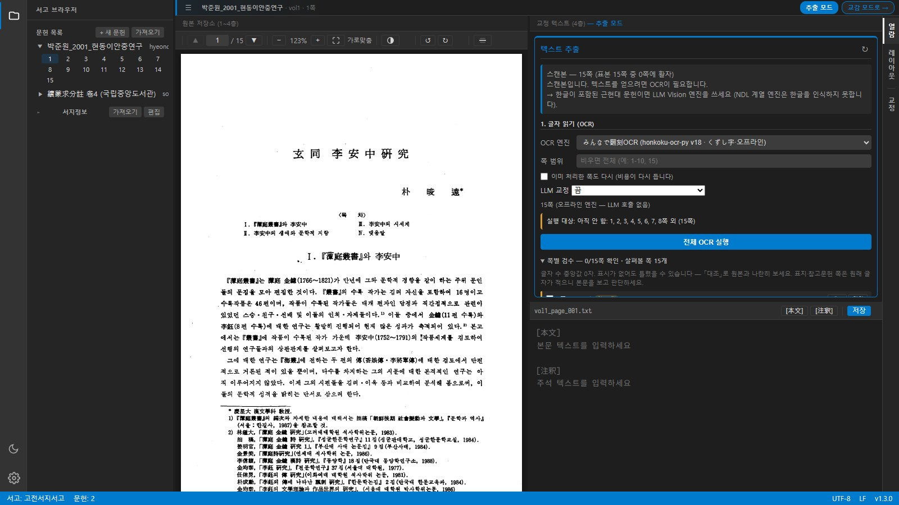
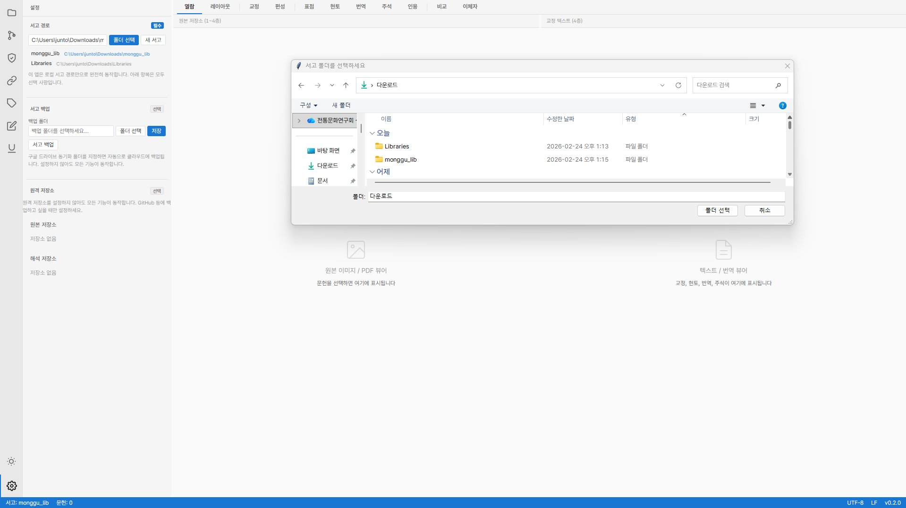

# 사용자 가이드 — 고전서지 통합 브라우저

> 이 문서는 **처음 사용하는 연구자**를 위한 단계별 안내서입니다.
> 프로그래밍 지식은 필요하지 않습니다.

---

## 목차

1. [이 프로그램은 무엇인가](#1-이-프로그램은-무엇인가)
2. [설치와 실행](#2-설치와-실행)
3. [화면 구성 이해하기](#3-화면-구성-이해하기)
4. [시작하기: 첫 문헌 등록](#4-시작하기-첫-문헌-등록)
5. [작업 흐름 1: 이미지에서 텍스트 만들기](#5-작업-흐름-1-이미지에서-텍스트-만들기)
6. [작업 흐름 2: 텍스트 해석하기](#6-작업-흐름-2-텍스트-해석하기)
7. [작업 흐름 3: 연구 도구 활용하기](#7-작업-흐름-3-연구-도구-활용하기)
7-A. [근현대 논문에서 텍스트만 빠르게 뽑기](#7-a-근현대-논문에서-텍스트만-빠르게-뽑기)
8. [LLM 설정 안내](#8-llm-설정-안내)
9. [서고 관리](#9-서고-관리)
10. [자주 묻는 질문](#10-자주-묻는-질문)

---

## 1. 이 프로그램은 무엇인가

개발자에게 VSCode가 있듯이, **고전 텍스트 연구자에게는 이 플랫폼**이 있습니다.

하나의 화면에서:
- 원본 이미지(PDF/스캔본)를 보면서
- 글자를 읽어내고(OCR)
- 교정하고
- 표점(구두점)을 찍고
- 현토를 달고
- 번역하고
- 주석을 붙이고
- 논문 인용을 준비할 수 있습니다.

**모든 작업 이력이 자동으로 기록**됩니다 (Git 기반). 이전 버전으로 되돌리거나, 다른 연구자와 작업을 공유할 수 있습니다.

### 핵심 개념: 8층 데이터 모델

데이터는 8개 층으로 구분됩니다. 아래에서 위로 쌓아올리는 구조입니다.



- **원본 저장소**(L1-L4)는 문헌 자체의 디지털화 작업입니다
- **해석 저장소**(L5-L8)는 연구자의 해석 작업입니다
- 두 저장소는 독립적이므로, 하나의 원본에 여러 해석을 붙일 수 있습니다 (예: 내 번역 vs LLM 번역)

---

## 2. 설치와 실행

### 2.1 다운로드

[**ZIP 다운로드**](https://github.com/hw725/classical-text-browser/archive/refs/heads/main.zip)를 클릭하고 원하는 위치에 압축을 풀어주세요.

> Git을 아는 분은 `git clone https://github.com/hw725/classical-text-browser.git`으로도 가능합니다.

### 2.2 설치

압축을 푼 폴더에서:

| OS | 설치 방법 |
|----|----------|
| **Windows** | `install.bat` 더블클릭 |
| **macOS/Linux** | 터미널에서 `./install.sh` 실행 |

설치 스크립트가 Python, Git, uv를 **자동으로 설치**하고, 의존성 설치(`uv sync`)도 처리합니다.
컴퓨터에 이미 설치된 것은 건너뜁니다. 처음 실행 시 1-2분 소요됩니다.

<details>
<summary>수동 설치 (고급)</summary>

```bash
cd classical-text-browser

# uv가 없다면 먼저 설치:
# Windows: irm https://astral.sh/uv/install.ps1 | iex
# macOS/Linux: curl -LsSf https://astral.sh/uv/install.sh | sh

# 설치. 약 828MB. 한글 논문 처리는 이것만으로 전부 됩니다
# — OCR, 텍스트 레이어 PDF, 형광 위치까지.
uv sync

# Python은 3.10~3.12를 씁니다 (.python-version은 3.12).
# uv가 알아서 받아 쓰므로 따로 설치할 필요는 없습니다.
# 3.13은 아직 안 됩니다 — paddlepaddle 휠이 cp312까지만 나와 있습니다.

# (선택) 다른 종류의 문헌을 다룰 때만 추가합니다.
# 셋 다 일본 국립국회도서관(NDL)이 CC BY 4.0으로 공개한 오프라인 엔진입니다.
uv sync --extra japanese       # NDLOCR-Lite — 일본어 문헌(근현대), 약 170MB
uv sync --extra classical      # NDL古典籍OCR-Lite — 고서(古典籍), 약 170MB
uv sync --extra classical-gpu  # NDL古典籍OCR Full (TrOCR) — 고서 최고 품질, 약 4.5GB
```

> **828MB 중 79%가 OCR 스택입니다**(PaddleOCR + numpy·OpenCV 등 651MB,
> PyMuPDF 51MB, 나머지 전부 127MB — 2026-07-26 실측). 덜어낼 수 있는 것이
> 사실상 없습니다. 웹 앱 뼈대를 통째로 빼도 14MB입니다.
>
> PaddleOCR를 빼면 형광 위치가 무너집니다 — 읽기는 LLM Vision이 하고
> PaddleOCR는 **글자 위치 찾기(검출)** 만 맡기 때문입니다. 없으면 텍스트가
> 왼쪽 여백에 균등 배치되어, 검색하면 형광은 뜨는데 그 자리에 원본 글자가
> 없습니다. 실측(15쪽 논문): 있음 → 502줄 중 433줄 제자리 / **없음 → 0줄**.
> 그래서 PaddleOCR는 선택이 아니라 기본 번들입니다(D-055).

> **한글 논문에 `classical`을 설치하지 마세요.** 고전적 전용 엔진은
> 학습 데이터에 한글이 없어 **한글을 인식하지 못합니다.** 예전 안내가
> 이 엔진을 「권장」이라고 적어 두어 혼동을 준 적이 있습니다.
>
> 예전 이름(`ndlocr`·`ndlkotenocr`·`ndlkotenocr-full`)도 그대로 동작합니다.
</details>

### 2.3 서버 실행

| OS | 실행 방법 |
|----|----------|
| **Windows** | `start_server.bat` 더블클릭 |

> 서버는 `src/` 안의 파이썬 파일이 바뀌면 스스로 다시 뜹니다(`--reload`). 코드를 고친 뒤 껐다 켤 필요가 없고,
> 화면 파일(JS·CSS)만 바뀐 경우는 브라우저에서 Ctrl+F5로 새로고침하면 됩니다.
| **macOS/Linux** | `./start_server.sh` |

또는 터미널에서 직접:
```bash
uv run python -m app serve                              # GUI에서 서고 선택
uv run python -m app serve --library /path/to/my-library # 서고 지정
```

실행 후 **브라우저에서 `http://localhost:8000`**을 엽니다 (자동으로 열립니다).

### 2.4 서고 만들기 (처음일 때)

CLI로 서고를 먼저 만들 수도 있습니다:
```bash
uv run python -m cli init-library /path/to/my-library
```

또는 GUI 설정 탭에서 「새 서고」 버튼을 누릅니다 ([9. 서고 관리](#9-서고-관리) 참조).

---

## 3. 화면 구성 이해하기

화면은 크게 4개 영역으로 나뉩니다.



### 3.1 액티비티 바 (맨 왼쪽, 아이콘 세로줄)

| 위치 | 아이콘 | 기능 |
|------|--------|------|
| 상단 | 폴더 | **서고 브라우저** — 문헌 목록, 서지정보, 해석 저장소 |
| 중간 | 가지 | **Git 이력** — 작업 저장 이력, 사다리형 그래프 |
| 중간 | 방패 | **검증 결과** — 데이터 무결성 검사 (향후 구현) |
| 중간 | 사슬 | **의존 추적** — 원본이 변경되었는지 추적 |
| 중간 | 꼬리표 | **엔티티** — 단위, Tag, Concept 등 코어 엔티티 |
| 중간 | 연필 | **비고** — 자유 메모 |
| 중간 | 밑줄 | **인용 양식** — 학술 인용 형식 관리 |
| 하단 | 해/달 | **테마 전환** — 밝은 모드 / 어두운 모드 |
| 하단 | 톱니바퀴 | **설정** — 서고 경로 변경, 최근 서고 |

> 서고 브라우저·설정을 뺀 가운데 아이콘들은 **교감 모드에서만** 보입니다.
> 추출 모드에서는 숨습니다(모두 교감 작업용이기 때문입니다).

> **팁**: 같은 아이콘을 다시 클릭하면 사이드바가 접힙니다. 넓은 화면이 필요할 때 유용합니다.

### 3.2 사이드바

**서고 브라우저** 모드일 때 세 섹션이 표시됩니다:

1. **문헌 목록** — 서고에 등록된 모든 문헌. 트리 형태로 권(卷)→페이지 탐색
2. **서지정보** — 선택한 문헌의 제목·저자·시기 등 메타데이터
3. **해석 저장소** — 선택한 문헌에 연결된 해석 작업 목록

**내용 트리(교감 모드)** — 해석 저장소를 고르면 사이드바에 「내용」 섹션이 나타납니다.
편성한 단위가 Work별·순서대로 놓이고, 블록을 누르면 그 내용이 있는 쪽으로
이동해 레이아웃 블록을 강조합니다. 두 쪽에 걸친 블록은 쪽 배지가 둘이고, 배지를
누르면 그 쪽으로 갑니다. 지금 보는 쪽의 블록은 굵게 표시됩니다.

> **글마다 표제가 서는 문헌(일기·담초·사행록)이면** 편성 탭의 「경계 제안」을 먼저
> 눌러 보세요. 권 전체 확정본에서 날짜·표제 어휘·형식으로 글이 바뀌는 자리를 찍어 주고,
> 체크한 것만 단위가 됩니다. 談草·筆談처럼 이 문헌만의 표제 어휘는 「규칙」에 적으면
> 문헌 설정으로 저장됩니다. 권 전체 확정본이 없으면 OCR 패널의 「권 전체 OCR」로 먼저 돌리세요.
> 개행 없이 「○七日…○八日…」처럼 열 중간에서 날이 바뀌는 일기(澹齋日錄류)도 같은 단추로 잡습니다 —
> 후보에 「n자째」가 붙고, 만든 단위는 행 중간에서 잘립니다.
>
> 해제(解題)나 서지 설명이 있으면 「규칙」의 **해제·참고 텍스트**에 붙여 넣으세요. 목차 감지(LLM)가 권차·편차·
> 수록 작품을 참고합니다. 사이드바의 섹션 머리(문헌 목록·서지정보·해석 저장소·내용)는 누르면 접힙니다.
>
> 가장 빠른 길은 사이드바 「내용」의 **자동 트리**입니다. 목차·해제·들여쓰기·위치를 합쳐 묶음 > 기사 > 조각의
> 개요를 한 번에 세우고, 행마다 ⇤⇥로 깊이를, ▲▼로 시작 행을, ×로 합치기를 합니다. 편성 탭의 「선택 적용」은
> 체크 상태가 곧 트리라서, 체크를 뺀 제안 경계는 지워지고 손으로 넣은 경계만 남습니다.
>
> **단위는 경계로 정해집니다(v1.3, D-092).** 사이드바 「내용」 트리의 «경계 넣기»로 아무 쪽·행·글자에
> 경계를 놓으면 그 자리에서 단위가 나뉘고, 행의 ×를 누르면 앞 단위에 합쳐집니다. 본문은 저장하지 않고
> 확정본에서 잘라 오므로 교감이 바로 반영되고, 확정본이 크게 바뀌어 자리를 못 찾은 경계는 ⚠로
> 표시됩니다 — ▲▼로 옮겨 주세요.
>
> **깊이와 역할은 다릅니다.** 깊이는 트리에서 몇 단 들어갔는지(⇤⇥로 바꾸고, 제한이 없습니다)이고,
> 역할은 그것이 무엇인지 — **묶음**(卷·集·編), **기사**(번역·주석이 붙는 단위), **조각**(기사 안 문단·문답·
> 협주) 셋입니다. 행의 「묶음/기사/조각」 단추를 누르면 돌아갑니다. 문집처럼 集 > 卷 > 기사로 세 단이면
> 기사가 3단에 있어도 역할은 기사입니다 — 번역·주석은 역할이 기사인 단위에 붙습니다.
>
> **글 단위가 잘 안 보이는 문헌이면** 쪽마다 단위 하나로 시작하세요(편성 탭의 「자동 편성」 —
> 그 쪽의 레이아웃 블록마다 경계를 하나씩 놓습니다). 구조가 보이는 곳부터 「내용」 트리의
> «경계 넣기»로 쪼개고 ×로 합치면 됩니다. 단위는 나중에 바꿔도 표점·번역은 제자리에
> 남습니다(D-085).

### 3.3 모드 탭 바

작업 종류에 따라 10개 모드를 전환합니다. **왼쪽에서 오른쪽으로 작업 순서**입니다.

| 모드 | 층 | 하는 일 |
|------|-----|---------|
| **열람** | L1-L4 | PDF 보기 + 텍스트 읽기 (기본 모드) |
| **레이아웃** | L3 | 이미지에서 텍스트 영역 지정 (본문 / 주석 / 제목 구분) |
| **교정** | L4 | OCR 결과를 글자 단위로 교정 |
| **편성** | L3→L5 | 레이아웃 블록을 해석 단위로 묶기 |
| **표점** | L5 | 한문에 구두점(。、；) 삽입 |
| **현토** | L5 | 한문에 한국어 토(은, 하고, 이니) 삽입 |
| **번역** | L6 | 문장별 현대어 번역 |
| **주석** | L7 | 인물·지명·용어·전거 주석 |
| **인용** | — | 논문 인용 구절 마크업 + 학술 인용 형식 내보내기 |
| **이체자** | L4 | 異體字 대응표 관리 + 일괄 교정 |

**작업 모드 — 교감 / 추출 (탭 줄 오른쪽 끝)**

```
[ 교감 모드 ]  추출 모드로 →
```

위 탭들은 **한 글자씩 교감(校勘)하는 작업**까지 포함한 순서입니다.
텍스트만 뽑으면 되는 자료에서는 버튼을 눌러 **「추출 모드」**로 바꾸세요.
**열람·레이아웃·교정** 셋만 남고 나머지 일곱은 숨습니다.

| | 교감 모드 | 추출 모드 |
|---|---|---|
| 탭 | 10개 전부 | **열람·레이아웃·교정** |
| 오른쪽 패널 | 교정 텍스트 | + **텍스트 추출 패널** |

셋을 남긴 이유가 있습니다 — **열람**은 원본을 봐야 하고, **레이아웃**은 드물지만
일본어 세로쓰기 다단에서 영역 지정이 필요하며, **교정**은 인쇄 품질이 나쁠 때
OCR 결과를 손봐야 하기 때문입니다.

- **문헌 종류를 판정하지 않습니다.** 앱이 「이건 논문이다」라고 추측하는 일은 없고,
  버튼을 누를 때만 바뀝니다. 애매한 자료는 「표점·현토를 쓸 것인가」만 생각하세요.
- 숨기는 것은 **표시뿐**입니다. 데이터는 그대로 있고, 되돌리면 다시 나타납니다.
- 모드는 **문헌마다 기억**되므로, 한 서고에 고서와 논문이 섞여 있어도
  문헌을 열 때마다 알맞은 화면으로 따라갑니다.
- 추출 모드로 바꿀 때 **쓰지 않는 빈 해석 저장소**가 있으면 휴지통으로 옮깁니다.
  번역·주석이 하나라도 들어 있으면 그대로 둡니다.
- **왼쪽 아이콘 줄을 통째로 접을 수 있습니다.** 탭 줄 왼쪽 끝의 `☰`를 누르세요.
  (사이드바를 접어도 아이콘 줄은 남기 때문에 따로 둔 것입니다.)
  다시 펴면 서고 브라우저가 열립니다. 접은 상태는 기억됩니다.
- 교정 탭의 **「OCR 채우기」**가 숨습니다 — 배치가 이미 채워 두므로 누를 일이 없습니다.
- 왼쪽 아이콘 줄이 **서고 브라우저·설정 둘만** 남습니다. 검증 결과·의존 추적·
  엔티티·비고·인용 양식·Git 이력이 숨습니다(모두 교감 작업용입니다).
  설정 안의 「원격 저장소」도 숨습니다. 교감 모드로 돌리면 그대로 돌아옵니다.
- **권이 하나뿐인 문헌은 트리에서 그 단계를 건너뜁니다.** 문헌을 누르면 쪽이
  바로 나옵니다. 여러 권짜리(고서 등)는 예전처럼 권을 거칩니다.
- 자세한 사용법은 [7-A. 근현대 논문에서 텍스트만 빠르게 뽑기](#7-a-근현대-논문에서-텍스트만-빠르게-뽑기)를 보세요.

### 나중에 권을 더하기

卷下를 뒤늦게 구했다면 문헌을 다시 만들 필요가 없습니다.
사이드바에서 **문헌 이름 위에 마우스를 올리면 「＋」 버튼**이 나옵니다.
PDF를 고르면 권으로 더해지고, 이름을 물어봅니다(예: `卷下`).

- **이미 한 OCR·교정은 그대로 남습니다.** 그게 이 기능을 만든 이유입니다.
- PDF만 더할 수 있습니다. 이미지는 새 문헌으로 만드세요.
- 여러 개를 한 번에 고르면 파일마다 별도 권이 되고, 이름은 파일 이름을 씁니다.

> **따로 등록해 버린 두 문헌을 합치는 기능은 아직 없습니다.** 쪽 번호가 겹치고
> 해석 저장소·Git 이력을 어떻게 할지 정해야 해서 설계가 더 필요합니다.
> 여러 권짜리는 **처음 등록할 때 파일을 여러 개 넣으면** 한 문헌의 여러 권이 됩니다.

### 3.4 메인 영역 (좌우 분할)

- **왼쪽**: PDF/이미지 뷰어 (원본 열람)
- **오른쪽**: 에디터 패널 (모드에 따라 내용이 바뀜)
- 경계선을 드래그하여 비율 조절 가능

### 3.5 사이드바의 다른 섹션들

예전에는 화면 아래에 «하단 패널»이 따로 있었지만, 지금은 **왼쪽 아이콘 줄에서 골라
사이드바에 펼치는 방식**으로 바뀌었습니다. 아이콘을 누르면 그 섹션이 사이드바에 나옵니다.

| 아이콘 | 용도 |
|----|------|
| **Git 이력** | 작업 저장 이력 보기, 사다리형 그래프 |
| **검증 결과** | 데이터 무결성 검사 결과 (향후 구현) |
| **의존 추적** | 원본이 변경되었는지 추적 |
| **엔티티** | 단위, Tag, Concept 등 코어 엔티티 |
| **비고** | 자유 메모 |
| **인용 양식** | 학술 인용 형식 관리 |

---

## 4. 시작하기: 첫 문헌 등록

### 가장 빠른 방법: 드래그 앤 드롭

PDF나 이미지 파일(이미지가 든 폴더도 가능)을 **브라우저 창 안 어디에나 끌어다 놓으세요.**

1. 서고가 아직 없으면 기본 서고(`내 문서/고전서지서고`)가 자동으로 만들어집니다
   (위치는 설정에서 언제든 바꿀 수 있습니다).
2. 파일 목록·제목(원본 파일명)이 채워진 확인 화면이 열립니다.
   문헌 ID는 비워 두면 자동으로 만들어지므로 입력하지 않아도 됩니다.
3. **“문헌 생성”** 클릭 — 끝입니다. 이미지 여러 장은 파일명 순서대로
   1권의 PDF로 묶이고, PDF는 각각 별도의 권이 됩니다.
   기본 해석 저장소(`문헌ID_interp`)도 함께 만들어지므로,
   OCR·교정 후 곧바로 표점·번역·주석 작업을 시작할 수 있습니다.

### 방법 A: URL로 등록 (서지정보 자동 추출)

1. 사이드바 상단의 **「+ 새 문헌」** 클릭
2. **URL 입력**:



   지원하는 서지정보 소스:
   - 한국고문헌종합목록(KORCIS) URL
   - 일본 국립국회도서관(NDL Search) URL
   - 일본 국립공문서관 디지털 아카이브 URL — **PDF 자동 다운로드** (구형/신형 IIIF 모두 지원)
   - 고려대 해외한국학자료센터(KOSTMA) URL — **PDF 자동 다운로드**
   - 한국학중앙연구원 장서각 URL — **PDF 자동 다운로드**
   - 서울대 규장각한국학연구원 URL — **PDF 자동 다운로드**
   - 기타 모든 URL (범용 LLM 파서 사용)
3. 시스템이 자동으로:
   - 서지정보를 파싱하여 제목·저자·시기를 채움
   - PDF/이미지가 있으면 자동 다운로드 제안



4. **「등록」** 클릭하면 서고에 문헌이 추가됩니다

### 방법 B: CLI로 등록

```bash
uv run python -m cli add-document /path/to/my-library \
    --title "蒙求" --doc-id monggu
```

등록 후 PDF 파일을 `documents/monggu/L1_source/` 폴더에 직접 복사합니다.

### 방법 C: HWP/HWPX 가져오기

1. 사이드바의 **「HWP」** 버튼 클릭
2. 한글 파일(.hwp 또는 .hwpx) 선택
3. 미리보기에서 옵션 설정:
   - **표점·현토 자동 분리**: 한문 원문에서 구두점과 토를 자동 분리
   - **대두(擡頭) 감지**: 줄바꿈 형식 메타데이터 추출
4. **가져오기 모드** 선택:
   - **새 문헌 만들기** (기본): 새 문헌 ID를 지정하여 등록
   - **기존 문헌에 텍스트 추가**: 이미 등록된 문헌(OCR 텍스트 보유)에 HWP 텍스트를 매핑
     - 한자 앵커로 기존 페이지와 HWP 텍스트를 자동 대조합니다
     - 매핑 미리보기에서 페이지별 대응을 확인할 수 있습니다
5. **「가져오기」** 클릭

---

## 5. 작업 흐름 1: 이미지에서 텍스트 만들기

> PDF/이미지 원본이 있는 문헌에 해당합니다.
> HWP에서 텍스트를 가져왔다면 이 단계를 건너뛸 수 있습니다.

### 5.1 레이아웃 분석 (L3)

**목적**: 페이지 이미지에서 «어디에 무슨 종류의 글자가 있는지» 지정합니다.

1. **레이아웃** 모드 탭 선택
2. **「자동감지」** 버튼 클릭 → 이 쪽의 영역을 자동으로 감지합니다
   (여러 쪽을 한 번에 하려면 **「전체 감지」**)
3. 결과를 확인합니다:
   - 초록색 박스 = 본문(大字)
   - 파란색 박스 = 주석(小字雙行)
   - 회색 박스 = 판심제, 장차 등
4. **잘못된 박스 수정**:
   - 박스 클릭 → 오른쪽 패널에서 속성(유형, 읽기 순서) 변경
   - 박스 드래그로 위치/크기 조정
   - 새 박스 추가 또는 삭제
5. **저장** (Ctrl+S 또는 저장 버튼)

> **읽기 순서(reading_order)**: OCR이 블록을 읽는 순서입니다. 고전 한문은 보통 오른쪽에서 왼쪽(세로쓰기, RTL)이므로 오른쪽 블록에 작은 번호를 부여합니다.

### 5.2 OCR (L2)

**목적**: 각 블록의 이미지를 글자로 변환합니다.

1. **레이아웃** 모드에서 우측 하단의 **OCR 실행** 패널 확인
2. 설정:
   - **엔진**: 드롭다운에서 선택 (설치된 엔진만 표시)
     - **NDL古典籍OCR Full** — 최고 품질, GPU 필요 (`uv sync --extra classical-gpu`)
     - **NDL古典籍OCR-Lite** — 고전적 전용, CPU OK (`uv sync --extra classical`)
     - **NDLOCR-Lite** — 근현대 일본어 자료 (`uv sync --extra japanese`)
     - **LLM Vision** — 온라인, API 키 필요
     - **PaddleOCR** — 기본 설치에 포함되어 있어 따로 받을 것이 없습니다
   - **언어**: PaddleOCR을 고를 때만 나오는 칸입니다
     (중국어 간체·번체, 한국어, 일본어, 영어)
3. **「모든 블록 OCR」** 클릭 → 모든 블록을 순서대로 OCR
   - 또는 특정 블록만 선택하여 **「선택 블록 OCR」**



4. 진행률 표시줄에서 **실시간** 진행 상황 확인 (블록별 스트리밍)
5. 완료 후 결과 미리보기

### 5.2-1 LLM 교정 패스와 정밀 판독

엔진 OCR을 먼저 돌린 뒤, **다시 볼 곳만** LLM에 넘기는 흐름입니다(설계 결정 D-082).
LLM은 이미지와 **엔진이 읽은 결과**를 함께 받아 교정하므로 백지에서 읽을 때보다
지어내는 여지가 적습니다. 결과는 L2를 덮지 않고 **교정 초안**으로 저장됩니다.

- **「LLM 교정(선별)」** — 신뢰도가 낮은 블록, 협주·방주, 한글을 못 읽는 엔진의 결과만
  골라 다시 읽습니다(추론 끔). 어느 블록을 왜 골랐는지 초안 목록에 이유가 붙습니다.
- **「정밀 판독(선택)」** — 선택한 블록 하나를 **앞뒤 블록과 앞뒤 쪽의 확정본**을 문맥으로
  붙여 **추론을 켠 채** 다시 읽습니다. 행초·흘림체처럼 자형만으로 안 풀리는 곳에 씁니다.
  추론 예산은 답변 예산에 더해지고, 출력이 잘리면 추론을 끄고 한 번 더 시도합니다(D-083).
- 초안 목록의 각 블록에는 **엔진 결과 → 교정본**, 앵커와의 일치율, `[?]`(불확실 글자) 수가
  보입니다. 일치율이 높고 불확실 표시가 없는 블록은 자동 수용 기준을 통과한 것이고,
  **「적용」**을 누른 블록만 L4(교정 텍스트)에 들어갑니다.
- 권 단위 일괄 OCR(추출 패널)에서는 **「LLM 교정」**을 「선별만」이나 「전체」로 켤 수
  있습니다. 기본은 끔입니다 — 켜면 쪽마다 LLM 호출이 나갑니다.

LLM이 확신하지 못한 글자는 `[?]`로, 판독 불가 자리는 `□`로 표시하도록 프롬프트가
지시합니다. 이 표시는 글자별 신뢰도로 바뀌어 저장되고, 텍스트에는 남지 않습니다.

### 5.2-2 문헌 판독 지침

LLM OCR 프롬프트에는 서지(연대·판종·문자 체계)에서 만든 문장과 블록 종류(본문·협주·
판심제 등)가 자동으로 들어갑니다(D-081). 여기에 **이 문헌에만** 해당하는 지침 — 자주
나오는 인명·지명, 주의할 자형, 문서 양식 — 을 덧붙이려면 API로 저장합니다:

```
PUT /api/documents/{doc_id}/ocr-guidance
{"ocr_guidance": "1930년대 조선총독부 공문서. 인명 長尾欽彌·藤島亥治郞가 자주 나온다."}
```

응답의 `preview`가 프롬프트에 실릴 [문헌 정보] 전문입니다. 자료마다 다른 어휘를
코드에 두지 않고 문헌 안에 둔다는 것이 이 방식의 요지입니다.

### 5.2-3 이체자 사전의 층과 문헌별 승인

이체자 사전은 관계 강도에 따라 세 층으로 나뉩니다(D-080).

| 층 | 뜻 | 대조 화면에서 |
|---|---|---|
| strict | 확정 동자 (기본 사전, 이 문헌에서 승인한 쌍) | **이체자**(노랑) |
| loose | 넓은 이체 관계 (교육부·漢語大字典 추출본 등) | 불일치 + «사전 힌트» |
| script | 간체·신자체 등 문자 체계 차이 (OpenCC) | 불일치 + «사전 힌트» |

넓은 사전은 힌트일 뿐 동치가 아닙니다. 丘와 业처럼 통가 수준의 관계까지 «같은 글자»로
치면 OCR 오독이 숨기 때문입니다. 대조 화면에서 불일치 줄을 누르면 **「이 문헌에서
같은 글자로 승인」**을 먼저 묻고, 승인한 쌍은 `documents/{doc_id}/variant_approvals.json`
에만 저장됩니다 — 다른 문헌의 판정을 바꾸지 않습니다. 어떤 층의 사전으로도 본문은
바뀌지 않습니다. 정자화가 필요하면 지금처럼 일괄교정으로 글자 쌍을 지정해 실행합니다.

사전 파일을 공개 자료에서 만들려면:

```
uv run python scripts/build_variant_dicts.py --opencc            # 간체·신자체 표 (Apache-2.0, 포함됨)
uv run python scripts/build_variant_dicts.py --unihan-zip Unihan.zip
uv run python scripts/build_variant_dicts.py --cjkvi             # 교육부·漢語大字典 추출본 — 라이선스 미확인, 로컬 전용
```

### 5.2-4 정확도 재기

프롬프트나 흐름을 바꿨으면 잽니다(D-084). 사람이 교정을 끝낸 쪽의 L4를 정답으로,
엔진 결과(L2)와 교정 초안의 글자 오류율(CER)을 쪽별·엔진별로 냅니다.

```
uv run python scripts/eval_cer.py --library ~/서고 --doc doc001 --part vol1 --pages 1-10
```

### 5.3 교정 (L4)

**목적**: OCR이 잘못 읽은 글자를 바로잡습니다.

1. **교정** 모드 탭 선택
2. **「OCR 채우기」** 클릭 → OCR 결과를 교정 편집기에 불러옵니다
3. 왼쪽 PDF 이미지와 비교하면서 글자를 수정합니다

**두 가지 편집 모드** (툴바의 「자유 편집」 버튼으로 전환):

| 모드 | 방식 | 적합한 상황 |
|------|------|------------|
| **글자 교정** (기본) | 글자 클릭 → 교정 다이얼로그 | 유형 지정(이체자, 이문 등), 정밀 교정 |
| **자유 편집** | textarea에서 자유롭게 타이핑 | OCR 오류 대량 수정, 글자 추가/삭제 |

- 자유 편집에서는 글자를 추가하거나 삭제할 수 있습니다
- 저장 시 원본과 자동 비교하여 교정 기록(corrections)이 생성됩니다
- 기존 글자 교정에서 지정한 유형·비고 메타데이터는 자유 편집 저장 후에도 보존됩니다

4. **대조** 서브탭: OCR 결과와 교정본을 글자별로 나란히 비교
   - 빨간색 = 불일치, 초록색 = 일치, 노란색 = 이체자



5. **저장** (Ctrl+S)

---

## 6. 작업 흐름 2: 텍스트 해석하기

> 해석 작업을 시작하려면 먼저 **해석 저장소를 생성**해야 합니다.
> 사이드바 「해석 저장소」 섹션에서 **「새로 만들기」**를 클릭합니다.

### 6.1 표점 (L5) — 한문에 구두점 삽입

1. **표점** 모드 탭 선택
2. 상단에서 블록 선택
3. 글자를 클릭하면 **표점 부호 팔레트**가 나타납니다
   - 기본 부호: 。 、 ， ； ： ？ ！ 《》
4. 부호를 선택하면 해당 글자 뒤에 삽입됩니다
   - 서명호(《》)는 범위 선택 필요
5. **「AI 표점」**: LLM 또는 외부 SikuRoBERTa 표점 서비스가 구두점을 제안합니다 → 경과 시간이 표시됩니다 → 검토 후 확정
6. **저장**

### 6.2 현토 (L5) — 한국어 토 달기

1. **현토** 모드 탭 선택
2. 글자를 클릭하면 **현토 입력 팝업**이 나타납니다
   - **위치**: before(글자 앞) 또는 after(글자 뒤)
   - **토**: 한국어 토 입력 (예: 은, 이, 하고, 이니)
3. **삽입** 클릭
4. **저장**

### 6.3 번역 (L6) — 현대어 번역

1. **번역** 모드 탭 선택
2. 상단에서 블록 선택
3. 원문이 표시되고 (표점·현토 적용된 상태), 아래에 문장별 번역 입력란이 나타납니다
4. 직접 번역을 입력하거나 **「전체 AI 번역」** 클릭
   - LLM이 문장별로 초안을 생성합니다
   - 초안(draft)을 검토하고 수정합니다
5. **참조 사전 활용**:
   - **「참조 사전 ON」** 토글 → 주석에서 만든 사전 항목이 번역에 참고됩니다
   - **「사전 관리」** → 다른 문헌에서 가져온 참조 사전 관리
6. **저장**

### 6.4 주석 (L7) — 인물·지명·용어·전거

1. **주석** 모드 탭 선택
2. 상단에서 블록 선택
3. 원문에서 주석할 범위를 드래그로 선택
4. 주석 유형 선택: 인물(person), 지명(place), 용어(term), 전거(allusion), 메모(note)
5. 내용 입력: 표제어, 설명, 참고문헌



6. **AI 태깅**: LLM이 자동으로 주석 후보를 생성합니다

#### 사전형 주석 (고급)

단순 태깅 외에 사전 형식의 체계적 주석을 만들 수 있습니다:

| 필드 | 설명 | 예시 |
|------|------|------|
| 표제어 | 한자 원문 | 王戎 |
| 독음 | 한국어 독음 | 왕융 |
| 사전적 의미 | 일반적 정의 | 서진의 관료, 죽림칠현의 한 사람 |
| 문맥적 의미 | 이 텍스트에서의 뜻 | 간결한 행정으로 유명한 인물의 예시 |
| 출전 | 참고문헌 | 《晉書》 列傳 第十三 |

**4단계 LLM 생성**:
1. **[1단계]**: 원문만으로 사전 항목 생성
2. **[2단계]**: 번역을 참고하여 보강
3. **[3단계]**: 원문+번역 통합하여 최종 생성
4. 연구자가 검토·편집 → **확정(accepted)**

확정된 주석은 LLM이 덮어쓰지 않습니다. 안심하고 편집하세요.

---

## 7. 작업 흐름 3: 연구 도구 활용하기

### 7.1 인용 마크

논문 인용을 위해 구절을 마크업합니다.

1. **인용** 모드 탭 선택
2. 원문 또는 번역에서 인용할 범위를 드래그로 선택
3. **「인용 마크」** 클릭
4. 레이블(메모)과 태그(분류)를 붙일 수 있습니다
5. **통합 컨텍스트 뷰**: 마크된 구절에 대해 원문·표점본·번역·주석을 한눈에 확인
6. **「내보내기」**: 학술 인용 형식으로 변환, 클립보드에 복사



인용 형식 예시:
```
朴趾源, 燕岩集卷2, 答巡使書 25면(韓國文集叢刊252집, 48면) : 若吾所樂者善，而所敬者天也。
```

### 7.2 사전 내보내기/가져오기

하나의 문헌에서 만든 주석 사전을 다른 문헌에서 참조할 수 있습니다.

1. **주석** 모드 → **「내보내기」** 클릭 → JSON 파일 저장
2. 다른 해석 저장소에서 **「사전 관리」** → **「가져오기」** → JSON 파일 선택
3. 가져온 사전의 표제어가 원문에서 자동 매칭됩니다
4. 매칭 결과를 체크박스로 선택 → 번역 프롬프트에 참고 사전으로 포함

### 7.3 Git 이력 관리

모든 저장은 자동으로 Git 커밋으로 기록됩니다.

1. **왼쪽 아이콘 줄** → **「Git 이력」** 선택 (사이드바에 펼쳐집니다)
2. **커밋 목록**: 최근 저장 이력을 시간순으로 보여줍니다
3. **사다리형 그래프**: 원본 저장소와 해석 저장소의 이력을 나란히 비교합니다
   - 가로 연결선은 «이 해석이 원본의 어떤 시점을 기반했는지»를 보여줍니다
   - **금색 링**: 현재 작업 중인 저장 시점을 표시합니다
4. **파일 미리보기**: 커밋 노드를 클릭하면 그 시점에 저장된 파일 목록을 볼 수 있습니다
   - 파일을 클릭하면 읽기 전용으로 내용을 미리봅니다
   - JSON 파일은 자동으로 보기 좋게 정렬됩니다
5. **이 버전으로 되돌리기**: 과거 시점의 상태로 복원합니다
   - 확인 다이얼로그가 표시됩니다
   - 되돌리기는 새로운 저장 시점으로 기록되므로, 기존 이력은 모두 보존됩니다
   - 저장하지 않은 변경사항이 있으면 먼저 저장해야 합니다

### 7.4 JSON 스냅샷 내보내기/가져오기

문헌의 현재 상태를 단일 JSON 파일로 저장하거나, 다른 환경에서 가져올 수 있습니다.

- **내보내기**: 사이드바 해석 저장소 → 선택 → 「JSON 내보내기」
- **가져오기**: 사이드바 해석 저장소 → 「가져오기」 → JSON 파일 선택

---

## 7-A. 근현대 논문에서 텍스트만 빠르게 뽑기

> 옛날 논문·단행본 스캔본처럼 **표점·현토·이체자가 필요 없는 자료**를 다룰 때입니다.
> 5~6장의 고서 작업 흐름을 그대로 거치지 않아도 됩니다.

### 7-A.1 먼저: 이 PDF에 OCR이 필요한가?

문헌을 드래그 앤 드롭으로 등록하면 **자동으로 진단**해서 알려 줍니다.
세 가지 중 하나입니다.

| 진단 | 뜻 | 다음에 할 일 |
|---|---|---|
| **텍스트 있음**(born_digital) | 대부분의 쪽에 활자 정보가 들어 있다 | **OCR 불필요.** 7-A.2로 |
| **일부만 있음**(partial) | 표지·판권지만 활자인 영인본이거나 부분 OCR본 | 나머지 쪽은 7-A.3으로 |
| **스캔본**(scanned) | 이미지뿐이다 | 7-A.3으로 |

나중에 다시 확인하려면: 사이드바에서 문헌을 열고 아래 주소를 브라우저에 넣습니다.

```
/api/documents/<문헌ID>/parts/<권ID>/text-layer
```

### 7-A.2 텍스트 추출 패널



*탭이 열람·레이아웃·교정 셋으로 줄고, 오른쪽 패널 제목에 「추출 모드」가 붙습니다.*

탭 줄 오른쪽 끝의 버튼을 눌러 **「추출」 모드**로 바꾸면,
**열람 탭 오른쪽에 「텍스트 추출」 패널**이 나타납니다. 아래 작업은 모두 이 패널에서 합니다.

| 칸 | 하는 일 |
|---|---|
| 진단 | 텍스트 레이어 유무와 다음에 할 일을 보여 준다 (↻로 다시 진단) |
| OCR 엔진 | 한글을 못 읽는 엔진은 이름에 «한글 불가»가 붙고, 고르면 경고가 뜬다 |
| 쪽 범위 | 비우면 전체. `1-10, 15`처럼 쓴다. 옆에 **예상 LLM 호출 횟수**가 표시된다 |
| 전체 OCR 실행 | 권 전체를 돌린다. 실행 중에는 같은 버튼이 **「중단」**이 된다 |
| 산출물 | 「2. 검색되는 PDF 만들기」 절 — 크기·시각, **「텍스트 레이어 PDF 다시 만들기」** 버튼, **「만든 PDF 내려받기」** 링크 |

### 7-A.3 텍스트가 이미 있는 PDF — OCR 없이 바로 가져오기

1. 사이드바에서 문헌의 페이지를 하나 엽니다.
2. 텍스트 추출 패널의 **「텍스트 바로 가져오기」** 버튼을 누릅니다.

PDF에 들어 있는 활자를 그대로 **교정 텍스트(L4)**로 옮깁니다.
OCR을 한 번도 돌리지 않으므로 오인식이 없고 몇 초면 끝납니다.

> 이미 교정해 둔 쪽은 **덮어쓰지 않고 건너뜁니다.** 몇 쪽을 건너뛰었는지 알려 줍니다.

### 7-A.4 스캔본 — 권 전체를 한 번에 OCR

고서와 달리 레이아웃을 직접 잡을 필요가 없습니다. 페이지 전체를 하나의 영역으로
보고 한 번에 처리합니다.

**엔진을 반드시 확인하세요.** 기본 엔진은 «설치된 것 중 첫 번째»라
고전적 전용 엔진이 잡히는 경우가 많은데, 그 엔진들은 **한글을 인식하지 못합니다.**

| 엔진 | 한글 | 비고 |
|---|---|---|
| NDL古典籍OCR (Full/Lite), NDLOCR-Lite | ❌ **인식 불가** | 한문·일본어 전용 |
| **LLM Vision** | ✅ | 한글 논문에는 이것을 쓰세요 |
| PaddleOCR | △ | 기본 설치에 들어 있지만, **한글 모델과 한자 모델이 따로**라 국한문 혼용은 한쪽만 읽힙니다. 이 저장소는 PaddleOCR를 **글자 위치 찾기(검출)** 에 씁니다 |

한글을 못 읽는 엔진을 고르면 **시작할 때 경고**가 뜹니다.

- 중간에 멈춰도 괜찮습니다. **이미 끝난 쪽은 저장돼 있어** 다시 실행하면 이어서 돕니다.
- 300쪽이면 LLM 호출도 300번입니다. 먼저 몇 쪽만 지정해 품질을 확인하고 전체를 도세요.

버튼 위에 **«실행하면 N쪽이 돕니다»**가 표시됩니다. 누르기 전에 규모를 확인하세요.

### 7-A.4-1 일부 쪽만 결과가 나쁠 때 — 그 쪽만 다시 돌리기

전체를 다 돌렸는데 몇 쪽만 결과가 엉켰다면 대개 판형 때문입니다.
2단으로 짠 쪽, 한시 원문과 번역이 나란한 쪽, 표가 있는 쪽이 그렇습니다.

이럴 때는 **그 쪽만** 고치면 됩니다.

1. **레이아웃** 탭으로 가서 문제가 된 쪽을 엽니다.
2. 영역을 나눕니다. 예를 들어 2단이면 왼쪽 단과 오른쪽 단을 각각 잡습니다.
3. **추출** 탭으로 돌아옵니다. 버튼 위에 이렇게 뜹니다:

   > 실행하면 쪽 1개가 돕니다 — 레이아웃 수정: 12쪽

4. **「전체 OCR 실행」을 그대로 누릅니다.** 쪽 범위를 입력할 필요가 없습니다.
   고친 쪽만 돌고, 나머지 쪽은 건너뜁니다. 끝나면 텍스트 레이어 PDF가
   그 결과까지 반영해 다시 만들어집니다.

**어떻게 아는 건가요?** OCR 결과에는 «어느 영역을 읽었는지»가 함께 저장됩니다.
레이아웃을 나누면 영역 구성이 달라지므로 프로그램이 그 차이를 알아봅니다.
쪽 번호를 기억해 두실 필요가 없습니다.

### 7-A.4-2 쪽별 검수 — 만들기 전에 확인하기

텍스트 레이어 PDF는 만들고 나면 서지 관리 도구로 넘어가 원본을 대체합니다.
그러니 **만들기 전에 쪽마다 결과를 확인**해 두는 편이 좋습니다.

OCR이 끝나면 추출 패널에 **「쪽별 검수」**가 나타납니다.

```
쪽별 검수 — 3/15쪽 확인 · 살펴볼 쪽 4개
글자 수 중앙값 939자. 표시가 없어도 틀렸을 수 있습니다 —
「대조」로 원본과 나란히 보세요.

  ☐  1쪽   0줄    0자  [결과 없음]        [대조] [영역]
        — 텍스트가 없습니다 —
  ☑  4쪽  36줄  999자                     [대조] [영역]
        大東文化硏究 第 25 輯 侍婢催進蘭湯滑 아이에게 화장수 가져오라…
```

| 표시 | 뜻 |
|---|---|
| **결과 없음** | OCR은 돌았는데 아무것도 못 읽었습니다. **확실한 실패입니다.** |
| **안 돌림** | 아직 이 쪽 차례가 오지 않았습니다 (실패가 아닙니다) |
| **글자 적음** | 글자 수가 이 문헌 중앙값의 40% 미만입니다 |
| **좌표 없음** | 글자 위치를 모릅니다 — 형광 표시가 제자리에 안 뜹니다 |

> **표시가 없다고 맞는 것은 아닙니다.** 여기서 잡히는 것은 글자 수처럼
> 숫자로 드러나는 문제뿐입니다. 몇 글자 오독은 글자 수가 정상이라 안 잡힙니다.
> 실제로 머리글이 `玄同`이어야 할 쪽이 `友同`으로 읽혔는데, 글자 수(684자)는
> 다른 쪽과 다를 바 없었습니다. **그런 것은 원본과 나란히 봐야 보입니다.**

**「글자 적음」은 「틀렸다」는 뜻이 아닙니다.** 표지·간지·참고문헌 쪽은 원래
글자가 적습니다. 실제 글자 수와 본문 앞머리를 함께 보여 주니 직접 판단하세요.

#### 세 갈래 — 증상에 맞는 곳으로 갑니다

| 버튼 | 어디로 | 언제 |
|---|---|---|
| **대조** | 교정 탭 | 원본 이미지 옆에서 글자를 직접 고칩니다. **몇 글자 오독은 이쪽이 빠릅니다** |
| **영역** | 레이아웃 탭 | 2단 조판·표처럼 읽을 영역이 잘못 잡힌 경우 |
| **행 클릭** | 쪽 범위에 넣기 | 엔진이나 모델을 바꿔 다시 돌릴 때 |

**「다시 OCR」이 만능은 아닙니다.** 같은 엔진·같은 레이아웃으로 다시 돌리면
결과도 대체로 같습니다. 다시 돌려서 나아지는 것은 이런 경우입니다.

- **결과 없음** — 호출이 실패한 것일 때가 많아 다시 돌리면 나옵니다
- **모델을 바꿨을 때** — 위 「모델」 칸에서 다른 것을 고르고 다시
- **레이아웃을 고쳤을 때** — 영역을 나눈 뒤 다시 (자동으로 잡힙니다)

그 밖의 오독은 **교정 탭에서 손으로 고치는 것이 빠르고 확실합니다.**
한 글자 때문에 LLM을 다시 부를 이유가 없습니다.

#### 확인 표시

왼쪽 체크상자로 **「이 쪽은 봤다」**를 기록합니다. 위 요약에 `3/15쪽 확인`처럼
진행률이 나오고, 산출물 절에도 아직 못 본 쪽이 몇 개인지 표시됩니다.

#### 다시 돌렸는데 더 나빠졌다면

**「OCR 되돌리기」는 새로 돌린 결과가 이전만 못할 때 쓰는 버튼입니다.**
그 용도 하나뿐입니다.

다시 돌리면 손으로 고친 교정이 새 OCR 결과로 덮입니다. 그래서 다시 돌리기
직전 상태를 한 벌 남겨 두고, 이 버튼으로 그리 돌아갑니다 — **교정도 함께**
돌아옵니다.

> 「직전 교정을 새 결과에 자동으로 다시 적용」은 하지 않습니다.
> 같은 글자를 또 다르게 읽을 수도 있고, 더 나쁘게는 **맞게 읽힌 글자까지
> 바꿔 버릴 수 있기** 때문입니다(예: `1 → 一` 규칙이 본문의 `1998`을 망침).
> 이체자 사전 일괄 교정이 안전한 것은 사람이 고른 대응표를 의도적으로
> 적용하기 때문이고, 한 쪽의 임시 교정을 자동 재생하는 것과는 다릅니다.

다시 누르면 원래대로 오니 두 결과를 오가며 비교할 수 있습니다.
남기는 것은 **직전 하나**뿐이라 두 차수를 거슬러 갈 수는 없습니다.

> **교정만 취소하려면 이 버튼이 아닙니다.** 교정 탭의 교정 목록에서
> 항목을 골라 지우거나 「모두 삭제」를 쓰세요. 그쪽이 더 세밀하고
> 몇 번을 고쳤든 원하는 것만 지울 수 있습니다.

> 확인한 뒤 그 쪽을 **다시 OCR 하면 확인이 저절로 풀립니다.** 내용이 달라졌는데
> 확인 표시만 남으면 보지 않은 결과를 봤다고 기록한 셈이 되기 때문입니다.

확인 기록은 이 브라우저에만 남습니다(문헌 데이터에는 저장되지 않습니다).

### 7-A.4-3 자동으로 안 잡히는 경우 — 쪽을 직접 지정하기

자동 판정은 **레이아웃이 바뀐 쪽**만 찾습니다. 그러니 이런 경우는 못 잡습니다.

- 판형은 멀쩡한데 **인쇄가 흐려** 글자가 틀리게 읽힌 쪽
- **다른 모델로 한 번 더** 시도해 보고 싶은 쪽
- 결과를 보니 이 쪽만 유난히 나쁜데 왜 그런지는 모르겠는 쪽

이럴 때는 **쪽을 직접 지정합니다.**

1. **쪽 범위**에 다시 돌릴 쪽을 적습니다. 예: `12` 또는 `12, 30-32`
2. **「이미 처리한 쪽도 다시」**를 켭니다.
3. 필요하면 **모델**을 다른 것으로 바꿉니다.
4. 실행합니다.

버튼 위에 이렇게 확인이 뜹니다:

> «이미 처리한 쪽도 다시»가 켜져 있어 쪽 1개가 다시 돕니다 (지정한 범위 12쪽).

> **표기 규칙**: 개수는 「개」, 쪽 번호는 「쪽」으로 적습니다.
> 「쪽 3개가 돕니다」는 세 쪽이 돈다는 뜻이고, 「1, 2, 3쪽」은 그 번호들입니다.

**두 스위치는 독립입니다.**

| 쪽 범위 | 이미 처리한 쪽도 다시 | 결과 |
|---|---|---|
| 비움 | 끔 | 안 한 쪽 + 레이아웃 고친 쪽 (평소 사용법) |
| `12` | 끔 | 12쪽이 아직 안 됐거나 레이아웃을 고쳤을 때만 |
| `12` | **켬** | **12쪽만 무조건 다시** ← 위 상황 |
| 비움 | 켬 | 전체 다시 — **쪽 수만큼 비용이 다시 듭니다** |

마지막 줄을 조심하세요. 300쪽 문헌에서 한 쪽을 고치려다 300회를 태울 수 있습니다.
**쪽 범위를 먼저 적고 나서** 체크박스를 켜는 습관이 안전합니다.

이미 처리한 쪽만 범위로 지정하고 체크박스를 켜지 않으면 화면이 이렇게 알려 줍니다:

> 지정한 12쪽은 이미 처리됐습니다. 다시 돌리려면 «이미 처리한 쪽도 다시»를 켜세요.

### 7-A.5 산출물: 텍스트 레이어를 텍스트 레이어 PDF

> **한자가 빠지지 않습니다.** 예전에는 파일을 작게 하려고 폰트를 넣지 않았는데,
> 그러면 표준 한국어 글꼴에 없는 한자가 **조용히 사라졌습니다** — 실측에서
> 15쪽 논문에 51종 130자였고 하필 한시 인용문에 몰려 있었습니다.
> 지금은 폰트를 함께 넣어 쪽당 약 5KB가 늘지만 그런 손실이 없습니다.

작업의 최종 결과물입니다. **원본 이미지 위에 보이지 않는 텍스트를 겹친 PDF**를 만듭니다.

> **중요 — OCR을 돌려도 원본 PDF는 스캔본 그대로입니다.**
> OCR 결과는 별도 파일(L2)에 저장될 뿐이고, 원본(`L1_source/`)은 절대 수정하지 않습니다.
> 검색 가능한 PDF는 **`exports/` 안에 새로 만들어지는 파일**입니다
> (`exports/<권ID>_text.pdf`).
> 권 전체 OCR을 실행하면 이 입히기까지 **자동으로 이어서** 실행되므로,
> 보통은 따로 누를 필요가 없습니다. 교정을 마친 뒤 다시 만들고 싶을 때만
> 「텍스트 레이어 PDF 다시 만들기」를 누르세요.
>
> 앱 안의 뷰어는 계속 **원본**을 보여 줍니다. 검색·복사를 하려면
> 「만든 PDF 내려받기」로 받아서 다른 PDF 뷰어에서 여세요.
> 내려받는 파일 이름은 **원본 논문 파일명 그대로**입니다 —
> `저자_연도_제목.pdf` 규약이 깨지지 않으므로 받은 파일을 원래 자리에
> 그대로 되돌려 놓을 수 있습니다.

> 만든 PDF를 앱이 **다시 열어 재 봅니다.** 글자 크기, 텍스트가 덮은 넓이,
> 표본 몇 쪽의 잉크 밀도까지 확인해 이상이 있으면 내려받기 버튼 옆에 적어 둡니다.

이렇게 하면 사이드카 `.txt` 파일과 달리 다음이 한꺼번에 됩니다.

- 뷰어에서 **복사**와 **Ctrl+F 검색**
- 다른 도구의 **구조 분석**·**참고문헌 추출**
- 인용 마커와 `p.N` 쪽 번호 점프

결과는 문헌 폴더 안 **`exports/`** 에 새 파일로 저장됩니다.
**원본(`L1_source/`)은 전혀 건드리지 않습니다.**

**형광 표시가 제자리에 뜨게 하려면 — 줄 위치 검출**

LLM Vision은 글자를 잘 읽지만 **그 글자가 어디 있는지는 알려주지 않습니다.**
그대로 두면 텍스트가 원본 자리가 아니라 왼쪽 여백에 차례대로 늘어서고,
검색했을 때 형광이 엉뚱한 자리에 뜹니다.

그래서 **PaddleOCR로 «글자가 있는 자리»만 따로 찾아** 붙입니다. 읽는 일은
LLM Vision이, 위치 찾는 일은 PaddleOCR이 맡는 분업입니다.

**PaddleOCR은 기본 설치(`uv sync`)에 들어 있습니다.** 따로 받을 것이 없고,
아무 설정 없이 자동으로 쓰입니다. 검출은 언어와 무관하므로 한글·한자 혼용
문헌에도 그대로 통합니다.

| | 검출 없이 | 검출 사용 |
|---|---|---|
| 형광 위치 | 원본과 무관 | **제자리** |
| 실측(15쪽 논문) | 0줄 | **433/502줄 (86%)** |
| 쪽당 추가 시간 | — | 약 8초 |

**남는 14%는 왜 그런가**: 검출이 나눈 줄 수와 LLM이 읽은 줄 수가 다른 쪽입니다.
개수가 어긋난 채로 순서를 맞추면 **모든 줄이 밀려** 더 나빠지므로, 그런 쪽은
손대지 않고 예전 방식으로 둡니다. 한시 원문과 번역이 나란한 쪽에서 주로 생깁니다.

> PDF 속성의 «producer» 항목에 정밀도가 기록됩니다.
> 한 줄이라도 자리를 못 찾았으면 `page-approximated`로 남으므로,
> 나중에 이 파일만 보고도 판별할 수 있습니다.

### 7-A.6 정리 — 논문 한 편을 처리하는 최소 경로

```
PDF를 창에 끌어다 놓기
  → 「문헌 생성」 클릭            (여기까지 자동: 서고·이력·해석 저장소)
  → 「추출」 모드로 전환         (문헌마다 한 번만. 다음부터 기억됨)
  → 텍스트 추출 패널의 진단을 확인
      텍스트 있음 → 「텍스트 바로 가져오기」              (OCR 0회, 몇 초)
      스캔본     → 엔진을 LLM Vision으로 → 「전체 OCR 실행」
                   (끝나면 텍스트 레이어 PDF까지 자동으로 입혀진다)
  → 「만든 PDF 내려받기」
```

**「전체 OCR 실행」을 중간에 멈춰도 괜찮습니다.** 버튼이 「중단」으로 바뀌어 있고,
누르면 지금 쪽까지 마치고 멈춥니다. 다시 실행하면 **끝난 쪽은 건너뛰고 이어서** 돕니다.

### 7-A.6-1 논문 한 편만 — 명령 한 줄로

GUI를 켜지 않고 처리할 수 있습니다. 서고를 미리 만들 필요도 없습니다.

```bash
# 무엇을 할지 먼저 봅니다 (아무것도 바꾸지 않습니다)
ctb ocr "논문.pdf"

# 실제로 실행
ctb ocr "논문.pdf" --execute
```

> `ctb`는 설치하면 함께 깔리는 명령입니다. 안 잡히면
> `uv run ctb ocr "논문.pdf"` 또는 `uv run python -m cli ocr "논문.pdf"`로도 됩니다.

산출물은 **원본 옆에** `논문_text.pdf`로 놓입니다. `-o`로 위치를 지정할 수도 있습니다.

| 옵션 | 뜻 |
|---|---|
| `--execute` | 실제 실행 (없으면 미리보기) |
| `-o 경로` | 산출물 위치 (기본: 원본 옆 `<이름>_text.pdf`) |
| `--library 경로` | 작업 서고 (기본: `~/Documents/고전서지서고_추출`) |
| `--no-line-detection` | 줄 위치 검출을 끔 — 쪽당 약 8초를 아끼는 대신 형광이 제자리에 안 뜸 |
| `--sleep 초` | 쪽 사이 대기 (LLM 한도를 아낄 때) |
| `--engine 이름` | OCR 엔진 (기본 `llm_vision` — 한글 문헌은 바꾸지 마세요) |
| `--paddle-lang 코드` | PaddleOCR 언어 모델. `korean`·`chinese_cht`·`ch`·`japan`·`en` |
| `--paddle-device 장치` | `auto`(기본)·`cpu`·`gpu` |

> **`--paddle-lang`이 필요한 경우.** PaddleOCR는 **한글과 한자를 동시에 읽지
> 못합니다.** `korean`은 한글만, `chinese_cht`는 한자만 읽습니다. 기본값 `ch`는
> 중국어 간체라 한국어 논문에서는 한글이 통째로 빠집니다.
> 국한문 혼용 문헌은 인식을 LLM Vision에 맡기는 기본 조합이 낫습니다 —
> PaddleOCR는 **줄 위치를 잡는 데** 쓰입니다.

**OCR 결과는 작업 서고에 남습니다.** 결과가 이상해 보이면 GUI를 켜서 그 서고를
열고 [쪽별 검수](#7-a4-2-쪽별-검수--만들기-전에-확인하기)를 하면 됩니다 —
OCR을 다시 돌릴 필요가 없습니다.

### 7-A.6-2 GPU로 돌리기 — 별도 환경 `.venv-gpu` (선택)

NVIDIA GPU가 있으면 **GPU 전용 가상환경을 따로 만듭니다.** 예전 방식(단일
환경에 GPU판을 수동 교체)은 `uv sync`가 돌 때마다 되돌아가는 함정이 있어
**폐기했습니다**(D-078). 이제 환경이 두 개입니다:

| 환경 | 내용 | 관리 |
|---|---|---|
| `.venv` | CPU 정본 — 락파일과 항상 일치 | `uv sync`·`uv run` 자유롭게 사용 |
| `.venv-gpu` | GPU 스택(torch + NDL Full + paddlepaddle-gpu — torch는 Windows cu124·Linux cu126 자동 분기) | 아래 재생성 명령으로만 관리. **이 환경에 `uv sync`·`uv run` 금지** |

`start_server.bat`이 실행할 때마다 `nvidia-smi`로 GPU를 감지해 **자동으로
골라 줍니다** — GPU가 보이고 `.venv-gpu`가 있으면 그쪽 python을 직접 실행하고,
아니면 `.venv`(CPU)로 갑니다. 사용자가 고를 것은 없습니다.

`.venv-gpu` 만들기(또는 재생성):

```bat
set UV_PROJECT_ENVIRONMENT=.venv-gpu
uv sync --extra ndlkotenocr --extra classical-gpu
uv pip uninstall --python .venv-gpu\Scripts\python.exe paddlepaddle
uv pip install --python .venv-gpu\Scripts\python.exe "paddlepaddle-gpu==3.3.1" --index-url https://www.paddlepaddle.org.cn/packages/stable/cu126/
set UV_PROJECT_ENVIRONMENT=
```

확인:

```bat
.venv-gpu\Scripts\python.exe -c "import paddle, torch; print(paddle.device.is_compiled_with_cuda(), torch.cuda.is_available())"
```

`True True`가 나오면 됩니다. 코드는 손댈 것이 없습니다 — 장치 기본값이 `auto`라
GPU 빌드가 보이면 알아서 씁니다.

**알아 둘 것 세 가지.**

1. **디스크가 두 환경 몫으로 듭니다**(GPU 환경 약 4.3GB+torch). uv가 패키지를
   하드링크로 공유하므로 겉보기 합계만큼 다 쓰지는 않습니다.
2. **`uv pip`은 대상 환경을 못 알아듣습니다** — `UV_PROJECT_ENVIRONMENT`를
   무시하고 기본 `.venv`에 설치합니다(2026-08-20 실측). `.venv-gpu`를 만질 때는
   반드시 `--python .venv-gpu\Scripts\python.exe`를 붙이십시오.
3. **`uv run`도 `.venv-gpu`에 쓰면 안 됩니다** — 실행 전에 락 기준으로 환경을
   되돌려 GPU 스택을 지웁니다. `.venv-gpu`는 python을 직접 호출합니다
   (start_server.bat이 그렇게 합니다).

**얼마나 빨라지나** — 실측(RTX 3070 Ti Laptop, 200DPI, `korean` 모델):
쪽당 **52.1초 → 1.0초**. 500쪽짜리 배치가 7시간 반에서 8분이 됩니다.

폴더를 주면 그 안의 스캔본을 모두 처리합니다. 수십 편이면 아래 `embed-folder`가
더 많은 조절 수단을 줍니다.

### 7-A.7 논문이 수십 편일 때 — 폴더째 처리하기

한 편씩 다루기에는 많을 때 씁니다. 폴더를 훑어 **스캔본만 골라** 처리하고,
원본은 아카이브로 옮긴 뒤 텍스트 레이어 PDF를 **원래 자리에 원래 이름으로** 놓습니다.
파일명이 유지되므로 서지 관리 도구의 흐름이 끊기지 않습니다.

**먼저 무엇을 할지 봅니다** (아무것도 바꾸지 않습니다):

```bash
uv run python -m cli embed-folder "C:/논문" --library C:/작업서고
```

```
전체 381개 중 텍스트 있음 318개(건너뜀), 처리 대상 63개
  이번에 처리할 것: 63편 / 3358쪽
  → LLM 호출 예상 3358회
[미리보기] 실제로는 아무것도 바꾸지 않았습니다.
```

**실제로 실행하려면 `--execute`를 붙입니다.**

| 옵션 | 뜻 |
|---|---|
| `--execute` | 실제 실행 (없으면 미리보기) |
| `--limit N` | N편만 처리 — **처음에는 `--limit 1`로 한 편만 해 보세요** |
| `--max-pages N` | N쪽 넘는 문헌은 건너뜀 (큰 것을 나중으로) |
| `--only 문자열` | 파일명에 이 말이 든 논문만 |
| `--sleep 초` | 쪽 사이 대기 — LLM 사용량 한도를 아낄 때 |
| `--sleep-between 초` | 논문 사이 대기 |
| `--engine` | 기본 `llm_vision`. 한글 문헌은 바꾸지 마세요 |
| `--no-line-detection` | 줄 위치 검출을 끔 — 쪽당 8초를 아끼는 대신 형광이 제자리에 안 뜸 |

**어느 모델로 얼마를 썼는지 확인하세요.** 실행이 끝나면 텍스트 추출 패널에
사용한 모델·호출 횟수·토큰·비용이 표시됩니다. 과금 방식에 따라 문구가 다릅니다:

| 표시 | 뜻 |
|---|---|
| 종량 과금 — 이번 실행 $0.0084 | 쓴 만큼 청구됩니다 (Gemini·OpenAI·Anthropic) |
| 구독 한도를 사용했습니다 | **금액은 0이지만 계정 한도를 씁니다** (Ollama 클라우드, OpenAI OAuth) |
| 로컬 모델로 처리했습니다 | 비용·한도 소모 없음 (Ollama 로컬) |

> 구독형(Ollama 클라우드·OpenAI OAuth)은 **남은 한도를 앱에서 알 수 없습니다.**
> 두 서비스 모두 그 정보를 제공하지 않습니다. 한도는 각 제공자 대시보드에서 확인하세요.

**모델을 직접 고를 수도 있습니다.** 패널의 「모델」 칸에서 비전 모델을 선택하면
그것으로 고정됩니다. 비우면 폴백 순서(Ollama → OpenAI OAuth → Gemini → OpenAI →
Anthropic)를 따릅니다. 목록에 과금 방식이 함께 표시됩니다.

`.env`에 `OLLAMA_VISION_MODEL=qwen3.5:cloud` 처럼 적어 두면 Ollama가 쓸 모델을
고정할 수 있습니다. 지정하지 않으면 설치된 비전 모델 중 클라우드를 우선해 자동으로 고릅니다.

**나눠서 돌려도 됩니다.** 처리 기록이 남으므로 다시 실행하면 **끝난 논문은 건너뛰고
이어서** 합니다. 며칠에 걸쳐 조금씩 해도 됩니다.

한 편의 **중간에서** 멈춘 경우도 마찬가지입니다. 60쪽짜리 논문을 40쪽까지 돌다가
끊겼다면, 다시 실행할 때 **41쪽부터** 이어서 합니다. 이미 나간 LLM 호출 40회는
버려지지 않습니다.

처리가 끝나면 이렇게 됩니다:

```
논문/<주제>/저자_연도_제목.pdf          ← 텍스트 레이어 PDF (이름 그대로)
논문/_scan_originals/<주제>/…           ← 원본 스캔본 (보관)
```

> **시간을 미리 재 보세요.** 쪽당 소요는 문헌·엔진·회선에 따라 다릅니다.
> `--limit 1`로 한 편을 돌리면 완료 줄에 «쪽당 N초»가 찍히므로,
> 그 값에 전체 쪽수를 곱하면 총 시간이 나옵니다.
> (실측 예: 15쪽 논문 1편 = 5.7분, 쪽당 20.3초)

---

## 8. LLM 설정 안내

이 플랫폼은 여러 LLM 프로바이더를 지원합니다. 설정하지 않아도 기본 폴백이 동작하지만, API 키를 설정하면 더 좋은 품질과 안정성을 얻을 수 있습니다.

### 8.1 프로바이더 목록

시스템은 위에서 아래로 순서대로 시도하며, 첫 번째로 응답한 프로바이더를 사용합니다. 하나가 실패하면 자동으로 다음을 시도합니다. 사용 불가한 프로바이더는 캐시하여 건너뛰므로 폴백이 빠르게 동작합니다.

| 순위 | 프로바이더 | 설정 방법 | 비전(이미지) | 비용 |
|------|-----------|----------|-------------|------|
| 1 | Ollama (로컬 모델) | `ollama serve` + 모델 내려받기 | O | **무료** (이 PC에서 돕니다) |
| 1 | Ollama (`:cloud` 모델) | 위에 더해 `ollama signin` | O | **구독 한도 소모** (금액은 0) |
| 2 | OpenAI OAuth | `start_server.bat` 자동 기동 또는 `npx -y openai-oauth` | O | **구독 한도 소모** (금액은 0) |
| 3 | Google Gemini | `.env`에 `GOOGLE_API_KEY` | O | 유료 (저렴) |
| 4 | OpenAI | `.env`에 `OPENAI_API_KEY` | O | 유료 (중간) |
| 5 | Anthropic (Claude) | `.env`에 `ANTHROPIC_API_KEY` | O | 유료 (최후) |

> **「금액 0」은 「공짜」가 아닙니다.** Ollama 클라우드 모델과 OpenAI OAuth는
> 청구서에 찍히지 않지만 **계정의 구독 한도를 씁니다.** 남은 한도는 두 서비스
> 모두 앱에 알려 주지 않으므로 각 제공자 대시보드에서 확인하세요.

> **권장**: 로컬 Ollama 모델만으로도 대부분의 기능을 사용할 수 있습니다.
> 안정적인 자동 표점이 필요하면 외부 SikuRoBERTa 표점 서비스를 함께 설정하세요.

### 8.1-1 연결 상태 확인 — 「왜 안 되지」를 화면에서 본다

**설정 → LLM 연결**에 프로바이더마다 현재 상태가 나옵니다.

| 표시 | 뜻 | 해야 할 일 |
|---|---|---|
| **연결됨** | 바로 쓸 수 있습니다 | 없음 |
| **로그인 필요** | 서비스는 떠 있는데 로그인이 안 돼 있습니다 | 칸에 적힌 명령을 터미널에 입력 |
| **키 필요** | API 키가 없습니다 | `.env`에 키를 넣고 서버 재시작 |
| **실행 안 됨** | 서비스가 실행 중이 아닙니다 | 칸에 적힌 명령으로 기동 |

**「로그인 필요」를 그냥 두면 조용히 유료 API로 넘어갑니다.** Ollama 서버는
로그인하지 않아도 뜨기 때문에, 클라우드 모델을 부르면 실패하고 다음 순위인
Gemini·OpenAI가 대신 처리합니다. 화면에는 아무 표시도 남지 않습니다.

로그인이 필요한 프로바이더는 **앱이 대신 해 줄 수 없습니다** — 브라우저 인증을
거치기 때문입니다. 칸에 적힌 명령을 터미널에 그대로 입력한 뒤 **「다시 확인」**을
누르면 됩니다. 서버를 다시 켤 필요는 없습니다.

로그인돼 있으면 **어느 계정·어느 요금제인지, 그리고 어느 모델이 한도를 쓰는지**가
함께 표시됩니다.

### 8.2 API 키 설정

**프로젝트 루트**에 `.env` 파일을 만들어 API 키를 등록합니다.
(`.env.example` 파일을 `.env`로 복사한 뒤 필요한 값만 채우세요.)

```bash
# .env 파일 위치: classical-text-browser/.env  (프로젝트 루트)

# Google Gemini (권장, 무료 티어 있음)
# 발급: https://aistudio.google.com/apikey
GOOGLE_API_KEY=AI...

# OpenAI
# 발급: https://platform.openai.com/api-keys
OPENAI_API_KEY=sk-...

# Anthropic Claude
# 발급: https://console.anthropic.com/
ANTHROPIC_API_KEY=sk-ant-...
```

**설정 우선순위**: 시스템 환경변수 → 서고 `.env` → 프로젝트 루트 `.env` → 기본값

- **프로젝트 루트 `.env`**: 모든 서고에 공통 적용 (API 키는 여기에)
- **서고 `.env`**: 특정 서고에만 적용 (서고별 설정 덮어쓰기용)
- **시스템 환경변수**: Windows 설정 → 환경 변수에서 직접 등록 (최우선)

> **주의**: `.env` 파일에는 API 키가 포함되므로 `.gitignore`에 등록되어 있습니다. Git에 커밋되지 않습니다.

### 8.3 OpenAI OAuth

Windows에서는 `start_server.bat`가 `npx.cmd -y openai-oauth`를 창 없이 자동 실행합니다. 포트 `10531`이 다른 프로그램에 잡혀 있으면(은행 보안 프로그램 AnySign4PC가 10530·10531을 쓰는 사례가 있습니다) 배치파일이 `10532~10540` 중 빈 포트를 골라 `--port`로 넘기고, 감지한 URL을 서버에 전달합니다. 프록시가 뜨지 않으면 `logs\openai-oauth.log`를 보세요 — `EADDRINUSE`면 포트 충돌, 로그인 안내가 있으면 그 URL로 로그인합니다.

첫 실행에서 로그인이 필요하면 열린 `OpenAI OAuth Proxy` 창의 안내를 따르세요. 직접 프록시를 띄운 포트를 고정해야 하는 경우 프로젝트 루트 `.env`에 다음처럼 적을 수 있습니다.

```bash
OPENAI_OAUTH_BASE_URL=http://127.0.0.1:10532/v1
```

### 8.4 외부 표점 서비스

Windows에서는 `start_server.bat`가 `punctuation-service/.env` 또는 `PUNCT_MODEL_HOST_PATH`를
감지하면 Docker Compose로 SikuRoBERTa 표점 서비스를 자동 실행합니다. Docker Desktop은 먼저
켜져 있어야 합니다. 기본 주소는 `http://127.0.0.1:8765`이므로 보통 본체에
`EXTERNAL_PUNCT_URL`을 따로 지정하지 않아도 됩니다.

`punctuation-service/.env` 예시:

```bash
PUNCT_MODEL_HOST_PATH=C:/Users/<USER>/Downloads/classical-text-browser-models/punctuation/v2.5_best_model_9110/v2.5_best_model_9110/punct-epoch=03-val_f1=0.9110.ckpt
```

표점 탭의 모델 드롭다운에서 `외부 표점 서비스 (SikuRoBERTa)`를 선택하면 사용합니다.
자동 연동을 끄려면 프로젝트 루트 `.env`에 `EXTERNAL_PUNCT_URL=off`를 설정하세요.

### 8.5 비전 모델

OCR과 레이아웃 분석은 **이미지를 볼 수 있는 모델**만 사용할 수 있습니다. 드롭다운에서 모델 옆에 눈 아이콘이 있으면 비전을 지원합니다.

### 8.6 모델 선택 팁

- **오프라인 작업**: NDL古典籍OCR-Lite 또는 NDLOCR-Lite(OCR용) + 수동 해석
- **무료 온라인**: OpenAI OAuth 프록시 또는 Ollama 클라우드 모델(kimi-k2.5, glm-5 등)
- **자동 표점 특화**: 외부 SikuRoBERTa 표점 서비스
- **저렴한 고품질**: Gemini 2.5 Flash (무료 티어 제공, API 키 필요)
- **최고 품질**: Gemini 3 Pro, OpenAI gpt-5, 또는 Anthropic Claude

---

## 9. 서고 관리

### 9.1 서고란?

«서고(Library)»는 여러 문헌과 해석 저장소를 묶어 관리하는 최상위 폴더입니다.

```
내_서고/
├── documents/           # 문헌들 (원본 저장소)
│   ├── monggu/          #   예: 蒙求
│   └── cheonjamun/      #   예: 千字文
├── interpretations/     # 해석 저장소들
│   ├── monggu_interp/   #   예: 蒙求 해석
│   └── ...
├── resources/           # 공유 리소스 (이체자 사전, 주석 유형 등)
└── .trash/              # 휴지통 (삭제된 항목)
```



### 9.2 서고 전환

1. 액티비티 바에서 **톱니바퀴(설정)** 클릭
2. **서고 경로** 옆의 **「편집」** 클릭
3. 새 경로를 입력하고 **「변경」** 클릭
4. 페이지가 새로고침되며 새 서고로 전환됩니다

**최근 서고**: 이전에 사용한 서고 목록이 표시됩니다. 클릭하면 바로 전환됩니다.

### 9.3 새 서고 만들기

1. 설정 탭에서 **「새 서고」** 클릭
2. 경로 입력 (예: `C:\연구\조선시대_문집`)
3. 기본 폴더 구조가 자동으로 생성됩니다

### 9.4 문헌/해석 삭제와 복원

**삭제**: 사이드바에서 문헌 또는 해석 저장소 선택 → 삭제 버튼
- 영구 삭제가 아닙니다! `.trash/` 폴더로 이동합니다
- 해당 문헌을 참조하는 해석 저장소가 있으면 경고를 표시합니다

**복원**: 설정 → 휴지통 → 복원할 항목 선택 → 「복원」

### 9.5 서고 백업

서고를 구글 드라이브 등 외부 폴더에 백업할 수 있습니다.

> **이 기능은 선택 사항입니다.** 백업을 설정하지 않아도 모든 기능이 정상 동작합니다.

**설정 방법**:
1. 설정 탭에서 **「서고 백업」** 영역의 **「폴더 선택」** 클릭
2. 백업 대상 폴더를 선택 (예: 구글 드라이브 동기화 폴더)
3. **「저장」** 클릭

**백업 실행**:
- **「서고 백업」** 버튼 클릭 → 확인 → 서고 전체가 백업 폴더에 복사됩니다
- 기존 백업이 있으면 자동으로 교체됩니다 (이전 백업은 `_prev` 접미사로 보존)
- `.git` 이력 파일은 제외됩니다 (로컬 전용이므로)

**구글 드라이브 연동**:
- 백업 폴더를 구글 드라이브 동기화 폴더로 지정하면, 백업 후 자동으로 클라우드에 동기화됩니다
- zip이 아닌 폴더 그대로 복사하므로, 구글 드라이브에서 파일을 개별적으로 열람할 수 있습니다

### 9.6 필수/선택 설정 구분

| 항목 | 필수 여부 | 설명 |
|------|-----------|------|
| 서고 경로 | **필수** | 로컬 서고 폴더 경로 |
| 서고 백업 | 선택 | 구글 드라이브 등 외부 폴더에 백업 |
| 원격 저장소 | 선택 | GitHub 등에 push/pull |

**이 앱은 로컬 서고 경로만 설정하면 완전히 동작합니다.** 원격 저장소나 백업은 필요할 때 설정하세요.

---

## 10. 자주 묻는 질문

### Q. 인터넷이 없어도 사용할 수 있나요?

**네.** 핵심 기능(PDF 보기, 텍스트 편집, 교정, 표점, 현토)은 완전히 오프라인에서 동작합니다.
오프라인 OCR은 기본 설치에 들어 있는 PaddleOCR을 쓰거나, 고서라면 NDL古典籍OCR-Lite(`uv sync --extra classical`), 근현대 일본어 자료라면 NDLOCR-Lite(`uv sync --extra japanese`)를 설치하세요. GPU가 있다면 NDL古典籍OCR Full(`uv sync --extra classical-gpu`)로 최고 품질을 얻을 수 있습니다. LLM을 오프라인에서 쓰려면 Ollama 로컬 모델을 설치하세요.

### Q. Git을 알아야 하나요?

**아니요.** Git은 내부적으로 자동 관리됩니다. 연구자는 「저장」 버튼만 누르면 됩니다. 사다리형 그래프에서 현재 작업 시점 확인, 과거 버전 파일 미리보기, 이전 버전으로 되돌리기를 모두 GUI에서 할 수 있습니다.

### Q. 원본 파일이 변경되지는 않나요?

**절대 변경되지 않습니다.** L1(원본 PDF/이미지)은 시스템이 읽기 전용으로 보호합니다. 모든 작업(OCR, 교정, 번역 등)은 별도의 파일에 저장됩니다.

### Q. 같은 문헌에 여러 해석을 만들 수 있나요?

**네.** 하나의 원본 저장소에 여러 해석 저장소를 연결할 수 있습니다. 예를 들어 «내 번역»과 «LLM 번역»을 따로 만들어 비교할 수 있습니다.

### Q. LLM이 생성한 결과를 반드시 사용해야 하나요?

**아니요.** LLM 결과는 항상 «초안(draft)» 상태로 생성됩니다. 연구자가 검토하여 수정·확정·거부할 수 있습니다. 확정된 내용은 LLM이 덮어쓰지 않습니다.

### Q. 원격 저장소(GitHub) 없이도 사용할 수 있나요?

**네.** 원격 저장소는 완전히 선택 사항입니다. 로컬 서고 경로만 설정하면 모든 기능이 동작합니다. 원격 저장소는 다른 연구자와 공유하거나 GitHub에 백업하고 싶을 때만 설정하세요.

### Q. 작업 데이터는 어디에 저장되나요?

서고 폴더 안에 모두 저장됩니다. 클라우드에 자동 전송되지 않습니다. 서고를 구글 드라이브 동기화 폴더에 백업하면 자동으로 클라우드에 동기화됩니다 ([9.5 서고 백업](#95-서고-백업) 참조).

### Q. 어떤 순서로 작업해야 하나요?

권장 순서: **레이아웃 → OCR → 교정 → (편성 →) 표점 → 현토 → 번역 → 주석**

단, 이 순서가 필수는 아닙니다:
- HWP에서 텍스트를 가져왔다면 레이아웃/OCR/교정을 건너뛸 수 있습니다
- 표점 없이 바로 번역을 할 수도 있습니다 (표점이 있으면 문장 단위 분리가 더 정확합니다)
- 주석은 번역 전이나 후 언제든 가능합니다

### Q. 다른 연구자와 공유하려면?

두 가지 방법이 있습니다:
1. **JSON 스냅샷**: 해석 저장소를 JSON으로 내보내기 → 상대방이 가져오기
2. **Git 원격 저장소**: GitHub 등에 Push → 상대방이 Clone/Pull

---

## 문서 안내

더 자세한 내용은 다음 문서를 참고하세요:

| 문서 | 대상 | 내용 |
|------|------|------|
| 이 문서 (`user-guide.md`) | 연구자 | 사용 방법 |
| [README.md](../README.md) | 설치자 | 설치·실행 |
| [platform-v7.md](platform-v7.md) | 개발자/설계자 | 전체 아키텍처 |
| [DECISIONS.md](DECISIONS.md) | 개발자 | 설계 결정 근거 |
| [schemas/README.md](../schemas/README.md) | 개발자 | JSON 스키마 구조 |
| [architecture-diagrams.md](architecture-diagrams.md) | 전체 | Mermaid 다이어그램 |

## 부록: 환경 진단 (doctor.bat)

OCR 엔진 드롭다운에 「PaddleOCR (사용 불가)」가 뜨거나 서버가 엉뚱한 파이썬으로 뜨는 것 같으면
설치 폴더의 **`doctor.bat`**을 실행하세요(macOS·Linux: `uv run python scripts/doctor.py`).
`.venv`와 `.venv-gpu`를 각각 조사해 다음을 보여 줍니다.

- start_server가 어느 환경을 고르는지, 각 환경의 파이썬 버전
- paddle·paddleocr·onnxruntime·torch·cv2를 불러올 수 있는지, 실패했다면 그 오류
- OCR 엔진별 사용 가능 여부와 사용 불가 이유
- `.venv`의 **PaddleOCR 워커 ping** — GPU 환경에서 PaddleOCR이 실제로 도는 자식 프로세스를
  직접 띄워 봅니다. 엔진 목록은 ✓인데 화면에서는 사용 불가인 경우(`.venv`에 GPU torch가 잘못
  들어간 경우가 그렇습니다)를 여기서 잡고, «고칠 것: `uv sync`»로 안내합니다
- **권고**: 예를 들어 「.venv-gpu의 파이썬이 3.13이라 PaddleOCR을 쓸 수 없습니다. 지우거나 이름을
  바꾸면 .venv(CPU)로 뜹니다」

**GPU 환경에서 PaddleOCR만 사용 불가라면** torch와 paddle의 cuDNN 충돌입니다. 둘은 각각 혼자서는
뜨지만 한 프로세스에서는 뒤에 읽히는 쪽이 죽습니다. `start_server.bat`은 이 경우 서버를 `.venv-gpu`에서
띄우고 PaddleOCR만 `.venv`(CPU)의 파이썬을 자식 프로세스로 돌립니다 — 둘 다 씁니다(D-091). PaddleOCR을
GPU로 돌리고 싶으면 `.venv-gpu`에서 torch를 빼야 하며, `doctor.bat` 권고 문구에 그 명령이 나옵니다.

파일을 지우지는 않습니다. 권고를 보고 직접 지우세요. `start_server.bat`도 `.venv-gpu`에서 paddle이
실제로 뜨는지 확인한 뒤에만 그 환경을 고릅니다.

